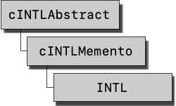
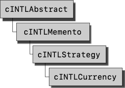
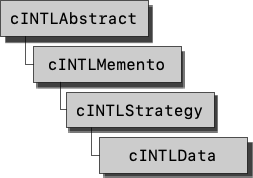
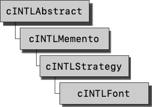
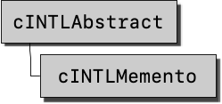
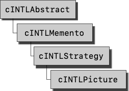
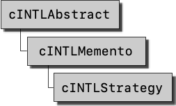
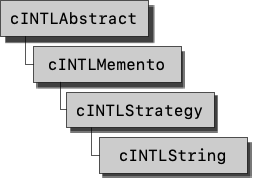
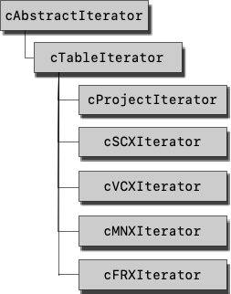
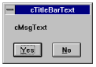

# Steven Black's INTL Toolkit for Visual FoxPro

***INTL makes short work of creating multilingual software in Visual FoxPro (VFP).***
It gives you the ability to create multilingual Visual FoxPro applications while minimizing the hassles of creating multi-version software.

This document serves to describe the following:

* [The INTL Toolkit](#installing-intl) for Visual FoxPro,
* [GENMENUX](#using-genmenux),
* [non-linguistic and strategic issues](#international-issues) in international development with VFP,
* [VFP’s international features](#vfps-international-features), and
* [other issues germane to spanning locales](#localization-factors-to-consider) with your VFP applications.

## Table of Contents

- [Installing INTL](#installing-intl)
- [INTL: How to...](#intl-how-to)
  * [How to Correctly Place Your INTL Files](#how-to-correctly-place-your-intl-files)
  * [How to Instantiate an INTL Object](#how-to-instantiate-an-intl-object)
  * [How to Localize Forms](#how-to-localize-forms)
  * [How to Get Automatic Form Localization](#how-to-get-automatic-form-localization)
  * [How to Localize Menus](#how-to-localize-menus)
  * [How to Change the Current Language](#how-to-change-the-current-language)
  * [How to Swap Languages on the Fly](#how-to-swap-languages-on-the-fly)
  * [How to Work With Locales](#how-to-work-with-locales)
  * [How to Demo your App in Swahili Today](#how-to-demo-your-app-in-swahili-today)
  * [How to Configure Your Main INTL Object](#how-to-configure-your-main-intl-object)
  * [How to Configure Strategies](#how-to-configure-strategies)
  * [How to Localize Strings](#how-to-localize-strings)
  * [How to Localize Fonts](#how-to-localize-fonts)
  * [How to Localize Data Sources](#how-to-localize-data-sources)
  * [How to Localize Pictures](#how-to-localize-pictures)
  * [How to Localize Currencies](#how-to-localize-currencies)
  * [How to Localize for Right-To-Left Writing Systems](#how-to-localize-for-right-to-left-writing-systems)
  * [How to Subclass an Existing Strategy](#how-to-subclass-an-existing-strategy)
  * [How to Create Your Own Generic Strategy](#how-to-create-your-own-generic-strategy)
  * [How to Make INTL Ignore an Object](#how-to-make-intl-ignore-an-object)
  * [How to Make INTL Treat an Object Differently](#how-to-make-intl-treat-an-object-differently)
  * [How to Substitute Your Own Strategies](#how-to-substitute-your-own-strategies)
  * [How to Batch-Update `strings.dbf`](#how-to-batch-update-stringsdbf)
  * [How to Localize Reports](#how-to-localize-reports)
  * [Details of How INTL Works](#details-of-how-intl-works)
  * [Details of How `MsgSvc()` Works](#details-of-how-msgsvc-works)
  * [How to Distribute INTL Files](#how-to-distribute-intl-files)
  * [Toolkit File Descriptions](#toolkit-file-descriptions)
  * [Overview of the INTL Class Library](#overview-of-the-intl-class-library)
  * [Class `INTL`](#class-intl)
  * [Class `cINTLAbstract`](#class-cintlabstract)
  * [Class `cINTLCurrency`](#class-cintlcurrency)
  * [Class `cINTLData`](#class-cintldata)
  * [Class `cINTLFont`](#class-cintlfont)
  * [Class `cINTLMemento`](#class-cintlmemento)
  * [Class `cINTLPicture`](#class-cintlpicture)
  * [Class `cINTLRightToLeft`](#class-cintlrighttoleft)
  * [Class `cINTLStrategy`](#class-cintlstrategy)
  * [Class `cINTLString`](#class-cintlstring)
- [Localizing VFP Menus](#localizing-vfp-menus)
  * [Using GENMENUX to Invoke INTL](#using-genmenux-to-invoke-intl)
  * [INTL `config.fpw` Menu Statements](#intl-configfpw-menu-statements)
  * [INTL Menu Memory Variables](#intl-menu-memory-variables)
  * [Two Very Useful GENMENUX Comment Directives](#two-very-useful-genmenux-comment-directives)
- [Message Services](#message-services)
  * [Introduction](#introduction)
  * [Up And Running](#up-and-running)
  * [`MsgSvc()` Dialog Return Values](#msgsvc-dialog-return-values)
  * [Fields in MsgSvc.DBF](#fields-in-msgsvcdbf)
  * [`MsgSvc()` Examples](#msgsvc-examples)
  * [Localizing Smart](#localizing-smart)
- [INTLTool](#intltool)
  * [Iterators And Visitors](#iterators-and-visitors)
  * [Updating `strings.dbf` Based on a .PJX](#updating-stringsdbf-based-on-a-pjx)
  * [Updating `strings.dbf` Based on a .SCX](#updating-stringsdbf-based-on-a-scx)
  * [Updating `strings.dbf` Based on a .VCX](#updating-stringsdbf-based-on-a-vcx)
  * [Updating `strings.dbf` Based on a .MNX](#updating-stringsdbf-based-on-a-mnx)
  * [Updating `strings.dbf` Based on a .FRX](#updating-stringsdbf-based-on-a-frx)
  * [Transforming Reports Based on a .PJX](#transforming-reports-based-on-a-pjx)
  * [Transforming Reports Based on a .FRX](#transforming-reports-based-on-a-frx)
  * [INTL Iterator Classes](#intl-iterator-classes)
  * [Class `INTLVisitor`](#class-intlvisitor)
- [Extend INTL](#extend-intl)
  * [Creating and Using Hooks](#creating-and-using-hooks)
- [VFP's International Features](#vfps-international-features)
  * [Introduction](#introduction-1)
  * [A Survey of VFP's International Features](#a-survey-of-vfps-international-features)
- [International Issues](#international-issues)
  * [Background](#background-1)
  * [Localization Factors to Consider](#localization-factors-to-consider)
  * [Sources of Cultural Difference](#sources-of-cultural-difference)
  * [Choosing Enabling Strategies](#choosing-enabling-strategies)
  * [Checklist for International Issues](#checklist-for-international-issues)
- [Using GENMENUX](#using-genmenux)
  * [Introduction](#introduction-2)
  * [GENMENUX Directives](#genmenux-directives)
  * [Timing of GENMENUX Drivers and Directives](#timing-of-genmenux-drivers-and-directives)
  * [Checklist for GENMENUX](#checklist-for-genmenux)
  * [The MNX Structure](#the-mnx-structure)
- [Glossary of Terms](#glossary-of-terms)
- [Acknowledgments](#acknowledgments)

# Installing INTL

First, put the INTL files into a clean new directory.

Then,

* **Deploy files:** Manually place files relative to your project as described in How to [Correctly Place Your INTL Files](#how-to-correctly-place-your-intl-files).

* **Modify the `config.fpw` file:** For menus, add the two lines to the `config.fpw` file as explained in [How to Localize Menus](#how-to-localize-menus).

* **Seed your Form class definition:** For now, probably forever, invoke INTL in forms with a `Form::Init()` statement that calls the INTL object. See [How to Get Automatic Form Localization](#how-to-get-automatic-form-localization).

* If you need localization, **instantiate an INTL object:** Now when localization is required, create and configure an INTL object as described in [How to Instantiate an INTL Object](#how-to-instantiate-an-intl-object).

# INTL: How to...

## How to Correctly Place Your INTL Files

It is important for VFP to find INTL’s files as needed. Here’s where to put your INTL files so they are available to your development environment:

**Deploy your files as follows:**

<dl>
<dt><code>genmenux.prg</code></dt>
  <dd>VFP root or the project root directory.</dd>
<dt><code>intl.prg</code></dt>
  <dd>VFP root or the project root directory, or along <code>SET PATH</code>.</dd>
<dt><code>strings.dbf strings.fpt strings.cdx</code></dt>
  <dd>Project root directory, or along <code>SET PATH</code>.</dd>
<dt><code>msgsvc.dbf msgsvc.fpt msgsvc.cdx</code></dt>
  <dd>VFP project root directory, or along <code>SET PATH</code>.</dd>
</dl>

## How to Instantiate an INTL Object

Create a member named `_SCREEN.oINTL` to hold the INTL instance.

In order to use INTL, your application must instantiate an INTL object. There are many ways to do this, the best being to add it to `_SCREEN`, like this:

```
*-- Anywhere, anytime:
*-- Instantiate INTL in _SCREEN
SET PROCEDURE TO INTL ADDITIVE
SCREEN.AddObject( "oINTL", "INTL" )
```

## How to Localize Forms

Localize forms by passing their object references to the `Localize()`
method of an INTL object.

Forms (and any other container ) are localized by passing its reference to the `oINTL.Localize()` method.

```
*-- Configure oINTL to another language
_SCREEN.oINTL.SetLanguage( "French" )

*-- Instantiate a form. If the form calls INTL in its Init()
*-- method, then the form appears in French....
DO FORM MyForm Name MyForm
```

....or you can localize the form on the fly.

```
_SCREEN.oINTL.Localize( MyForm )
```

## How to Get Automatic Form Localization

**Place a call to `oINTL` in your `Form.Init()` hierarchy.**

To make your forms localize themselves automatically call the `oINTL.Localize()` method in your form class hierarchy. To do so, place the following code in the `Init()` method of your form class definition. |

```
*-- Don't forget to call the ParentClass!
DODEFAULT()

IF TYPE("_SCREEN.oINTL" ) == "O"
  _SCREEN.oINTL.Localize( This )
ENDIF
```

## How to Localize Menus

Just like in prior versions of INTL, a GENMENUX driver is used to localize menus. To activate GENMENUX and its INTL.PRG driver, put the following lines in your `config.fpw`:

Add these lines to `config.fpw`.

```
*-- Configuring for INTL menus.
_GENMENU = GENMENUX.PRG
_MNXDRV2 = INTL.PRG
*-- End of configuration for INTL menus.
```

Some of these changes require a VFP restart. To avoid restarting FoxPro at this time, issue the following command in the command window:

```
_GENMENU = HOME()+”GENMENUX.PRG”
```

This is all you need to change in your development environment to
localize menus. Henceforth, generate menus as usual.

**GENMENUX is very cool. [Check it out](#using-genmenux).**

**Note**: GENMENUX does not replace VFP’s native menu generator. Since GENMENUX calls GENMENU.PRG, your code is generated by VFP as usual. The INTL Toolkit uses GENMENUX as a pre-processor. GENMENUX is a rich program. Please see [GENMENUX](#using-genmenux) for more information about its capabilities.

## How to Change the Current Language

The structure of `strings.dbf` determines which languages you support.

Use the `SetLanguage()` method to change INTL’s language.

INTL comes with a table named `strings.dbf` which contains a variety of fields, one of which is `cOriginal`, and it may contain other fields for different languages, for example `cFrench`, `cGerman`, `cSpanish`, and so on.

The languages you support are determined by the structure of the `strings.dbf` table. To add a new language, just change the structure of `strings.dbf`.

To change the current localization language, use the `SetLanguage()` method. Say we want a form to be in French. First set the language, then localize the form:

```
_SCREEN.oINTL.SetLanguage( "French" )
_SCREEN.oINTL.Localize( _SCREEN.ActiveForm )
```

## How to Swap Languages on the Fly

**Nothing demos better than swapping the display language on the fly.**

To swap languages on the fly, which is always a success in a demo (do it even if it isn't required — it's so easy), create a mechanism in your application to configure the INTL object with `INTL.SetLanguage()`, as follows.

```
_SCREEN.oINTL.SetLanguage("German" ) && Configure INTL for German

FOR i = 1 TO ALEN(_SCREEN.Forms ) && Localize active forms
  _SCREEN.oINTL.Localize( _SCREEN.Forms[i] )
ENDFOR

DO MAIN.MPR && Refresh the menu too!
```

## How to Work With Locales

To change your application's locale-based personality, I suggest you
subclass `INTL` to work as needed. Subclassing `INTL` for your own needs is a great
way to meet locale demands with a minimum of code and fuss.

Here is an example of an INTL subclass that works for me in a variety of locales.
We subclass the `INTL` class to change all the locale-specific settings at once.

Take note of the RightToLeft strategy (class `cINTLRightToLeft`), which is useful for Middle-Eastern writing systems.

```
DEFINE CLASS MyINTL AS INTL
  FUNCTION SetLocale( tcLocale )
    IF EMPTY( tcLocale )
      tcLocale = this.GetLocale()
    ENDIF
    IF INTL::SetLocale( @tcLocale )
      DO CASE
      CASE PROPER(tcLocale )= "Usa"
        SET CURRENCY TO "$"
        SET CURRENCY LEFT
        SET POINT TO "."
        SET SEPARATOR TO ","
        SET DATE TO American
        SET MARK TO "/"
        this.SetRightToLeft( .F. )
        this.SetConversion( "Usa", 1.33 )
        this.SetLanguage( "USEnglish" )

      CASE PROPER(tcLocale )= "France"
        SET CURRENCY TO " F"
        SET CURRENCY RIGHT
        SET POINT TO ","
        SET SEPARATOR TO "."
        SET DATE TO DMY
        SET MARK TO "/"
        this.SetRightToLeft( .F. )
        this.SetConversion( "France", 0.28 )
        this.SetLanguage( "French" )

      CASE PROPER(tcLocale )= "Germany"
        SET CURRENCY TO " DM"
        SET CURRENCY RIGHT
        SET POINT TO ","
        SET SEPARATOR TO "."
        SET DATE TO DMY
        SET MARK TO "/"
        this.SetRightToLeft( .F. )
        this.SetConversion( "Germany", 0.28 )
        this.SetLanguage( "German" )

      CASE PROPER(tcLocale )= "Israel"
        SET CURRENCY TO "ILS"
        SET CURRENCY LEFT
        SET POINT TO "."
        SET SEPARATOR TO ","
        SET DATE TO British
        SET MARK TO "/"
        this.SetConversion( "Israel", 0.41 )
        this.SetRightToLeft( .T. )
        this.SetLanguage( "Hebrew" )
      ENDCASE
    ENDIF
ENDDEFINE
```

## How to Demo your App in Swahili Today

**INTL is designed to be implemented quickly.**

Here’s what you need to do to localize your application this morning for a multilingual demo this afternoon. If you've used VFP's design tools properly, this is a quick job. If not, this will take a tad longer to engineer.

The basic steps are:

**Install INTL and seed the `Init()` method of your form base classes.**
Follow the steps in the section titled [Installing INTL](#installing-intl). Make sure you review all the steps. Especially important are the steps titled [How to Instantiate an INTL Object](#how-to-instantiate-an-intl-object), [How to Get Automatic Form Localization](#how-to-get-automatic-form-localization), and [How to Localize Menus](#how-to-localize-menus).</dd>

**Modify the structure of `strings.dbf` and add one field for each language you need.**

* Copy the `strings.dbf` table that comes with INTL and put it in your project root directory.
* `ZAP` the `strings.dbf` table that you just placed in your project root.
* `MODIFY STRUCTURE` of `strings.dbf` and add a new column named `cSwahili` with a length of 120. Note that the "c" in `cSwahili` is required.


**Make your application create an INTL object.**  Early in your application, instantiate an INTL object just as described in How to [Instantiate an INTL Object](#how-to-instantiate-an-intl-object). Displaying in a different language is now just a matter of using its `SetLanguage()` method.

**Do a “Build All”.** Open your project, select "Build", and build an App or Exe, being sure to select "Recompile All Files". Go to lunch.

**To automatically load `strings.dbf`, either run your app or use the INTLTool utility.** There are two ways to populate the `strings.dbf` table with your project's interface strings. The first way is to simply run your program. As objects are instantiated, INTL will append the strings (like `Caption`, `Tooltiptext`, etc.) into the strings table. A better way is to run the INTLTool update program. See [INTLTool](#intltool).

**Input the translations in the `strings.dbf` table.** In the `cSwahili` column, type-in Swahili translations, complete with hot-keys and shortcut-keys as required.
Note: you can get a "quick-and-dirty" translation for testing and internal demos by simply doing:

```
`REPLACE ALL cSwahili with "**"+TRIM(cOriginal)+"**" FOR cOriginal <> "(("`
```

## How to Configure Your Main INTL Object

I recommend making a main INTL object named `_SCREEN.oINTL`.

It's possible to have several separate INTL objects co-exist together. Each INTL object is an amalgam of other INTL objects called hooks or strategies. Your main INTL object is the master INTL object in your environment, which I assume is called `_SCREEN.oINTL`.

Use the `SetConfig( n )` method to configure your main INTL object.

You configure INTL with a `_SCREEN.oINTL.SetConfig( n )` method, where `n` is a bitwise integer value with the following interpretation:

| Value | Configuration Meaning |
| --- | --- |
| `1` (Default)<br>`2`<br>`4`<br>`8`<br>`16`<br>`32` | Load the String strategy<br>Load the Font strategy<br>Load the Data strategy<br>Load the Picture strategy<br>Load the Currency strategy<br>Load the RightToLeft strategy |

**Example: create an INTL object that localizes strings and fonts**

```
*-- create an INTL object
_SCREEN.AddObject("oINTL", "INTL" )
*-- Load the strings and font strategies.
_SCREEN.oINTL.SetConfig( 1 + 2 )
```

The operative language and locale of the main INTL object are configured
with the `SetLanguage()` and `SetLocale()` methods.

## How to Configure Strategies

Strategies are bitwise configured.

Configuring individual strategies is easy. Simply get a reference to the strategy, then configure it. Here are the configuration meanings for each configurable strategy.

| Strategy | Value | Localization |
| --- | --- | --- |
| Data | `1` (Default)<br>`2`<br>`4`<br>`8`<br>`16` | `BoundColumn`<br>`ControlSource`<br>`RowSource`<br>`RecordSource`<br>`InputMask`
| Font | `1` (Default)<br>`2` (Default) | `Font` and `FontSize`<br>`DynamicFont` and `DynamicFontSize` |
| Picture | `1` (Default)<br>`2`<br>`4` (Default)<br>`8` |`Picture`<br>`DownPicture`<br>`Icon`<br>`DragIcon` |
| RightToLeft | `1` (Default) | All objects reversed within their respective containers |
| Strings | `1` (Default)<br>`2` (Default)<br>`4` (Default)| `Caption`<br>`ToolTipText`<br>`StatusBarText` |

To get a handle on a loaded strategy, use the `oINTL.GetStrategy()` method.
Thereafter, use the handle's `oINTL.SetConfig()` method to configure the
strategy.

**Example: create an INTL object that localizes strings but not Tooltips**

Use the `oINTL.GetStrategy()` method to get an object reference, then use its `oINTL.SetConfig()` method to configure it.

```
*-- create an INTL object
_SCREEN.AddObject("oINTL", "INTL" )
*-- Load the strings and font strategies.
_SCREEN.oINTL.SetConfig( 3 )
*-- Configure Strings to NOT localize ToolTips
LOCAL loTempHandle
loTempHandle = _SCREEN.oINTL.GetStrategy( "String" )
*-- For the string strategy, the configuration
*-- for Caption and StatusBarText is 5
loTempHandle.SetConfig( 1 + 4 )
```

**Example: create an INTL object that localizes only strings and
InputMasks.**

```
*-- create an INTL object
_SCREEN.AddObject( "oINTL", "INTL" )
*-- Load the strings and data strategies.
_SCREEN.oINTL.SetConfig( 5 )
*-- now modify the data strategy from its default.
LOCAL oTemp
oTemp = _SCREEN.oINTL.GetStrategy( "Data" )
*-- Input masks only.
oTemp.SetConfig( 16 )
```

## How to Localize Strings

Interface strings are usually the first things that come to mind when we think of translating software.

INTL loads only the string strategy by default.

The following table lists the configuration bits for INTL. These configuration bits decide which strategy is loaded. By default, only the String strategy is loaded, which is to say that strings are automatically localized by INTL by default.

| Class | Configuration bits | Localization |
| --- | --- | --- |
| INTL | **`1` (Default)**<br>`4`<br>`2`<br>`8`<br>`16`<br>`32` | **`cINTLString` strategy loaded**<br>`cINTLFont` strategy loaded<br>`cINTLData` strategy loaded<br>`cINTLPicture` strategy loaded<br>`cINTLCurrency` strategy loaded<br>`cINTLRightToLeft` strategy loaded |
| CINTLString | `1` (Default)<br>`2` (Default)<br>`3` (Default) | `Caption`<br>`ToolTipText`<br>`StatusBarText` |

Activate the string strategy as follows:

```
*-- cINTLString is loaded by default.
*-- So there’s usually no need to do this
_SCREEN.oINTL.SetStrategy( "String", "cINTLString" )
```

Another more cryptic way to load the String strategy is:

```
-- Set configuration bit 2^0 "ON"
_SCREEN.oINTL.SetConfig( BITSET( oINTL.GetConfig(), 0 ))
```

So there are two ways to do it.

Strings can be localized by providing translations in `strings.dbf`.

| cOriginal | cFrench |
| --------- | ------- |
| `Yes` | `Oui` |
| `No` | `Non` |

**Configure the String Strategy with its `SetConfig()` method.**

The INTL String strategy, like all strategies, is bitwise-configured. You can control the string strategy object as follows:

**Example:** to disable font processing for the `ToolTipText` property:

```
*-- Get a handle on the string strategy:
oFont = _SCREEN.oINTL.GetStrategy( "String" )
*-- We want Caption( 1 ) and StatusbarText( 4 ) only
oFont.SetConfig( 5 )
```

## How to Localize Fonts

Fonts can be locale-specific.

Fonts like Arial, Times New Roman, MS Sans Serif might not be suitable in some languages. This matters; we may need a way to change fonts when we change locales.

The following table lists the configuration bits for the INTL object to load the Font strategy, and the configuration integers to configure the Font strategy.

| Class | Configuration bits | Localization |
| --- | --- | --- |
| INTL | `1` (Default)<br>**`2`**<br>`4`<br>`8`<br>`16`<br>`32` | `cINTLString` strategy loaded<br>**`cINTLFont` strategy loaded**<br>`cINTLData` strategy loaded<br>`cINTLPicture` strategy loaded<br>`cINTLCurrency` strategy loaded<br>`cINTLRightToLeft` strategy loaded |
| CINTLFont | `1` (Default)<br>`2` (Default) | `Font` and `FontSize`<br>`DynamicFont` and `DynamicFontSize` |

Activate the font strategy as follows:

```
*-- cINTLFont is the Font strategy class.
_SCREEN.oINTL.SetStrategy( "Font", "cINTLFont" )
```

Another more cryptic way to load the Font strategy is:

```
*-- Set configuration bit 2^1 "ON"
_SCREEN.oINTL.SetConfig(BITSET(oINTL.GetConfig(),1 ))
```

So there are two ways to do it.

Fonts can be localized by providing translations in `strings.dbf`. Font
specifications are prefixed with the identifier “`((Font ))`”, for example:

| cOriginal | cRussian |
| ----- | ----- |
| `((Font))Courier New,10` | `((Font))Courier New Cyr,10` |
| `((Font))Arial,16` | `((Font))Arial Cyr,16` |

**Configure the Font Strategy with its `SetConfig()` method.**

The INTL Font strategy, like all strategies, is bitwise-configured. You can control the font strategy object as follows:

**Example:** to disable font processing for `DynamicFont` and
`DynamicFontSize`, which will slightly improve the font strategy
performance:

```
*-- Set Font localization on
oINTL.SetConfig( BITSET( oINTL.GetConfig(), 1 )) && Set 2^1 "ON"
*-- Get a handle on the font strategy:
oFont = _SCREEN.oINTL.GetStrategy("Font" )
*-- We want Font and FontSize and to disable DynamicFont
*-- and DynamicFontSize
oFont.SetConfig( 1 )
```

## How to Localize Data Sources

Data can be locale-specific.

Sometimes it is the data itself that needs to be localized. INTL allows you to present different fields for different locales.

The Data strategy works just like the other strategies.

The following table lists the configuration bits for the INTL object to load the Picture strategy, and the configuration integers to configure the Picture strategy.

| Class | Configuration bits | Localization |
| --- | --- | --- |
| INTL | `1` (Default)<br>`2`<br>**`4`**<br>`8`<br>`16`<br>`32` | `cINTLString` strategy loaded<br>`cINTLFont` strategy loaded<br>**`cINTLData` strategy loaded**<br>`cINTLPicture` strategy loaded<br>`cINTLCurrency` strategy loaded<br>`cINTLRightToLeft` strategy loaded |
| CINTLData | `1` (Default)<br>`2`<br>`4`<br>`8`<br>`16` | `BoundColumn`<br>`ControlSource`<br>`RowSource`<br>`RecordSource`<br>`InpuMask` |

Activate the data strategy as follows:

```
*-- cINTLData is the Graphics strategy class.
_SCREEN.oINTL.SetStrategy( "Data", "cINTLData" )
```

Another more cryptic way to load the Data strategy is:

```
*-- Set configuration bit 2^2 "ON"
_SCREEN.oINTL.SetConfig(BITSET(oINTL.GetConfig(),2 ))
```

So there are two ways to do it.

Data elements can be localized by providing translations in `strings.dbf`.  Data specifications are prefixed with the identifier “`((Data))`”, like for example:

| cOriginal | cRrussian |
| ----- | ----- |
| `((Data))cEngDesc` | `((Data))cRussianDesc` |

**Configure the Data Strategy with its `SetConfig()` method.**

The INTL data strategy, like all strategies, is bitwise-configured. You can control the picture strategy object as follows:

**Example:** Localize ControlSource properties.

```
*-- Set Data localization on
*-- Set 2^2 "ON"
oINTL.SetConfig( BITSET( oINTL.GetConfig(), 2 ))
*-- Get a handle on the data strategy:
oData = _SCREEN.oINTL.GetStrategy("Data" )
*-- We want ControlSource (2)
*-- property localized.
oPicture.SetConfig( 2 )
```

## How to Localize Pictures

**Images can be locale-specific.**  Some of the icons and images we use every day may not be appropriate in other locales. INTL provides a way to change the displayed images when we change locales.

**The Picture strategy works just like the other strategies.** The following table lists the configuration bits for the INTL object to load the Picture strategy, and the configuration integers to configure the Picture strategy.

| Class | Configuration bits | Localization |
| --- | --- | --- |
| INTL | `1` (Default)<br>`2`<br>`4`<br>**`8`**<br>`16`<br>`32` | `cINTLString` strategy loaded<br>`cINTLFont` strategy loaded<br>`cINTLData` strategy loaded<br>**`cINTLPicture` strategy loaded**<br>`cINTLCurrency` strategy loaded<br>`cINTLRightToLeft` strategy loaded |
|  `cINTLPicture` | `1` (Default)<br>`2`<br>`4` (Default)<br>`8` | `Picture`<br>`DownPicture`<br>`Icon`<br>`DragIcon` |


Activate the picture strategy as follows:

```
*-- cINTLPicture is the Graphics strategy class.
_SCREEN.oINTL.SetStrategy( "Picture", "cINTLPicture" )
```

Another more cryptic way to load the Picture strategy is:

```
*-- Set configuration bit 2^3 "ON"
_SCREEN.oINTL.SetConfig(BITSET(oINTL.GetConfig(),3 ))
```

So there are two ways to do it.

Pictures can be localized by providing translations in `strings.dbf`.
Picture specifications are prefixed with the identifier “`((Picture))`”,
for example:

| `coriginal` | `crussian` |
| ----- | ----- |
| `((Picture))Doctor.BMP` | `((Picture))Doktor.BMP` |
| `((Picture))Friend.BMP` | `((Picture))Comrade.BMP` |

**Configure the Picture Strategy with its `SetConfig()` method.**

The INTL picture strategy, like all strategies, is bitwise-configured. You can control the picture strategy object as follows:

**Example:** Localize Picture, DownPicture, and Icon properties.

```
*-- Set Picture localization on
*-- Set 2^3 "ON"
oINTL.SetConfig( BITSET( oINTL.GetConfig(), 3 ))
*-- Get a handle on the font strategy:
oPicture = _SCREEN.oINTL.GetStrategy("Picture" )
*-- We want Picture (1), DownPicture( 2 ) and Icon (4)
*-- properties localized. 1+2+4 = 7
oPicture.SetConfig( 7 )
```

## How to Localize Currencies

INTL provides a simple yet adaptable multi-currency capability.

INTL enables you to endow your application with a simple multi-currency capability. This architecture is flexible, and by subclassing the `cINTLCurrency` class you can probably implement almost any multi-currency scheme you need.

At the heart of it all, the INTL Currency strategy works only on fields having a format property of "$".

Recall that INTL strategies are bitwise-configured according to the following table.

| Class (with default) | Value | Localization
| --- | --- | --- |
| INTL (1) | `1` (Default)<br>`2`<br>`4`<br>`8`<br>**`16`**<br>`32` | `cINTLString` strategy loaded<br>`cINTLFont` strategy loaded<br>`cINTLData` strategy loaded<br>`cINTLPicture` strategy loaded<br>**`cINTLCurrency` strategy loaded**<br>`cINTLRightToLeft` strategy loaded |

Activate the currency strategy as follows:

Use `oINTL.SetConfig()` or `oINTL.SetStrategy()` to load the Currency strategy.

```
OINTL = _SCREEN.oINTL
oINTL.SetStratrgy( "Currency", "cINTLCurrency" )
```

An alternate (and more cryptic) way is to use INTL's `SetConfig()` method to make INTL invoke the Font strategy of a given class, as follows:

```
OINTL = _SCREEN.oINTL
*-- Set bit 2^4 "ON"
oINTL.SetConfig( BITSET( oINTL.GetConfig(), 4 ))
```

So there are two ways to do it.

The Currency strategy is not like the others. The INTL toolkit currency strategy is a little different from other strategies in three important respects:

* currencies are *locale*-specific, not language-specific.

* class `cINTLCurrency` does not use class `cINTLString` services, and

* class `cINTLCurrency` makes many input fields read-only when the data is in a converted state.


The default exchange rate for all currencies is `1.00`.

With the `cINTLCurrency` class that ships with INTL, you assign currency conversion factors to different currencies. By default the conversion factor used by the Currency strategy is `1.00`.

If you need time-dependent currency conversions, you can subclass `cINTLCurrency` to do anything you need it to do, such as lookups.

Let's configure INTL for the following currencies: Canadian dollar, Euro, and US dollar. Assume that our data is based in Canadian dollars.

`oINTL.SetConversion()` sets the exchange rate between the original and other locales.

Use `SetLocale()` to change the currency locale. Then localize as usual.

```
oINTL = _SCREEN.oINTL

*-- Load the currency strategy
*-- Set 2^4 "ON"
oINTL.SetConfig( BITSET( oINTL.GetConfig(), 4 ))
*-- Define a few locales and currencies
oINTL.SetConversion( "Canada", 1 )
oINTL.SetConversion( "Euro", 1.55 )
oINTL.SetConversion( "USA", 1.33 )

*-- Lets assume we want to see it in US dollars
oINTL.SetLocale( "USA" )

*-- Localize the current form
oINTL.Localize(_SCREEN.ActiveForm )
```

## How to Localize for Right-To-Left Writing Systems

INTL will automatically make your form objects display from right to left.

INTL enables you to display objects from right-to-left, which is required by Middle-Eastern writing systems. To do this, INTL reverses the location of objects within containers along the vertical centerline of the container. INTL also modifies the alignment property of checkboxes and option groups.

INTL does not change the orientation of caption text. To change the orientation of caption text, you must be using a Middle-Eastern localization of Windows.

The result is forms are reversed; if they were read from left-to-right now they read from right-to-left, and vice-versa.

Recall that INTL strategies are bitwise-configured according to the
following table:

| Class (with default) | Value | Localization
| --- | --- | --- |
|  INTL (1) | `1` (Default)<br>`2`<br>`4`<br>`8`<br>`16`<br>**`32`** | `cINTLString` strategy loaded<br>`cINTLFont` strategy loaded<br>`cINTLData` strategy loaded<br>`cINTLPicture` strategy loaded<br>`cINTLCurrency` strategy loaded<br>**`cINTLRightToLeft` strategy loaded** |


Activate the currency strategy as follows:

Use `oINTL.SetConfig()` or `oINTL.SetStrategy()` to load the Currency strategy.

```
OINTL = _SCREEN.oINTL
oINTL.SetStratrgy( "RightToLeft", "cINTLRightToLeft" )
An alternate (and more cryptic ) way is to use INTL's `SetConfig()` method make INTL invoke the Font strategy of a given class, as follows:
OINTL = _SCREEN.oINTL<b
*-- Set bit 2^5 "ON"
oINTL.SetConfig( BITSET( oINTL.GetConfig(), 5 ))
```

So there are two ways to do it.

The RightToLeft strategy is the only strategy that actually rearranges objects in containers.

The INTL toolkit right-to-left strategy is a little different from other strategies in four important respects:

* The right-to-left writing direction is *locale*-specific *and* language-specific.
* Class `cINTLRightToLeft` does not use class `cINTLString` services.
* Class `cINTLRightToLeft` reverses the location of objects within containers along the container's vertical axis. What was on the left ends up on the right, and vice versa. Also the alignment property of Checkboxes and Optiongroups is reversed, as is the sequences of Pages in Pageframes and Columns in grids.
* If you develop in a right-to-left writing system, you can use a `cINTLRightToLeft` strategy to write from left-to-right.


Let's configure INTL for a right-to-left language. The cleanest way to do this is with a subclass of the `INTL::SetLanguage()` method. Alternately, you could also do it with the `SetLocale()` method. Either way, the implementation is the same.

In this example, we use `SetLanguage()` to configure for the RightToLeft transformation.

**Note: for clarity we've omitted configuring for the Font strategy, which we would probably need to do. See [How to Localize Fonts](#how-to-localize-fonts).**

```
DEFINE CLASS MidEastINTL AS INTL
  FUNCTION SetLanguage( tcLanguage )
    LOCAL llRetVal
    LlRetVal = INTL::SetLanguage( tcLanguage )
    *-- The right-to-left strategy is configured
    *-- with the fifth INTL configuration bit.
    IF tcLanguage = "Hebrew" OR ;
      TcLanguage = "Arabic"
      this.SetConfig( BITSET( this.GetConfig(), 5 ))
    ELSE
      this.SetConfig( BITCLEAR( this.GetConfig(), 5 ))
    ENDIF
    RETURN llRetVal
ENDDEFINE
```

## How to Subclass an Existing Strategy

**Need different behavior? Consider a subclass.**  You may encounter situations where you need to do thing differently. Instead of changing the INTL source code (which will create difficulties when merging future releases) consider subclassing an existing strategy for desired behavior.

In the diagram below, we've created two subclasses, one from the
`cINTLString` class and one from the `cINTLCurrency` class. The class
hierarchy now looks like this:

New classes added to the INTL class hierarchy.

To use your subclasses instead of those that ship with INTL, call the
setstrategy()method as follows:

```
*-- Assuming _SCREEN.oINTL is already Instantiated
_SCREEN.oINTL.SetStrategy("String", "cMyString" )
_SCREEN.oINTL.SetStrategy("Currency", "cMyCurrency" )
```

## How to Create Your Own Generic Strategy

You can create your own strategies and use INTL to automatically invoke
them. Just make your new strategy a subclass of the cINTLStrategy class
(so you'll have the properties and methods INTL expects) and then run
with it!

Just as in the case of subclassing an existing strategy, use the
`SetStrategy()` method to load your strategy into INTL.

## How to Make INTL Ignore an Object

Three ways:

  - You can make INTL ignore an object or a container object by placing
    the string "INTL Ignore" in the object's comment property. This
    string is not case sensitive.

  - If you can, give your object's class an INTL property, and assign it
    logical .F.

  - If you can, give your object's class an INTL property, and assign it
    a numeric value of less than 0.

## How to Make INTL Treat an Object Differently

If you have special needs for a particular object, give your object's
class an INTL property, and assign a numeric value to the property in
the class definition or to this object's instance. This numeric value is
the value you would assign to INTL's `SetConfig()` method to configure
INTL for this particular object.

## How to Substitute Your Own Strategies

If you wish to substitute your own strategies in subsequent strategy
instantiations, use the `SetStrategyClass()` method to assign a new
strategy class to an existing strategy alias.

```
*-- Permanently install cMyStringStrategy for the string strategy.
_SCREEN.oINTL.SetStrategyClass( "String", "cMyStringStrategy" )
```

## How to Batch-Update `strings.dbf`

INTL ships with iterator and visitor classes designed to recur VFP
structures and, among other things, load all the string interface
elements into the `strings.dbf`.

See [Updating `strings.dbf` Based on a .PJX](#updating-stringsdbf-based-on-a-pjx).

## How to Localize Reports

VFP report structures are not generated or compiled — they are bound
into your application "as-is". Reports must therefore be transformed
before the .APP or .EXE is created.

Localizing reports is something you really only need to do once. The
transformation process turns your report labels into report expressions
containing a call to INTL's `I()` function. For example, the report label
`"Name:"` becomes expression `I("Name:")`.

See [Transforming Reports Based on a .PJX](#transforming-reports-based-on-a-pjx).

## Details of How INTL Works

If you plan to get *really* fancy with swapping languages on the fly, it
will be helpful to know the following things:

  - After INTL localizes a form, it adds to the form an object named
    oINTL of class `cINTLMemento` configured as INTL was configured. This
    memento is a lightweight object that allows several INTL objects to
    peacefully co-exist because they can know that a particular Form is,
    at this moment, displaying in, say, Japanese.

  - When an INTL object finds a form containing a member named oINTL, it
    will adopt the member's configuration as determined by its
    `GETCONFIG()` value.

If you need alternate behavior — for example if you need the second INTL
object to completely override a memento from the first — then first
localize the form back to original (which removes the Form.oINTL member)
and *then* localize to the new locale using the second INTL object.

## Details of How `MsgSvc()` Works

Upon first invocation, `MsgSvc()` creates an object named `_SCREEN.oMsgSvc`
which thereafter will manage messaging. If an object named
`_SCREEN.oINTL` exists, the `_SCREEN.MsgSvc` object will obey its language
settings and use its services.

## How to Distribute INTL Files

For run time localization, you need to distribute the following files:

| File | Notes
| --- | --- |
| `i.prg` | For best performance, place this function in your first `SET PROCEDURE` file. |
| `intl.prg` | For best performance, `SET PROCEDURE TO INTL Additive`. |
| `msgsvc.dbf`<br>
`msgsvc.fpt`<br>
`msgsvc.cdx` | If you use `MsgSvc()` you will need to distribute these files. |
| `msgsvc.prg` | The message services library. |
| `nohot.prg` | For best performance, place this function in your first `SET PROCEDURE` file. |
| `strings.dbf`<br>
`strings.fpt`<br>
`strings.cdx` | You’ll need to distribute these too. |

For the STRINGS and MSGSVC tables and files, if you include them in your
APP or EXE then they will, of course, be read-only.

## Toolkit File Descriptions

Here's a description of the files used by INTL. To reckon where these
can be best placed relative to your project, see How to [Correctly Place Your INTL Files](#how-to-correctly-place-your-intl-files).

| File | Description
| --- | --- |
| `addendum.txt` | Late breaking news that may or may not be included in the documentation or the help file. |
| `genmenux.zip` | An archive of the latest available GENMENUX program by Andrew Ross MacNeill. |
| `i.prg` | A stand-alone function that serves as a shortcut to the `_SCREEN.oINTL.I()` method. |
| `intl.prg` | The core code for the classes and utilities in the INTL toolkit. |
| `intltool.prg` | Developer’s utilities to do batch operations on project files and other VFP structures. Do not distribute this file with your applications. |
| `msgsvc.dbf`<br>`msgsvc.fpt`<br>`msgsvc.cdx` | Table and supporting files containing messages for dialogs, wait windows, thermometer bars and text blocks. |
| `msgsvc.prg` | The message services library. |
| `nohot.prg` | `nohot()` strips hot key characters from FoxPro prompt expressions. It is a one-line function that you should cut and paste as a procedure somewhere in your application’s invocation stack. |
| `strings.dbf`<br>`strings.fpt`<br>`strings.cdx` | Table and supporting files containing translated phrases. |

## Overview of the INTL Class Library

**The INTL class hierarchy is based on class `cINTLAbstract`.**  `cINTLAbstract` serves to define the interface for the entire hierarchy. Wherever possible, adding rogue properties, events, and methods to subclasses has been avoided.

The figure below shows an OMT diagram of the INTL class hierarchy.


The INTL class hierarchy.

In normal circumstances, the only objects you’ll probably use are of
class `INTL`.

**Class `cINTLMemento` can be used as a token.**

`cINTLMemento` is a configuration token that INTL objects may use to store details of a specific localization. `cINTLMemento` includes access methods to protected properties.

INTL is the public interface and template methods for the localization
process.

cINTLStrategy is the Parentclass of various localization engines.

**`cINTLString`**, **`cINTLCurrency`**, **`cINTLFont`**, **`cINTLMeasures`**, **`cINTLPicture`**, and **`cINTLData`** are classes of specific strategic implementations.

## Class `INTL`



The INTL class provides services to localize objects and other elements
in your application.

### Class `INTL` Exposed Properties

#### `INTL::cCurrencyStrategy`

**INTL allows you to localize currencies.**

A string specifying the name of the currency strategy class.

|  |  |
| ----- | ----- |
| **Default** | `"cINTLCurrency"` |
| **Remarks** | You may subclass `cINTLCurrency` to suit your particular needs. You may then use the `SetStrategy("Currency",cYourCurrencyClass)` method to set this currency strategy property to something other than the default. |
| **See Also** | [`cINTLMemento::GetStrategy()`](#cintlmementogetstrategy) |

----
#### `INTL::cDataStrategy`

**INTL allows different data sources for different locales.**  A string specifying the name of the data strategy class.

|  |  |
| ----- | ----- |
| **Default** | `"cINTLData"` |
| **Remarks** | You may subclass `cINTLData` to suit your particular needs. You may use the `SetStrategy("Data", cYourDataClass)` method to set this data strategy property to something other than the default. |
| **See Also** | [`cINTLMemento::GetStrategy()`](#cintlmementogetstrategy) |

----
#### `INTL::cFontStrategy`

**INTL allows the proper fonts to be substituted.**

A string specifying the name of the font strategy class.

|  |  |
| ----- | ----- |
| **Default** | `"cINTLFont"` |
| **Remarks** | You may subclass `cINTLFont` to suit your particular needs. You may use the `SetStrategy("Font", cYourFontClass)` to set the font strategy property to something other than the default. |
| **See Also** | [`cINTLMemento::GetStrategy()`](#cintlmementogetstrategy) |

----
#### `INTL::cPictureStrategy`

**INTL can localize pictures, icons, and images.**

A string specifying the name of the picture strategy class.

|  |  |
| ----- | ----- |
| **Default** | `"cINTLPicture"` |
| **Remarks** | You may subclass `cINTLPicture` to suit your particular needs. You may use the ::SetStrategy("Picture", cYourPictureClass ) to set the picture strategy property to something other than the default. |
| **See Also** | [`cINTLMemento::GetStrategy()`](#cintlmementogetstrategy) |

----
#### `INTL::cStringStrategy`

**INTL localizes words and phrases.**

A string specifying the name of the string strategy class. The string strategy class is responsible for localizing strings and phrases in the application, and also serves as a function repository for other strategy classes.

|  |  |
| ----- | ----- |
| **Default** | `"cINTLSting"` |
| **Remarks** | You may subclass `cINTLString` to suit your particular needs. You may use the `SetStrategy("String", cYourStringClass)` to set the property. |
| **See Also** | [`cINTLMemento::GetStrategy()`](#cintlmementogetstrategy) |
| **The `cINTLString` strategy class is by far the most useful, and it provides services to other strategies.** | **Note:** many strategies use string-based services that are provided by the active string strategy class. To reduce cohesion with a particular `cStringStrategy` class, many string methods that would normally belong in class `cStringStrategy` are found in class `cINTLStrategy`, the parent strategy class. Thus all strategies have some inherent string localization abilities. | |

### Class `INTL` Exposed Methods

----
#### `INTL::Execute()`

Localizes a numeric, a string, an object, or array of objects. In the
case of objects and array of objects, the execute function passes each
object in turn to all the active localization strategies.

|  |  |
| --- | --- |
| **Syntax** | `oINTL.Execute( @PassedObject )` |
| **Return** | Nothing |
| **Arguments** | `PassedObject`: Can be of type numeric, string, or object. It can also be an array of object references. |
| **See Also** | **INTL::ObjArray()** |

**Example**
```
DIMENSION laScratchArray[1]
SET PROC TO INTL
oINTL = CREATEOBJECT("INTL" )
oXX = CREATEOBJECT("Form" )
*-- Load the array with object references
oINTL.ObjArray( oXX, @laScratchArray )
oINTL.Execute( @laScratchArray )
```

----
#### `INTL::GetAlias()`

| **Strategies may require resource files, which are referenced by alias.**

Returns the alias of the resource table associated with the default localization strategy. Normally, the default strategy object is of class `cINTLString`.

|  |  |
| --- | --- |
| **Syntax** | `oINTL.GetAlias()` |
| **Return** | The character value of the string strategy table alias. |
| **Arguments** | None. |
| **Remarks** | The `GetAlias()` method is a *hookable* method, meaning that if an object of class `INTL` has an attached hook object, then `GetAlias()` defers to the method of the hook object. Since by default objects of class `INTL` are hooked with an object of the `cINTLStringStrategy` class, invoking `oINTL.GetAlias()` is the equivalent of invoking `oINTL.oStringStrategy.getAlias()`. |

**Example**
```
_SCREEN.AddObject( "oINTL", "INTL" )
*-- The following two are equivalent
_SCREEN.oINTL.oStringStrategy.GetAlias()
_SCREEN.oINTL.GetAlias() |
```

----
#### `INTL::GetTable()`

Returns the name of the resource table associated with the string
strategy.

|  |  |
| --- | --- |
| **Syntax** | oINTL.GetTable()
| **Return** | The character value of the string strategy table name. |
| **Arguments** | None. |
| **Remarks** | The `GetTable()` method is a *hookable* method, meaning that if an object of class `INTL` has an attached hook object, then `GetTable()` defers to the method of the hook object. Since by default objects of class `INTL` are hooked with an object of the `cINTLStringStrategy` class, invoking `oINTL.GetTable()` is equivalent to invoking `oINTL.oStringStrategy.GetTable()`. |
| **See Also** | [`cINTLStrategy::SetTable()`](#cintlstrategysettable) |

**Example**
```
_SCREEN.AddObject( "oINTL", "INTL" )
*-- The following two are equivalent
_SCREEN.oINTL.oStringStrategy.GetTable()
_SCREEN.oINTL.GetTable()
```

----
#### `INTL::GetUpdateMode()`

Returns the setting for the update mode of the current string strategy.

|  |  |
| --- | --- |
| **Syntax** | `oINTL.<StrategyObject>.GetUpdateMode()` |
| **Return** | `.T.` if update mode is currently "On", false otherwise. |
| **Arguments** | None. |
| **See Also** | [`cINTLStrategy::SetUpdateMode`](#cINTLStrategySetUpdateMode) |
| **Remarks** | If `GetUpdateMode()` is logical true then, for some strategies, this cause INTL resource files to be self-maintained. For example, the native string strategy will add new strings to `strings.dbf` as they are encountered if the string strategy's update mode is set to true.<br><br>The `GetUpdateMode()` method is a *hookable* method, meaning that if an object of class `INTL` has an attached hook object, then `GetUpdateMode()` defers to the method of the hook object. Since by default objects of class `INTL` are hooked with an object of the `cINTLStringStrategy` class, invoking `oINTL.GetUpdateMode()` is equivalent to invoking `oINTL.oStringStrategy.GetUpdateMode()`. |

**Example**
```
_SCREEN.AddObject( "oINTL", "INTL" )
_SCREEN.oINTL. GetUpdateMode() |
```

----
#### `INTL::I()`

The `I()` function is an all-purpose localization method.

|  |  |
| --- | --- |
| **Syntax** | `oINTL.I(cString \| nAmount \| oObject )` |
| **Return** | Localized value of `cString` or `nAmount` or `oObject`. |
| **Argumemnts:** | `cString`: a string to localize. The string could be an interface item, a font name and size, a data source, or a file name.<br>`nAount`: an amount to localize.<br>`oObject`: an object (or a container of objects) to traverse. |
| **Remarks** | The `INTL::I()` method is a *hookable* method, meaning that if an object of class `INTL` has an attached hook object, then `INTL.I()` defers to the hook object. Since by default objects of class `INTL` are hooked with an object of the `cINTLStringStrategy` class, invoking `oINTL.I()` is equivalent to invoking `oINTL.oStringStrategy.I()`. |
| **See Also** | **`cINTLMemento::SetLocale()`**<br>`cINTLCurrency::GetConversion()` |

**Example**
```
this.I("Hello World" )
this.I( nSalary )
```

----
#### `INTL::Init()`

When creating a master INTL object, you may pass 0, 1, 2 or 3 parameters
of type "C", "N", or "O" in any sequence. A character parameter is
assumed to be a language, a numeric parameter is assumed to be a
configuration integer, and an object parameter is assumed to be
something to localize. Note that the language and configuration
parameters are used to initialize the state of INTL.

|  |  |
| --- | --- |
| **Syntax** | `oX = CREATE( "INTL", [C \| N \| O], [C \| N \| O], [C \| N \| O] )` |
| **Return** | `.T.` always. |
| **Arguments** | You may pass one of each of the following:<br>Type "C": the language to set.<br>Type "N": an INTL configuration integer.<br>Type "O": an object to traverse and localize. |
| **Example** | `oX = CREATE( "INTL", "French", _SCREEN.Activeform )` |

----
#### `INTL::LoadStrategies()`

Loads an array with the strategy objects as implied by
INTL::GetConfig(). Unless you create your own custom mechanisms, you
wouldn't normally call the `LoadStrategies()` method since INTL classes
invoke it when necessary.

|  |  |
| --- | --- |
| **Syntax** | `oX = CREATE( "INTL" )`<br>`oX.LoadStrategies()` |
| **Return** | True if successful, false otherwise. |
| **Arguments** | None. |
| **See Also** | **[`cINTLMemento::SetHook`](#cintlmementosethook)** |

**Example**
```
*-- For some reason, refresh the strategies loaded
*-- by the screen INTL object.
_SCREEN.oINTL.LoadStrategies() |
```

----
#### `INTL::Localize()`

Localizes an VFP structure and optionally also sets the locale
characteristics of the main INTL object.

|  |  |
| --- | --- |
| **Syntax** | `oINTL.Localize( [cLang \| oObj][,cLang \| oObj] )` |
| **Return** | `.T.` if successful, `.F.` if otherwise. |
| **Arguments** | `cLang`: the language to localize the object.<br>`oObj`: the object to localize. Default is `THISFORM`. |
| **See Also** | [`INTL::Execute()`](#intlexecute) |

**Example**
```
_SCREEN.AddObject( "oINTL", "INTL" )
_SCREEN.oINTL.Localize( "German", THIS ) |
```

----
#### `INTL::ObjArray()`

The `INTL::ObjArray()` method fills an array with object references for an
object and all the contents of that object.

|  |  |
| --- | --- |
| **Syntax** | `INTL::ObjArray( oObject, @ArraName )` |
| **Return** | The dimension of the array. |
| **Arguments** | oObject: can be any object but most usually some sort of container, such as a FormSet or a Form. |
| **Remarks** | The object passed for the argument occupies the first item in the array. |

**Example**
```
DIMENSION laScratch[1]
Foo = CREATEOBJECT( "Form" )
Foo.AddObject("Bar", CommandButton )
INTL::ObjArray( Foo, @laScratch ) && yields 2
```

----
#### `INTL::SetConversion()`

Method that allows direct access to the currency strategy if it’s
loaded.

|  |  |
| --- | --- |
| **Syntax** | `INTL:SetConversion( cLocale, nExchange, xOptional )` |
| **Return** | `.T.` if successful, `.F.` otherwise. |
| **Arguments** | `cLocale`: the name of a locale.<br>`Nexchange`: the exchange rate for the locale.<br>`XOptional`: an optional parameter you can use in subclasses/ |
| **Remarks** | If the currency strategy isn’t loaded, `.NULL.` is returned. |

| **Example**
```
_SCREEN.oINTL.SetStrategy(“Currency” )
*-- Talk directly to the currency strategy
_SCREEN.oINTL.SetConversion(“ USA”, 1.35 )
```

## Class `cINTLAbstract`

**The `cINTLAbstract` class is not designed to be directly instantiated.**

`CINTLAbstract` is the principal base class of the INTL class library. As its name implies, it is an abstract class, and its
main purpose is to define the complete interface for all subclasses.

### Class `cINTLAbstract` Protected Properties

#### `cINTLAbstract::cType`

String used to store the type of INTL class.

|  |  |
| --- | --- |
| **Default** | “Abstract” |
| **Remarks** | The cType is typically the type of strategy, such as “String”, “Font”, “Currency”, and so on. |
| **See Also:** | `cINTLAbstract::GetType()` |

----
#### `cINTLAbstract::Visible`

Logical used to control this INTL objects visibility.

|  |  |
| --- | --- |
| **Default** | Logical false. |
| **Remarks** | There is no reason to make visible any member of the INTL class hierarchy. |

### Class `cINTLAbstract` Exposed Properties

#### `cINTLAbstract::INTL_Abstract_ID`

Used by the INTL class for identification purposes.

|  |  |
| --- | --- |
| **Default** | `"Visual INTL"` |
| **Remarks** | This property should never be changed. |
| **See Also** | [`cINTLAbstract::Name`](#cintlabstractname) |

----
#### `cINTLAbstract::oLogicalParent`

Object reference to the logical parents of INTL objects.

|  |  |
| --- | --- |
| **Default** | `.NULL.` |
| **Remarks** | This property is useful for callbacks and for error handling. The logical parent property is automatically set by the `SetHook()` method. |
| **See Also** | **`cINTLAbstract::GetLogicalParent()`**<br>`cINTLAbstract::SetLogicalParent()`<br>`cINTLAbstract::GetHook()` |

----
#### `cINTLAbstract::oHook`


|  |  |
| --- | --- |
| **Motivation** | Object reference to the hook object. |
| **Default** | `.NULL.` |
| **Remarks** | This property is used to hold hook objects. |
| **See Also** | **`cINTLMemento::SetHook()`**<br>`cINTLAbstract::GetHook()` |

----
#### `cINTLAbstract::Name`

The name of this INTL object. Each class, including those you write
yourself, should normally have a distinctive name.

|  |  |
| --- | --- |
| **Default** | The name of the parent class. |
| **Remarks** | Explicitly assigning a name property, as all INTL classes do, is a good way to increase object instantiation performance. |

### Class `cINTLAbstract` Abstract Methods

The following functions are declared in class `cINTLAbstract` but are in
fact defined in subclasses. Hooked methods are those that, by default,
will message or delegate to an object attached to the ohook reference.

| Function | Remarks |
| ----- | ------- |
| [`cINTLAbstract::aStrat()`](#cintlabstractastrat) | Hooked |
| [`cINTLAbstract::alang()`](#cintlabstractalang) | Hooked |
| [`cINTLAbstract::CreateStrategyTable()`](#cintlabstractcreatestrategytable) | Hooked |
| [`cINTLAbstract::AdornMemento()`](#cintlabstractadornmemento) | |
| [`cINTLAbstract::CreateStrategy()`](#cintlabstractcreatestrategy) | Hooked |
| [`cINTLAbstract::Execute()`](#cintlabstractexecute) | Hooked |
| [`cINTLAbstract::GetConfig()`](#cintlabstractgetconfig) | Hooked |
| [`cINTLAbstract::GetConversion()`](#cintlabstractgetconversion) | Hooked |
| [`cINTLAbstract::GetStrategy()`](#cintlabstractgetstrategy) | Hooked |
| [`cINTLAbstract::GetExplicit()`](#cintlabstractgetexplicit) | Hooked |
| [`cINTLAbstract::GetLanguage()`](#cintlabstractgetlanguage) | Hooked |
| [`cINTLAbstract::GetConfig()`](#cintlabstractgetconfig) | Hooked |
| [`cINTLAbstract::GetTable()`](#cintlabstractgettable) | Hooked |
| [`cINTLAbstract::GetAlias()`](#cintlabstractgetalias) | Hooked |
| [`cINTLAbstract::GetUpdateMode()`](#cintlabstractgetupdatemode) | Hooked |
| [`cINTLAbstract::I()`](#cintlabstracti) | Hooked |
| [`cINTLAbstract::Init()`](#cintlabstractinit) | |
| [`cINTLAbstract::IsValidLanguage()`](#cintlabstractisvalidlanguage) | Hooked |
| [`cINTLAbstract::LoadStrategies()`](#cintlabstractloadstrategies) | |
| [`cINTLAbstract::Localize()`](#cintlabstractlocalize) | Hooked |
| [`cINTLAbstract::LoopOut()`](#cintlabstractloopout) | Hooked |
| [`cINTLAbstract::Mov()`](#cintlabstractmov) | |
| [`cINTLAbstract::objArray()`](#cintlabstractobjarray) | |
| [`cINTLAbstract::OpenStrategy()`](#cintlabstractopenstrategy) | Hooked |
| [`cINTLAbstract::Pitch()`](#cintlabstractpitch) | |
| [`cINTLAbstract::Pop()`](#cintlabstractpop) | |
| [`cINTLAbstract::Push()`](#cintlabstractpush) | |
| [`cINTLAbstract::Release()`](#cintlabstractrelease) | |
| [`cINTLAbstract::SetConfig()`](#cintlabstractsetconfig) | Hooked |
| [`cINTLAbstract::SetConversion()`](#cintlabstractsetconversion) | Hooked |
| [`cINTLAbstract::SetDefaults()`](#cintlabstractsetdefaults) | Hooked |
| [`cINTLAbstract::SetExplicit()`](#cintlabstractsetexplicit) | Hooked |
| [`cINTLAbstract::SetLanguage()`](#cintlabstractsetlanguage) | Hooked |
| [`cINTLAbstract::SetLocale()`](#cintlabstractsetlocale) | Hooked |
| [`cINTLAbstract::SetHook()`](#cintlabstractsethook) | Hooked |
| [`cINTLAbstract::SetStrategy()`](#cintlabstractsetstrategy) | Hooked |
| [`cINTLAbstract::SetAlias()`](#cintlabstractsetalias) | Hooked |
| [`cINTLAbstract::SetTable()`](#cintlabstractsettable) | Hooked |
| [`cINTLAbstract::SetUpdateMode()`](#cintlabstractsetupdatemode) | Hooked |
| [`cINTLAbstract::UpdateResource()`](#cintlabstractupdateresource) | Hooked |

### Class `cINTLAbstract` Exposed Methods


#### `cINTLAbstract::GetHook()`

Returns an object reference to the hook of the object.

|  |  |
| --- | --- |
| **Syntax** | `this.GetHook()` |
| **Return** | Hook object reference if the current object is hooked, `.NULL.` otherwise. |
| **Arguments** | None. |
| **Example** | `this.GetHook()` |
| **Remarks** | `GetHook()` returns an object reference (if a hook is defined) or `.NULL.` if not. |
| **See Also** | [`cINTLMemento::SetHook()`](#cintlmementosethook) |

----
#### `cINTLAbstract::GetLogicalParent()`

Returns the name of the INTL object’s logical parent.

|  |  |
| --- | --- |
| **Syntax** | `this.GetLogicalParent()` |
| **Return** | Hook object reference if the current object is hooked, `.NULL.` otherwise. |
| **Arguments** | None. |
| **Example** | `this.GetLogicalParent()` |
| **Remarks** | Returns the name of the INTL object’s logical parent if one has been defined, or `.NULL.` otherwise. |
| **See Also** | [`cINTLAbstract::SetLogicalParent()`](#cintlabstractsetlogicalparent) |

----
#### `cINTLAbstract::IsINTLClass()`

Returns true if a reference is an object belonging to the INTL class.

|  |  |
| --- | --- |
| **Syntax** | `this.IsINTLClass( Expression )` |
| **Return** | `.T.` if the object is a member of the INTL class. |
| **Arguments** | An expression that may or may not evaluate to type "O". |
| **Example** | `this.IsINTLClass( CREATE( "ComboBox" )) && Returns .F.`|
| **Remarks** | An expression is considered to be a member of the INTL class if it contains an exposed property named `"INTL_Abstract_ID"`. |

----
#### `cINTLAbstract::Release()`

Explicitly releases an INTL object.

|  |  |
| --- | --- |
| **Syntax** | `_SCREEN.oINTL.Release()` |
| **Return** | `.T.` always. |
| **Arguments** | None. |
| **Remarks** | Releases the current INTL object. Provided for your own benefit if for some reason you need to cleanly release INTL objects. This method is not explicitly called anywhere in INTL. |

----
#### `cINTLAbstract::SetLogicalParent()`

This access method sets the pointer to the object’s logical parent.

|  |  |
| --- | --- |
| **Syntax** | `oINTL.SetLogicalParent( oObject )` |
| **Return** | `.T.` if successful, `.F.` otherwise. |
| **Arguments** | oObject: an object reference. |
| **Example** | `this.SetLogicalParent( _SCREEN.oINTL )` |
| **Remarks** | The logical parent reference is automatically assigned by the `SetHook()` method. INTL classes do not use the logical parent back-pointer reference. Included here for compatibility with some object-oriented error handlers my customers use. |
| **See Also** | [`cINTLAbstract::GetLogicalParent()`](#cintlabstractgetlogicalparent) |

----
#### `cINTLAbstract::GetType()`

Returns the type of INTL object this is.

|  |  |
| --- | --- |
| **Syntax** | `oINTL.GetType()` |
| **Return** | A string, the object type, such as `“INTL”`, `“String”`, `“Font”`, `“Currency”`, and so on. |
| **Remarks** | When you subclass a strategy, don’t change its type property unless you also change its basic function. |

----
#### `cINTLAbstract::GetVersion()`

Returns the version stamp for your INTL for Visual FoxPro software.

|  |  |
| --- | --- |
| **Syntax** | `oINTL.GetVersion()` |
| **Return** | A 2-line version signature. |
| **Remarks** | The version number may be important to resolve technical support issues. |

## Class `cINTLCurrency`



**You can subclass the `cINTLCurrency` class to adapt it to your multi-currency needs.**  The `cINTLCurrency` class is used to localize currency fields so you can, among other things, swap the locale on the fly and adjust currency values dynamically. The native `cINTLCurrency` class works rather simply with one constant exchange rate per currency. For more complex mechanisms, like those that use a lookup table to reckon currency conversions as a function of time, can be accommodated by subclassing the `cINTLCurrency` class.

### Class `cINTLCurrency` Exposed Methods

----
#### `cINTLCurrency::GetConversion()`

Gets a currency conversion factor from memory.

|  |  |
| --- | --- |
| **Syntax** | `oINTL.GetConversion( cLocale )`
| **Return** | A numeric conversion factor. |
| **Arguments** | `cLocale`: the name of the local to fetch. |
| **See Also** | [`cINTLCurrency::SetConversion()`](#cintlcurrencysetconversion) |

**Example**
```
_SCREEN.AddObject( "oINTL", "INTL" )
_SCREEN.oINTL.SetConversion( "Canada", 1.3205 )
_SCREEN.oINTL.GetConversion() && 1.0000
_SCREEN.oINTL.GetConversion( "Canada" ) && 1.3205
_SCREEN.oINTL.SetLocale( "Canada" )
_SCREEN.oINTL.GetConversion() && 1.3205 |
```

----
#### `cINTLCurrency::I()`

Localizes a numeric currency value.

|  |  |
| --- | --- |
| **Syntax** | `oINTL.I ( nValue )` |
| **Return** | A numeric conversion factor. |
| **Arguments** | `nValue`: the original currency value. |
| **See Also** | [`cINTLCurrency::GetConversion()`](#cintlcurrencygetconversion) |

**Example**
```
_SCREEN.AddObject( "oINTL", "INTL" )
_SCREEN.oINTL.SetConversion( "Canada", 1.3205 )
_SCREEN.oINTL.GetConversion() && 1.0000
_SCREEN.oINTL.I(10.00 ) && 10.0000
_SCREEN.oINTL.GetConversion( "Canada" ) && 1.3205
_SCREEN.oINTL.SetLocale( "Canada )
_SCREEN.oINTL.GetConversion() && 1.3205<br>
_SCREEN.oINTL.I( 10.00 ) && 13.2050 |
```

----
#### `cINTLCurrency::SetConversion()`

Sets a currency exchange rate.

|  |  |
| --- | --- |
| **Syntax** | `oINTL.SetConversion( cLocale, nFactor )` |
| **Return** | A numeric conversion factor. |
| **Arguments** | `cLocale`: the name of the local to fetch. |
| **See Also** | [`cINTLCurrency::GetConversion()`](#cintlcurrencygetconversion) |

**Example**

```
_SCREEN.AddObject( "oINTL", "INTL" )
_SCREEN.oINTL.SetConversion( "Canada", 1.3205 )
_SCREEN.oINTL.GetConversion() && 1.0000
_SCREEN.oINTL.GetConversion( "Canada" ) && 1.3205
_SCREEN.oINTL.SetLocale( "Canada )
_SCREEN.oINTL.GetConversion() && 1.3205 |
```

## Class `cINTLData`



**You can** **display different data in different locales.**

Class `cINTLData` is a strategy used to localize the data sources in your applications. For example, cINTLData can be used to switch the display of data for different locales.

Data translations are kept in `strings.dbf` and are prefixed with the characters “`((Data ))`”. For example: `((Data))Customer.cType`


## Class `cINTLFont`



**To display the characters of some languages, you may need to change fonts.**

Class `cINTLFont` is a strategy used to localize the fonts in your applications. For example, cINTLFont can be used to switch from "Arial" to "Arial CE" or "Arial Cyr" for use in Eastern Europe and the former Soviet Union.

Font translations are kept in `strings.dbf` and are prefixed with the characters “`((Font))`”. For example: `((Font))Arial,10`.

### Class `cINTLFont` Exposed Properties

Here are the exposed properties of class cINTLFont.

#### `cINTLFont::nConfig`

|  |  |
| --- | --- |
| Default | `3` |
| Remarks | Stores the current configuration information for this font strategy object. |

### Class `cINTLFont` Exposed Methods

Here are the exposed methods of class cINTLFont.

----
#### `cINTLFont::SetConfig()`

|  |  |
| --- | --- |
| **Syntax** | `oINTL.oFontStrategy.SetConfig( nConfig )` |
| **Return** | `.T.` if successful, `.F.` otherwise. |
| **Arguments** | `nConfig`: a configuration integer. |

**Example**
```
_SCREEN.AddObject( "oINTL", "INTL" )
*-- Load the font strategy
* _SCREEN.oINTL.SetStrategy( “Font" ) && works too
_SCREEN.oINTL.SetConfig( 2 ) && for fonts
*-- Comfigure the font object for all
_SCREEN.oINTL.oFontStrategy.SetConfig( 1 + 2 ) |
```

**Remarks**: The configuration components for cINTLFont are as follows:<br>

* `FontName` and `FontSize`
* `DynamicFontName` and `DynamicFontSize`


## Class `cINTLMemento`



**The `cINTLMemento` class is used to store status and configuration information.**

A `cINTLMemento` object encapsulates all the properties and access methods of INTL objects. This class serves as an INTL configuration token and also the superclass of all INTL master objects and their attached hooks and strategies. |

Thus all useful INTL objects are subclasses of `cINTLMemento`.

### Class `cINTLMemento` Exposed Properties

----
#### `cINTLMemento::Name`

The object name.

|  |  |
| ----- | ----- |
| **Default** | "`cINTLMemento`" |

----
#### `cINTLMemento::aStrategies[...]`

The array collection of strategy object references.

|  |  |
| ----- | ------ |
| **Default** | `.NULL.` |

####  `cINTLMemento::oCurrencyStrategy`

An explicit object reference to the string currency strategy.

|  |  |
| ----- | ------ |
| **Default** | `.NULL.` |

####  `cINTLMemento::oDataStrategy`

An explicit object reference to the data strategy.

|  |  |
| ----- | ------ |
| **Default** | `.NULL.` |

####  `cINTLMemento::oFontStrategy`

An explicit object reference to the font strategy.

|  |  |
| ----- | ------ |
| **Default** | `.NULL.` |

----
#### `cINTLMemento::oHook`

Object reference to the hook object.

|  |  |
| ----- | ------ |
| **Default** | `.NULL.` |

####  `cINTLMemento::oPictureStrategy`

An explicit object reference to the image localization strategy.

|  |  |
| ----- | ------ |
| **Default** | `.NULL.` |

----
#### `cINTLMemento::oStringStrategy`

An explicit object reference to the string strategy.

|  |  |
| ----- | ------ |
| **Default** | `.NULL.` |

### Class `cINTLMemento` Exposed Methods

----
#### `cINTLMemento::aStrat()`

Fills an array with the strategy engines found in the current INTL
object.

|  |  |
| --- | --- |
| **Syntax** | `oINTL.aStrat( @taArray [, nType] )` |
| **Return** | The size or the array, 0 if nothing found. |
| **Arguments** | `taArray`: an array, always passed by reference.<br>`nType`: the type of array desired<br>`0 `- Standard 1- D array of strategy names (Default)<br>`1` - 2-dimension array of strategy names and object references<br>`2` - 2-dimension array of strategy names and configuration integers |
| **Remarks** | The array must be passed by reference. Like all other FoxPro array functions, the passed array is automatically redimensioned. |
| **See Also** | [`cINTLString::Alang`](#cintlstringalang) |

**Example**
```
DIMENSION MyStrategyArray[1]
_SCREEN.oINTL.SetStrategy( “Font” )
?_SCREEN.oINTL.aStrat( @MyStrategyArray ) && 2
?MyStrategyArray[1] && "String"
?MyStrategyArray[2] && "Font”
?_SCREEN.oINTL.aStrat( @MyStrategyArray,2 ) && 2
?MyStrategyArray[1,1] && "String"
?MyStrategyArray[1,2] && 1
?MyStrategyArray[2,1] && "Font"
?MyStrategyArray[2,2] && 3 |
```

----
#### `cINTLMemento::GetConfig()`

Returns an integer encoding the object’s configuration.

|  |  |
| --- | --- |
| **Syntax** | `oINTL.GetConfig()` |
| **Return** | Integer. |
| **Arguments** | None. |
| **See Also** | [`cINTLMemento::SetConfig()`](#cintlmementosetconfig) |

**Example**
```
_SCREEN.AddObject( "oINTL", "INTL" )
? _SCREEN.oINTL.GetConfig() && Returns 1
```

----
#### `cINTLMemento::GetLanguage()`

Returns the localization language to be used by the INTL when localizing
objects.

|  |  |
| --- | --- |
| **Syntax** | `oINTL.GetLanguage()` |
| **Return** | Character string containing the name of a language. |
| **Arguments** | None. |
| **See Also** | [`cINTLMemento::SetLanguage()`](#cintlmementosetlanguage) |

**Example**
```
_SCREEN.AddObject( "oINTL", "INTL" )
_SCREEN.oINTL.GetLanguage() && Returns "Original"
```

----
#### `cINTLMemento::GetExplicit()`

Returns true if explicit localization is enabled.

|  |  |
| --- | --- |
| **Syntax** | `oINTL.GetExplicit()` |
| **Return** | `.T.` if the INTL object is in explicit mode, false otherwise. |
| **Arguments** | None. |
| **See Also** | [`cINTLMemento::SetExplicit()`](#cintlmementosetexplicit) |

**Example**
```
_SCREEN.AddObject( "oINTL", "INTL" )
? _SCREEN.oINTL.GetExplicit() && Returns .F.
```

----
#### `cINTLMemento::GetLanguage()`

Returns the localization language to be used by the INTL when localizing
objects.

|  |  |
| --- | --- |
| **Syntax** | `oINTL.GetLanguage` |
| **Return** | Character string containing the name of a language. |
| **Arguments** | None. |

**Example**
```
_SCREEN.AddObject( "oINTL", "INTL" )
_SCREEN.oINTL.GetLanguage() && Returns "Original"
```

----
#### `cINTLMemento::GetLocale()`

Returns the value of the INTL object locale property.

|  |  |
| --- | --- |
| **Syntax** | `oINTL.GetLocale( @oPointer )` |
| **Return** | Name of the current locale. |
| **Arguments** | None. |
| **See Also** | [`cINTLMemento::SetLocale()`](#cintlmementosetlocale) |

**Example**
```
_SCREEN.AddObject( "oINTL", "INTL" )
_SCREEN.oINTL.GetLocale() && Returns “Defaut”
```

----
#### `cINTLMemento::GetStrategy()`

Returns an object reference to a strategy object.

|  |  |
| --- | --- |
| **Syntax** | `oINTL.GetStrategy( [cStrategy] )` |
| **Return** | An object reference to a given strategy. |
| **Arguments** | `cStrategy`: a strategy name, the default being `"String"`. Other valid names for native strategies include `"Currency"`, `"Data"`, or `"Font"`. |
| **Example** | `oINTL.GetStrategy( "Currency" )` |
| **Remarks** | The strategy must be loaded for `GetStrategy()` to return a reference. |

----
#### `cINTLMemento::GetStrategyClass()`

Returns the class used for subsequent strategy object instantiations.

|  |  |
| --- | --- |
| **Syntax** | `oINTL.GetStrategyClass( [cStrategy] )` |
| **Return** | A strategy class name. |
| **Arguments** | `cStrategy`: a strategy name. Valid names for native strategies include `“String”`, `"Currency"`, `"Data"`, `“Picture”`, and `"Font"`. |
| **Example** | `oINTL.GetStrategyClass( "Currency" ) && “cINTLCurrency”` |

----
#### `cINTLMemento::Mov()`

Move selected properties of this object to the object specified.

|  |  |
| --- | --- |
| **Syntax** | `this.Mov( oObject )` |
| **Return** | True |
| **Arguments** | `oObject`: the INTL class object to configure. |
| **See Also** | [`cINTLMemento::Pitch()`](#cintlmementopitch)<br>[`cINTLMemento::Pop()`](#cintlmementopop)<br>[`cINTLMemento::Push()`](#cintlmementopush) |

**Example**

```
oX = CREATEOBJECT( "INTL" )
this.Mov( oX )
```

**Remarks**

You wouldn't normally use this function. The example above is equivalent to performing:

```
oX = CREATEOBJECT( "INTL" )
oX.SetLanguage( this.GetLanguage())
oX.SetConfig( this.GetConfig())
oX.SetExplicit( this.GetExplicit())
oX.SetLocale( this.GetLocale())
ox.SetHook( this.GetHook())
```

----
#### `cINTLMemento::Pitch()`

Removes the internal configuration of an INTL object off a stack.

|  |  |
| --- | --- |
| **Syntax** | `oINTL.Pitch()`
| **Return** | `.T.` if there was something on stack to pitch. |
| **Arguments** | None. |
| **Example** | `oINTL.Pitch()` |
| **Remarks** | You wouldn't normally use this function unless you have a reason to save and restore INTL’s state. |
| **See Also** | [`cINTLMemento::Pop()`](#cintlmementopop)<br>[`cINTLMemento::Push()`](#cintlmementopush) |

----
#### `cINTLMemento::Pop()`

Pops the internal configuration of an INTL object off the stack.

|  |  |
| --- | --- |
| **Syntax** | `oINTL.Pop()`
| **Return** | `.T.` if successful, `.F.` otherwise. |
| **Arguments** | None. |
| **Remarks** | You wouldn't normally use this function unless you have a reason to save and restore INTL’s state. |
| **See Also** | [`cINTLMemento::Pitch()`](#cintlmementopitch)<br>[`cINTLMemento::Push()`](#cintlmementopush) |

**Example**
```
_SCREEN.AddObject( "oINTL", "INTL" )
*-- Store the current state
_SCREEN.oINTL.Push() && Returns 1
_SCREEN.oINTL.Pop() && Returns .T.
_SCREEN.oINTL.Pop() && Returns .F. |
```

----
#### `cINTLMemento::Push()`

Stores the internal configuration of an INTL object on a stack.

|  |  |
| --- | --- |
| **Syntax** | `oINTL.Push()`
| **Return** | The index in the stack where the configuration is stored. |
| **Arguments** | None. |
| **Remarks** | You wouldn't normally use this function unless you have a reason to save and restore INTL’s state. |
| **See Also** | [`cINTLMemento::Pitch()`](#cintlmementopitch)<br>[`cINTLMemento::Pop()`](#cintlmementopop) |

**Example**
```
_SCREEN.AddObject( "oINTL", "INTL" )
*-- Store the current state
_SCREEN.oINTL.Push() && Returns 1
_SCREEN.oINTL.Push() && Returns 2
```

----
#### `cINTLMemento::SetConfig()`

Sets the configuration of an INTL object. You can configure INTL to
selectively localize strings, fonts, datasources, graphical elements,
and currency values. By default, INTL will just localize the strings in
your interface.

|  |  |
| --- | --- |
| **Syntax** | `oINTL.SetConfig( nExpression )`
| **Return** | `.T.` if successful, `.F.` otherwise. |
| **Arguments** | `nExpression`: a numeric configuration integer. |
| **Remarks** | Invoking `SetConfig()` automatically triggers a call to `LoadStrategies()` to refresh the object's loaded strategies. |
| **See Also** | [`cINTLMemento::GetConfig()`](#cintlmementogetconfig), [`cINTLAbstract::LoadStrategies()`](#cintlabstractloadstrategies) |

**Example**
```
*-- Load the string and font strategies
oINTL.SetConfig( 3 ) |
```

----
#### `cINTLMemento::SetDefaults()`

Sets the operational properties of INTL objects to their defaults.

|  |  |
| --- | --- |
| **Syntax** | `oINTL.SetDefaults()` |
| **Return** | `.T.` if all operational properties were successfully reset to default. |
| **Arguments** | None. |
| **Example** | `oINTL.SetDefaults()` |
| **Remarks** | The default configuration is set 'at the factory' and cannot be changed programmatically. |
| **See Also** | [`cINTLMemento::SetConfig()`](#cintlmementosetconfig) |

----
#### `cINTLMemento::SetExplicit()`

Sets the INTL object into Explicit mode.

|  |  |
| --- | --- |
| **Syntax** | `oINTL.SetExplicit( lSetting )` |
| **Return** | `.T.` if successful, `.F.` otherwise. |
| **Arguments** | `lSetting`: `.T.` to turn on Explicit mode, `.F.` to turn it off. |
| **See Also** | [`cINTLMemento::GetExplicit()`](#cintlmementogetexplicit) |

**Example**
```
_SCREEN.AddObject( "oINTL", "INTL" )
_SCREEN.oINTL.SetExplicit()
```

----
#### `cINTLMemento::SetHook()`

Sets the hook reference pointer.

|  |  |
| --- | --- |
| **Syntax** | `oINTL.SetHook( oRefenceObject )`
| **Return** | `.T.` if successful, `.F.` otherwise. |
| **Arguments** | `oReferenceObject`: the name of an object to act as reference. A null string nullifies the reference. |
| **See Also** | [`cINTLAbstract::GetHook()`](#cintlabstractgethook) |

**Example**
```
*-- In this example, we substitute our own class
*-- for the INTL string class that normally serves
*-- as the main hook strategy.
_SCREEN.AddObject( "oINTL", "INTL" )
_SCREEN.oINTL.SetHook( CREATE( “MyStringClass” ))
```

----
#### `cINTLMemento::SetLanguage()`

Sets the language for subsequent localization.

|  |  |
| --- | --- |
| **Syntax** | `oINTL.SetLanguage( cLanguage )` |
| **Return** | `.T.` if successful, `.F.` otherwise. |
| **Arguments** | `cLanguage`: the language the INTL object will use in subsequent localizations. |
| **See Also** | [`cINTLMemento::GetLanguage()`](#cintlmementogetlanguage) |

**Example**
```
_SCREEN.AddObject( "oINTL", "INTL" )
_SCREEN.oINTL.SetLanguage( "German" )
```

----
#### `cINTLMemento::SetLocale()`

Set the INTL locale.

|  |  |
| --- | --- |
| **Syntax** | `oINTL.SetLocale( cLocalename )` |
| **Return** | `.T.` if successful, `.F.` otherwise. |
| **Arguments** | `cLocalename`: the alias of a locale. |
| **See Also** | [`cINTLMemento::GetLocale()`](#cintlmementogetlocale) |

**Example**
```
_SCREEN.AddObject( "oINTL", "INTL" )
_SCREEN.oINTL.SetLocale( "SPAIN" )
```

----
#### `cINTLMemento::SetStrategy()`

Loads a strategy.

|  |  |
| --- | --- |
| **Syntax** | `oINTL.SetStrategy( cStrategy, cClassName \| oObject )` |
| **Return** | `.T.` if successful, `.F.` otherwise. |
| **Arguments** | `cStrategy`: a strategy name. Valid names for native strategies include "String", "Currency", "Data", or "Font".<br>`cClass`: the name of a strategy class.<br>`oObject`: a strategy object. |
| **Example** | `oINTL.SetStrategy( "Currency","cINTLCurrency" )` |
| **Remarks** | The `cStrategy` argument becomes the alias by which the strategy is named. If `cStrategy` is one of the native INTL aliases (`"String"`, `"Font"`, `"Data"`, `"Picture"`, or `"Currency"`) then an automatic `::SetConfig()` is executed. For example, if `oINTL.GetConfig()` returns 1, then after `oINTL.SetStrategy( "Currency", "cMyCurrency" )` it will report `17`. |
| **See Also** | [`cINTLMemento::GetStrategy()`](#cintlmementogetstrategy) |

----
#### `cINTLMemento::SetStrategyClass()`

Sets the class name that is to be used for subsequent strategy object
instantiations.

|  |  |
| --- | --- |
| **Syntax** | `oINTL.SetStrategyClass( cStrategy, cStrategyClass )`
| **Return** | `.T.` if successful, `.F.` otherwise. |
| **Arguments** | `cStrategy`: a strategy name. Valid names for native strategies include `“String”`, `"Currency"`, `"Data"`, `“Picture”` and `"Font"`.<br>`CStrategyClass`:the name of a class to associate with the strategy name. |
| **Example** | `oINTL.SetStrategyClass( "Currency", “MyCurrencyClass” )` |
| **See Also** | [`cINTLMemento::GetStrategyClass()`](#cintlmementogetstrategyclass) |

### Class `cINTLMemento` Protected Properties

----
#### `cINTLMemento::aStack`

This array member stores the stack of INTL configuration properties.

|  |  |
| --- | --- |
| **Default** | .NULL.
| **See Also** | [`cINTLMemento::Pitch()`](#cintlmementopitch)<br>[`cINTLMemento::Pop()`](#cintlmementopop)<br>[`cINTLMemento::Push()`](#cintlmementopush) |

----
#### `cINTLMemento::cLang`

Stores the current language configuration of this particular INTL
object.

|  |  |
| --- | --- |
| **Default** | "Original"
| **See Also** | [`cINTLMemento::GetLanguage()`](#cintlmementogetlanguage)<br>[`cINTLMemento::SetLanguage()`](#cintlmementosetlanguage) |

----
#### `cINTLMemento::cLocale`

Stores the current locale name of this particular INTL object.

|  |  |
| --- | --- |
| **Default** | "Original"
| **See Also** | [`cINTLMemento::GetLocale()`](#cintlmementogetlocale)<br>[`cINTLMemento::SetLocale()`](#cintlmementosetlocale) |

----
#### `cINTLMemento::cStringStrategy()`

Default class name for the string strategy.

|  |  |
| --- | --- |
| **Default** | `"cINTLString"` |
| **See Also** | [`cINTLMemento::GetStrategy()`](#cintlmementogetstrategy)<br>[`cINTLMemento::SetDefaults()`](#cintlmementosetdefaults)<br>[`cINTLMemento::SetStrategy()`](#cintlmementosetstrategy)<br>[`cINTLMemento::aStrat()`](#cintlmementoastrat) |

----
#### `cINTLMemento::lExplicit`

Value is `.T.` if the localization is explicit. Explicit localization
localizes only objects containing "INTL" properties or have associated
references to an INTL object in members named `oINTL`.

|  |  |
| --- | --- |
| **Default** | `.F.` |
| **See Also** | [`cINTLMemento::aStrategies[...]`](#cintlmementoastrategies[...])<br>[`cINTLMemento::GetStrategy()`](#cintlmementogetstrategy)<br>[`cINTLMemento::SetStrategy()`](#cintlmementosetstrategy)<br>[`cINTLMemento::GetConfig()`](#cintlmementogetconfig)<br>[`cINTLMemento::SetConfig()`](#cintlmementosetconfig) |`

----
#### `cINTLMemento::nConfig`

Stores the configuration integer for this particular object.

|  |  |
| --- | --- |
| **Default** | `1` |
| **See Also** | `cINTLMemento::aStrategies[...]`<br>[`cINTLMemento::GetConfig()`](#cintlmementogetconfig)<br>[`cINTLMemento::SetConfig()`](#cintlmementosetconfig) |`

----
#### `cINTLMemento::nDefaultConfig`


|  |  |
| --- | --- |
| **Default** | `3` — meaning both `FontName` and `DynamicFontName` properties are localized.
| **Remarks** | Stores the default configuration for the strategy object. |
| **See Also:** | `cINTLMemento::GetConfig()`<br>`cINTLMemento::SetConfig()`<br>`cINTLMemento::SetDefaults()` |

## Class `cINTLPicture`



**Use a `cINTLPicture` strategy to localize graphical elements.**

A `cINTLPicture` strategy object is used to localize the graphical elements of your applications, like bitmaps, icons,
images and graphical mouse cursors. Picture translations are kept in `strings.dbf` and are prefixed with the characters
`“((Picture))”`. For example: `((Picture))Working.BMP`.

## Class `cINTLRightToLeft`


**The `cINTLRightToLeft` strategy is useful for Middle-Eastern cultures.**

A `cINTLRightTiLeft` strategy object is used to reverse a form's objects so the form reads from right to left or vice versa.
This is useful if you are localizing to or from Middle-Eastern writing systems like Hebrew or Arabic.

Note that the `cINTLRightToLeft` strategy only rearranges controls, and does not actually reverse the direction
of the displayed text. To change the direction of the displayed text, you must be using a Middle-Eastern version
of Windows and the RightToLeft properties of the form objects must be logical true.

## Class `cINTLStrategy`



The cINTLStrategy class serves as an abstract class for concrete
localization subclasses.

### Class `cINTLStrategy` Exposed Properties

#### `cINTLStrategy::lStrategyOpen`

Value is `.T.` if, at last indication, the strategy resource files were
open.

|  |  |
| --- | --- |
| **Default** | Logical false. |
| **Remarks** | This property is set to logical true when the strategy resource table is open, though there is no guarantee that the table won’t be closed. Used purely for performance reasons. |
| **See Also** | `cINTLMemento::aStrategies[...]`<br>[`cINTLMemento::GetStrategy()`](#cintlmementogetstrategy)<br>[`cINTLMemento::SetStrategy()`](#cintlmementosetstrategy) |`

#### `cINTLStrategy::nDefaultConfig`

The default configuration integer.

|  |  |
| --- | --- |
| **Default** | `1` |
| **See Also** | [`cINTLMemento::GetConfig()`](#cintlmementogetconfig)<br>[`cINTLMemento::SetConfig()`](#cintlmementosetconfig)<br>[`cINTLMemento::SetDefaults()`](#cintlmementosetdefaults) |`

### Class `cINTLStrategy` Exposed Methods

----
#### `cINTLStrategy::GetAlias()`

Returns the alias of the resource table used by this strategy.

|  |  |
| --- | --- |
| **Syntax** | `_SCREEN.oINTL.GetAlias()` |
| **Return** | The name of the alias for the strategy’s resource table (if there is one) or `.NULL.` (if there isn’t). |
| **Arguments** | None. |
| **Remarks** | Some strategies may not use resource tables. Note that `::GetAlias()` returns the value of the strategy’s cAlias property, and does not indicate if the resource table actually exists. |
| **See Also** | [`cINTLStrategy::GetTable()`](#cintlstrategygettable) |

**Example**
```
_SCREEN.AddObject( "oINTL","INTL" )
ACTIVATE SCREEN
*-- Since INTL is hooked by the String strategy, the
*-- following two lines are equivalent
? _SCREEN.oINTL.GetAlias() && Returns “Strings.DBF”
? _SCREEN.oINTL.oStringStrategy.GetAlias() && Ditto
```

----
#### `cINTLStrategy::GetTable()`

Returns the name of the strategy object’s resource table.

|  |  |
| --- | --- |
| **Syntax** | `_SCREEN.oINTL.GetTable()` |
| **Return** | The name of the strategy’s resource table (if there is one) or `.NULL.` (if there isn’t.) |
| **Arguments** | None. |
| **Remarks** | Some strategies may not use resource tables. Note that `::GetTable()` returns the value of the strategy’s `cTable` property, and does not indicate if the resource table actually exists. |
| **See Also** | [`cINTLStrategy::GetAlias()`](#cintlstrategygetalias) |

**Example**
```
_SCREEN.AddObject( "oINTL","INTL" )
ACTIVATE SCREEN
*-- The following two lines are equivalent
? _SCREEN.oINTL.GetTable()
? _SCREEN.oINTL.oStringStrategy.GetTable()
```

----
#### `cINTLStrategy::GetUpdateMode()`

Returns the setting for the update mode of the current strategy.

|  |  |
| --- | --- |
| **Syntax** | `oINTL.<StrategyObject>.GetUpdateMode()` |
| **Return** | `.T.` if so, false otherwise. |
| **Arguments** | None. |
| **Remarks** | Strategies may possess the ability to automatically update or refresh their resource files. The update mode controls whether this feature is on or off.
| **See Also** | [`cINTLStrategy::SetUpdateMode()`](#cintlstrategysetupdatemode) |

**Example**
```
_SCREEN.AddObject( "oINTL", "INTL" )
_SCREEN.oINTL. GetUpdateMode()
```

----
#### `cINTLStrategy::I()`

Handles localization tasks of this particular strategy.

|  |  |
| --- | --- |
| **Syntax** | `cINTLStrategy.I( expr1, expr2 )` |
| **Return** | Typically the localization of expr1 according to `cINTLMemento::GetLanguage()` or `cINTLMemento::SetLocale()`.
| **Arguments** | Varies according to what's required by the strategy subclass instance. Typically `expr1` is a string, a number, or a file name to localize. `Expr2` is usually an additional qualifier. For example, in a custom currency strategy, `expr2` might be used to pass a valuation date. |

----
#### `cINTLStrategy::OpenStrategy()`

Open the strategy object’s resource table.

|  |  |
| --- | --- |
| **Syntax** | `oINTL.OpenStrategy( [cFileName [,cOptions]] )` |
| **Return** | `.T.` if successful, `.F.` otherwise. |
| **Arguments** | `cFileName`: the name of the table to open as a resource file. This defaults to what’s returned by `GetTable()`. |
| **Remarks** | Some strategies may not use resource tables. |

----
#### `cINTLStrategy::SetAlias()`

Sets a new value for the alias of the strategy object’s resource table.

|  |  |
| --- | --- |
| **Syntax** | `oINTL.SetAlias( cAliasName )` |
| **Return** | `.T.` if successful, `.F.` otherwise. |
| **Arguments** | `cAlias`: the alias of the resource table. |
| **Example** | `oINTL.SetAlias( "C:\\NEW\\Strings.DBF" )` |
| **Remarks** | Some strategies may not use resource tables. |
| **See Also** | [`cINTLStrategy::GetAlias`](#cintlstrategygetalias) |

----
#### `cINTLStrategy::SetTable()`

Sets the name of the strategy object’s resource table.

|  |  |
| --- | --- |
| **Syntax** | `oINTL.SetTable( cFileName )` |
| **Return** | `.T.` if successful, `.F.` otherwise. |
| **Arguments** | `cFilename`: the name of a strategy resource table. |
| **Example** | `oINTL.SetTable( "C:\\NEW\\Strings.DBF" )` |
| **Remarks** | Some strategies may not use resource tables. |
| **See Also** | [`cINTLStrategy::GetTable()`](#cintlstrategygettable) |

----
#### `cINTLStrategy::SetUpdateMode()`

Controls the resource updating behavior of this strategy.

|  |  |
| --- | --- |
| **Syntax** | `oINTL.SetUpdateMode( lOnOff )` |
| **Return** | `.T.` if successful, `.F.` otherwise. |
| **Arguments** | `lOnOff`: logical true to enable update mode, false to disable. |
| **Remarks** | Some strategies may not support automatic resource updating. |
| **See Also** | [`cINTLStrategy::GetUpdateMode()`](#cintlstrategygetupdatemode) |

### Class `cINTLStrategy` Protected Properties

#### `cINTLStrategy::cAlias`

Stores the alias of the strategy object’s resource table.

|  |  |
| --- | --- |
| **Default** | `"Strings"` |
| **Remarks** | Some strategies don’t use resource tables. |
| **See Also** | `cINTLStrategy::cTable`<br>`cINTLStrategy::GetAlias`

#### `cINTLStrategy::cTable`

Stores the resource table name to be used by the strategy object.

|  |  |
| --- | --- |
| **Default** | `"Strings.DBF"` |
| **Remarks** | Some strategies don’t use resource tables.
| **See Also** | [`cINTLStrategy::cAlias`](#cintlstrategycalias)<br>[`cINTLStrategy::GetTable()`](#cintlstrategygettable)<br>[`cINTLStrategy::SetTable()`](#cintlstrategysettable)<br>[`cINTLStrategy::OpenStrategy()`](#cintlstrategyopenstrategy) |

#### `cINTLStrategy::lUpdate`

value is `.T.` or `.F.`, controlling strategy resource updating.

|  |  |
| --- | --- |
| **Default** | `.T.` |
| **Remarks** | If the lUpdate property is set to logical true, then INTL will automatically update the resource table as new resource values are encountered. Some strategies don’t use resource tables, and therefore cannot have an lUpdate property set to logical true. |
| **See Also** | [`cINTLStrategy::GetUpdateMode()`](#cintlstrategygetupdatemode)<br>[`cINTLStrategy::SetUpdateMode()`](#cintlstrategysetupdatemode)<br>[`cINTLString::UpdateResource()`](#cintlstringupdateresource) |

#### `cINTLStrategy::lUpdateable`

Stores logical `.T.` or `.F.` depending if the strategy resource table is
updateable.

|  |  |
| --- | --- |
| **Default** | `.T.` |
| **Remarks** | Some strategies don’t use resource tables, and are therefore not updateable. |
| **See Also** | [`cINTLStrategy::GetUpdateMode()`](#cintlstrategygetupdatemode)<br>[`cINTLStrategy::SetUpdateMode()`](#cintlstrategysetupdatemode)<br>[`cINTLString::UpdateResource()`](#cintlstringupdateresource) |

## Class `cINTLString`



The `cINTLString` class is the workhorse class in INTL that serves both as
the localization strategy for strings and as a service provider to other
localization strategy classes like `cINTLFont`, `cINTLData`, and
`cINTLPicture`.

In addition, by default, a `cINTLString` object is attached to the primary
hook for the INTL object. Therefore, many calls to the INTL object are
automatically passed through to the string strategy.

### Class `cINTLString` Exposed Properties

Here are the exposed properties of class `cINTLString`.

#### `cINTLString::Name`

Stores the name of the string object.

|  |  |
| ----- | ----- |
| **Default** | `"cINTLString"` |

### Class `cINTLString` Protected Properties

Here are the protected properties of class `cINTLString`.

#### `cINTLString::nConfig`

Stores the current configuration integer for the string strategy.

| **Default** | `7` |
| --- | --- |
| **Remarks** | Use `SetConfig()` and `GetConfig()` to change the configuration integer.<br>The string strategy is bitwise configured with the following values:<br>[`1`] `Caption`<br>[`2`] `Tooltip`<br>[`4`] `Statusbartext` |
| **See Also** | [`cINTLMemento::GetConfig()`](#cintlmementogetconfig) |

#### `cINTLString::nDefaultConfig`

Stores the default configuration integer for this strategy.

| **Default** | 7 |
| ----- | ----- |
| **Remarks** | This integer is used in the `SetDefaults()` method, which is used to restore a strategy to its factory defaults. |
| **See Also** | [`cINTLMemento::SetDefaults`](#cintlmementosetdefaults) |

### Class `cINTLString` Exposed Methods

----
#### `cINTLString::Alang()`

Fills an array with the languages supported by the resources of the
string strategy object.

| **Syntax** | `oINTL.Alang( @aArray )` |
| --- | --- |
| **Return** | The number of rows in the array, 0 if nothing found. |
| **Arguments** | An array, passed by reference, to store the language collection. |
| **Remarks** | The array must be passed by reference. Like all other FoxPro array functions, the array will be automatically redimensioned by this function. `Alang()` returns 0 if the strings table is missing. `Alang()` does not leave the strings table open if it was previously unopened. |
| **See Also** | [`cINTLString::IsValidLanguage()`](#cintlstringisvalidlanguage) |

**Example**
```
DIMENSION MyArray[1]
oINTL.ALang( @MyArray )
```

----
#### `cINTLString::CreateStrategyTable()`

Creates the resource table used by this strategy object.

| | |
| --- | --- |
| **Syntax** | `oStringStrategy.CreateStrategyTable()` |
| **Return** | `.T.` if successful, `.F.` otherwise. |
| **Arguments** | None. |
| **Remarks** | Some strategies may not use resource tables. |

**Example**
```
_SCREEN.AddObject( "oINTL", "INTL" )
LOCAL oX, lcFile
oX = _Screen.oINTL
lcFile = oX.oStringStrategy.GetTable()
IF !ISNULL( cFile ) OR ! FILE( lcFile )
  oX.oStringStrategy.CreateStrategyTable() && here it is.
ENDIF
```

----
#### `cINTLString::CreateStrategyCDX()`

Create or recreate the index belonging to the strategy object’s resource
table.

| | |
| --- | --- |
| **Syntax** | `oStringStrategy.CreateStrategyCDX()` |
| **Return** | `.T.` if successful, `.F.` otherwise. |
| **Arguments** | None. |
| **Remarks** | Some strategies may not use resource tables. |

**Example**
```
_SCREEN.AddObject( "oINTL", "INTL" )
LOCAL oX, lcFile
oX = _Screen.oINTL
lcFile = oX.oStringStrategy.GetTable()
IF !ISNULL( cFile ) OR ! FILE( lcFile )
  oX.oStringStrategy.CreateStrategyCDX() && here it is.
ENDIF
```

----
#### `cINTLString::Execute()`

Iterates through a VFP structure, localizing strings.

|  |  |
| --- | --- |
| **Syntax** | `oINTL.oStringStrategy.Execute( aStructure \| Object )` |
| **Return** | `.T.` if successful, `.F.` otherwise. |
| **Arguments** | `aStructure`: an array of object references, or `oObject`: a (container) object reference. |

----
#### `cINTLString::IsInResource()`

Returns logical true if the passed string is in the resource table.

|  |  |
| --- | --- |
| **Syntax** | `oINTL.IsInResource( xTest )` |
| **Return** | `.T.` if the passed string is in the resource table, `.F.` otherwise. |
| **Arguments** | `xtest`: the element to search in the resource table. |
| **Example** | `oINTL.IsInResource( “Cancel” ) && True, probably` |
| **Remarks** | Does not indicate if the resource is localized in the resource table. |

----
#### `cINTLString::IsValidLanguage()`

Returns logical true if the passed language is supported by the string
strategy object.

| | |
| --- | --- |
| **Syntax** | `oINTL.IsValidLanguage( cLanguage )` |
| **Return** | `.T.` if the passed language is supported by the string strategy. |
| **Arguments** | `cLanguage`: a field name (minus the leading "c") in `strings.dbf`. |
| **See Also** | [`cINTLString::Alang`](#cintlstringalang) |

**Example**
```
_SCREEN.AddObject( "oINTL", "INTL" )
*-- The following two are equivalent
_SCREEN.oINTL.IsValidLanguage( "Russian" )
_SCREEN.oINTL.oStringStrategy.IsValidLanguage( "Russian" ) |
```

**Remarks** cLanguage is a valid language if a corresponding field exists in the strategy’s resource table (normally `strings.dbf`). Note that the "c" field-name prefix should not be included in cLanguage. For example, if field cSpanish exists in `strings.dbf`, the following results can be expected:

```
oINTL.IsValidLanguage( "Spanish" ) && Returns .T.
oINTL.IsValidLanguage( "cSpanish" ) && Returns .F. |
```

----
#### `cINTLString::ResourceInsert()`

Inserts an item into the resource table.

| | |
| --- | --- |
| **Syntax** | `oINTL.ResourceInsert( cString [,cOriginFile]` ) |
| **Return** | `.T.` if successful, `.F.` otherwise. |
| **Arguments** | `cString`: the item to insert into the resource file<br>`cOriginalFile`: string for the cWhere field. |
| **Example** | `oINTL.ResourceInsert( "New", "MyPrg.PRG" )` |
| **Remarks** | This method inserts an item without regard to duplicates. Use the `cINTLString::IsInResource()` method to determine if the element is a duplicate. |
| **See Also** | [`cINTLString::IsInResource`](#isinresource)<br>[`cINTLString::UpdateResource`](#cintlstringupdateresource) |

----
#### `cINTLString::SetConfig()`

Sets the configuration of the string strategy object.

| | |
| --- | --- |
| **Syntax** | `oINTL.oStringStrategy.SetConfig( nConfigInteger )` |
| **Return** | `.T.` if successful, `.F.` otherwise. |
| **Arguments** | `nConfigInteger`: a configuration integer that encodes the sum of configuration bytes. The configuration bytes are as follows:<br>1 Localize Caption properties.<br>2 Localize Tooltiptext properties.<br>4 Localize Statusbartext properties. |
| **Remarks** | The default value for `nConfigInteger` is `7`, meaning: localize the `Caption`, `Tooltiptexts`, and `Statusbartext` properties. |
| **See Also** | [`cINTLStrategy::GetConfig()`](#cintlstrategygetconfig) |

**Example**
```
_SCREEN.Addobject( "oINTL","INTL" )
_SCREEN.oINTL.oStringStrategy.SetConfig( 6 ) |
```

----
#### `cINTLString::UpdateResource()`

This method updates the resource file with the passed argument.

|  |  |
| --- | --- |
| **Syntax** | `oINTL.UpdateResource( xArgument )` |
| **Return** | `.T.` always. |
| **Arguments** | xArgument: the value to insert into the resource table. |
| **Remarks** | Note that the `UpdateResource()` method unconditionally inserts values into the resource table without regard for duplication or type checking. Some strategies may not support resource updating. |
| **See Also** | [`cINTLStrategy::GetUpdateMode()`](#cintlstrategygetupdatemode) |

# Localizing VFP Menus

## Using GENMENUX to Invoke INTL

GENMENUX is a menu generator *shell*. It creates a custom environment
from which it calls the regular FoxPro menu generator `genmenu.prg` (or a
substitute generator of your choice). GENMENUX is hassle-free and, once
installed, you might never think about it again. The following diagrams
illustrate the relationship between `genmenu.prg` and GENMENUX.

The standard FoxPro menu generation process. Metadata created by the
menu builder is processed by `genmenu.prg` to create a FoxPro source code
file.  The GENMENUX process. Temporary files, created before and after
the standard FoxPro `genmenu.prg` process, are created and processed by
GENMENUX. GENMENUX allows optional user-defined drivers like INTL.

In general terms, GENMENUX works as follows:

1.  GENMENUX copies the metadata (.MNX file) to a temporary file.

2.  The temp file is processed for GENMENUX directives and, if desired,
    passed through user defined driver programs. The directives and
    drivers can add, edit or delete records in the temporary file.

3.  The modified temporary file is processed by the standard FoxPro
    `genmenu.prg` (or any routine you
    specify) to generate a temporary source file (MPR), whose output is
    stored in a temporary memo field.

4.  GENMENUX processes the temporary source code memo. Here changes can
    be made to the actual source code.

5.  GENMENUX writes the resulting source code memo to a source file on
    disk.

GENMENUX provides a rich set of opportunities for manipulating the
screen generation process. In a few short months, GENMENUX technology
has revolutionized how many developers generate FoxPro menu code.

INTL exploits the opportunities provided by GENMENUX technology by
automatically processing each element of your application’s
user-interface to create linguistic variants.

### Run-Time Menu Localization

Run-time localization is INTL's default behavior. Run-time localization
means the linguistic elements are referenced as the program is
executing.

Here, step by step, is what you need to make your VFP menus
benefit from INTL at run-time.

  - Before proceeding, do a quick query of FoxPro’s `SYS(2019)` to make
    sure you have the correct `config.fpw` file. In `config.fpw`, add the
    following lines:

```
_GENMENU =[PATH]\GENMENUX.PRG
_MNXDRV2 = INTL
```

  - For now, to avoid re-starting FoxPro, set the following system
    memory variables:

```
_GENMENU ="[PATH]\GENMENUX.PRG"
```

  - Add I.PRG and `msgsvc.prg` to your project.

  - Put `strings.dbf/fpt/cdx` and
    `msgsvc.dbf/fpt/cdx` in your project root directory. Data files are
    opened automatically by INTL functions if they aren’t already
    opened. You may keep these tables where you wish, but you must
    instruct your application where to find them, typically with `SET
    PATH`. Keep these files in the root for now.

  - Rebuild all.

  - To set to another run-time language, add a new language field in the
    `strings.dbf` and `msgsvc.cbf` tables, create a memory variable called
    `_INTLLANG`, and make it equal to the language you wish to run. For
    example, to create a Spanish version:

<!-- end list -->

1.  Add a `cSPANISH` field to `strings.dbf`

2.  Add a `cSPANISH` memo field to `msgsvc.dbf`.

3.  `_SCREEN.oINTL.SetLanguage( “Spanish” )`

4.  Run the program.

When you run your application, all the screen and menu strings will be
automatically appended (as they are encountered) to the cOriginal field
of `strings.dbf`. Since no Spanish
translation entries exist yet, you will see the English (or cOriginal)
phrases.

The final step is to translate the literals in the STRINGS.cOriginal
field into Spanish.

## INTL `config.fpw` Menu Statements

The following `config.fpw` statements
activate INTL behavior and control INTL processes.

#### _GENMENU

This is the native FoxPro statement to specify which menu generator
program to use. We absolutely need this to be:

```
_GENMENU =[expC PATH]\GENMENUX.PRG.
```

#### `_INTLEXPLICIT`

Used to put INTL in "explicit" mode, whereby INTL will only localize
objects containing `*:INTL EXPLICIT` in the comment snippet. Useful for
creating subtle same-language variants. Default is OFF.

Example: `_INTLEXPLICIT = ON`

#### `_INTLLANG`

Used to specify the language of localization. There must be an
equivalent "c" plus language field in the STRINGS table.

Example: `_INTLLANG = French`

...assumes a cFrench field exists in the STRINGS table.

This setting is overridden by the m._INTLLANG build-time memory
variable explained below.

#### `_INTLTIMING`

Controls the type of localization to be performed. The acceptable values
are RUN and GENERATE. The default is RUN**.** One way to change this
default is to change the appropriate \#DEFINE statement in INTL.PRG.

Example: `_INTLTIMING = RUN`

This setting is overridden by the m._INTLTIMING build-time memory
variable explained below.

#### `_INTLUPDATE "OFF" |"ON" |[PATH]`

Controls whether the STRINGS table is refreshed at generate-time.
Arguments are either OFF (the default), ON, or the path to `strings.dbf`,
which acts as an implicit ON.

Example: `_INTLUPDATE = C:\MyProj\`

#### `_MNXDRV2`

This instructs GENMENUX to process each menu record with the proper
drivers. We use the second hook in GENMENUX for the INTL
driver.

Example: `_MNXDRV2 = INTL`

This is overridden by the `*:MNXDRV2` menu setup snippet directive.

## INTL Menu Memory Variables

The following memory variables will override the commands set in
`config.fpw`.

#### `m._GENMENU`

Specifies which menu generation program
to use.

#### `m._INTLEXPLICIT = "ON" |"OFF"`

Used to put INTL in "explicit" mode, whereby INTL will only localize
objects containing `*:INTL EXPLICIT` in the comment snippet. Useful for
creating subtle same-language variants. Default is "OFF".

Example: m._INTLEXPLICIT ="ON"

#### `m._INTLLANG`

Used to specify the language of localization. There must be an
equivalent "c" plus language field in the STRINGS table. Example:
m._INTLLANG ="French" ...assumes a cFrench field exists in the STRINGS
table.

#### `m._INTLUPDATE = "OFF" |"ON" |[PATH]`

Controls whether the STRINGS table is refreshed at generate-time.
Arguments are either OFF (the default), ON, or the path to `strings.dbf`,
which acts as an implicit ON.

Example: `_INTLUPDATE = C:\MyProj\`

## Two Very Useful GENMENUX Comment Directives

GENMENUX comes with a number of built-in directives. Two of them are of
special interest in creating multilingual applications:

#### `*:IF <expC>`

Placed in the comment snippet of an object, it will *bracket* the object
with the specified if statement.

#### `*:DELETE`

Placed in the comment snippet of an object, this will suppress the
object at generate time.

# Message Services

## Introduction

**Interface messages are fundamentally different than simple interface strings.**

Because of their nature, dialog messages are different from other simple interface strings. Simple interface strings are short – typically a word, a phrase, or a sentence. Messages in dialogs can be long, multi-sentenced, and sometimes contain one or more variable components.

Furthermore, dialogs are often used to get responses from users, and that triggers program branching. It’s important to get dialogs right because they are so visible, both to the user and to the developer mucking around in source code.

**INTL includes `msgsvc.prg` and `msgsvc.cbf` that provide message services.**

For maximum flexibility, I recommend that strings and messages be handled by separate mechanism. Thus INTL for Visual FoxPro comes with two related objects. The INTL object, stored at `_SCREEN.oINTL`, handles strings, fonts, currencies, and so on. The message services object called `oMsgSvc`, stored at `_SCREEN.oMsgSvc`, handles dialog services.

The source for message services is found in MSGSVC.PRG. The message services are personified by the `MsgSvc()` function, which uses the `msgsvc.cbf` table to store message resources.
**`MsgSvc()` is a flexible run-time function for messaging.** `MsgSvc()` provides run-time multilingual and cross platform messaging in VFP. It serves to launch many sorts of messages, dialogs, and text services.

**`MsgSvc()` is table-based, and encapsulates all the multilingual behavior of messages.** `MsgSvc()` is table-based and works only as a run-time mechanism. Like I(), it will append new records in the message phrase book (called `MSGSVC.DBF`) if required. It can return the user's choice as text in the *original* language of the developer, or return as a number, or return a logical value. You choose.

**`MsgSvc()` is centralized message handling. Regardless of INTL, it makes sense to use it.** `MsgSvc()` is powerful. All my user-dialogs now route through it, even for applications that aren’t multi-lingual or cross-platform. The main advantage of a clearing-house for messaging is the ability to control all messages from a single point. If you have existing applications, a one-time pass through the source to route dialogs through `MsgSvc()` pays good dividends. Do it.

## Up And Running

To use `MsgSvc()`, you need:

  - `msgsvc.prg` bundled with your application ;

  - The `msgsvc.cbf` table either opened by your application or placed so
    that `MsgSvc()` can find it (in the application’s root or in the VFP
    path).

Call `MsgSvc(expC)` whenever you need to display a simple dialog, WAIT
WINDOW, text block, or thermometer bar.

## `MsgSvc()` Dialog Return Values

`MsgSvc()` can return a variety of data types, depending on type of dialog
and the value in the cRetType field in the `msgsvc.cbf` table. Here is a
list of the possible data types returned by `MsgSvc()` dialogs:

| cRetType | `MsgSvc()` Returns
| --- | --- |
| **O** | `MsgSvc()` automatically returns an object reference for all modeless dialogs. |
| **C** | The string of the button prompt selected by the user, if any, *in the developer’s language*, no matter the language of execution. This will be the null string in the event of a dialog timeout or if the escape key is pressed. |
| **L** | TRUE if the first button was selected, false otherwise. |
| **M**

Compatibility with MESSAGEBOX(), namely
* 0 - Button selected is incompatible with MESSAGEBOX()
* 1 - OK
* 2 - Cancel
* 3 - Abort
* 4 - Retry
* 5 - Ignore
* 6 - Yes
* 7 - No |

| **N** | The number of the button selected, 1 for the first button, 2 for the second, and so on. Returns 0 if no button was selected; for example, if the dialog times out, or if releasing the dialog is the result of the Esc key.

**`MsgSvc()` return data types.**

## Fields in MsgSvc.DBF

Here is a description of the fields in the `msgsvc.cbf` table and how they
affect the generation and handling of user interface messages.

#### Field `MsgSvc.cKey`

The case insensitive search key for the table. MSGSVC.DBF. The search
key can be any string you like.

For source readability reasons, I like the key to be representative of
what the message delivers. For example:

```
= MsgSvc( "Printer Not Responding" )
```

If a `MsgSvc()` call is made with an argument that doesn’t exist in the
cKey field of MSGSVC.DBF, then `MsgSvc()` appends a new record to
MSGSVC.DBF and displays a dialog with an [OK] push button having the
calling argument for a message.

#### Field `MsgSvc.cFunction`

The cFunction field controls the type of message generated by MsgSvc().

| cFunction | Result |
| ----- | ----- |
| `Blank` | Produces a dialog with an `[ok]` push button. |
| `ARI` | Produces an `[abort] [retry] [ignore]` push button. |
| `NY` | Produces a dialog with `[no] [yes]` push buttons. |
| `NYC` | Produces a dialog with `[no] [yes] [cancel]` push buttons. |
| `OC` | Produces an `[ok] [cancel]` push button dialog. |
| `Ok` | Produces a dialog with an `[ok]` push button. |
| `RC` | Produces a `[Retry] [Cancel]` dialog. |
| `TEXT` | Returns the message as a stream of text, useful for placing blocks of text on screen. Embedded carriage returns are expected, with the " |" character serving as an additional carriage return symbol. |
| `Tip` | Produces a "Tip-of-the-Day" dialog. |
| `WAIT` | Produces a `WAIT WINDOW` dialog. |
| `WAIT NOWAIT` | Produces a `WAIT WINDOW...NOWAIT` dialog. |
| `Working` | Brings forth a modeless "Working" type of dialog that can be cleared with a parameterless `MsgSvc()` call. |
| `YN` | Produces a dialog with `[yes][no]` push buttons. |
| `YNC` | Produces a dialog with `[yes][no][cancel]` push buttons. |

***Personalized Push Buttons*** may be created with semi-colon delimited
syntax in the cFunction field. For example, the following field values
will produce the dialog with the custom push button array shown below.

```
MsgSvc( “Spock!” )
```

| Field | Value |
| ----- | ----- |
| `CKEY` | `“Spock!”` |
| `CFUNCTION` | `"\\<Phasers;\\<Lasers;\\<Run Away"` |
| `CTITLE` | `"MsgSvc() Custom Button Example"` |
| `CORIGINAL` | `"What do you want to do now, Mr Spock?"` |
| `CGUIVISUAL` | `"Info.BMP"` |

All the elements of the dialog are localized by the INTL Toolkit. So the
title and push button text all get referenced to foreign-language
equivalents in the `strings.dbf` table.

#### Field `MsgSvc.cOriginal`

The text message, in the developer’s tongue, that you want to display.
The " |" character can be used (as can hard-returns) to create line
breaks.

#### Field `MsgSvc.cFrench, cGerman, cSpanish....`

Like the rest of INTL tools, the linguistic variants of the message go
here.

#### Field `MsgSvc.cErrno`

An error number. All error messages should have an associated error
number, which you can enter here. This automatically produces an "Error
Number nnn" prefix in the title of the dialog box or in the wait window
message. The nice thing about this error number field is it’s very easy
to produce a multilingual lists of errors and error numbers.

#### Field `MsgSvc.cObject`

Use this field to designate which button has initial focus. A value of
"1" sets focus to the first button, "2" sets focus to the second button,
and so on.

#### Field `MsgSvc.CALIGNMENT`

C, L, or R depending if you want text to be center, left, or right
aligned in the dialog box. This attribute has no effect on wait window
messages.

#### Field `MsgSvc.cBell`

If there is anything in the bell field, a beep will be produced.
Sometime in the future, you will be able to specify a sequence of tones
or a tune to play.

#### Field `MsgSvc.cRow, cCol`

The row and columns for the upper left hand corner of the dialog box.
This defaults to the center of the desktop for dialogs. cRow and cCol
have no effect on the positioning of wait window dialogs.

#### Field `MsgSvc.cVisual`

Included for backward compatibility with character-mode version of
FoxPro.

#### Field `MsgSvc.cGUIVisual`

The name of the bitmap or icon file for display in the dialog box.
Examples of the syntax in this field are:

| cGUIVisual | Result
| --- | --- |
| FileName | Specifying a single file name makes both platforms use the same file. |
| <p>WindowsFile~MacFile
<p>*-- Note the “~” | Note the tilde "~" separating the two file specifications. What’s before the tilde is the Windows file spec, what’s after is for the Macintosh. |
| <p>~MacFilename
<p>*-- Note the “~” | This signifies no Windows icon, and a Macintosh icon. Again, the tilde "~" symbol delimits the two platforms.

#### Field `MsgSvc.cObject`

Which button number is originally selected. Note this is a character
field, but numeric entries are assumed.

#### Field `MsgSvc.cTimeout`

Time delay in seconds before the message disappears and processing
control is passed back to the program. If the dialog times out, then the
null string is returned.

#### Field `MsgSvc.cTitle`

The title of the dialog box. The title is automatically localized.

If the title is not specified, the name of the executing application is
placed in the title bar. This conforms to Windows interface standards.
For a blank title bar, place "\\" for cTitle.

If your message has an error number associated with it, the number is
automatically placed in the dialog title.

Wait Windows do not have titles.

#### Field `MsgSvc.cWhere`

This field is maintained by INTL Toolkit utilities that audit the
project file and hunt-down strings. cWhere will contain the file names
containing the calls to this message.

#### Field `MsgSvc.cWINFont , cMACFont`

These fields are used to control text and button fonts in dialog boxes.
The syntax for these fields is as follows:

*TextFont\~ButtonFont*

Note the tilde "\~" delimiting the text and button font specifications.
The fonts specifications themselves are comma delimited. For example:

It is recommended that True Type fonts only be used with `MsgSvc()` dialog
boxes.

#### Field `MsgSvc.cFont, nFontSize, cFontStyle`

These fields are still supported (for now) but are no longer needed and
can be eliminated. If you are upgrading from a prior version of MSGSVC,
please transfer the pertinent information to the cWinFont and cMacFont
fields as appropriate.

## `MsgSvc()` Examples

Here are some common uses of the `MsgSvc()` function.

### `WAIT WINDOW` messages

If the cFunction field in the `msgsvc.cbf` record contains the string WAIT
or WAIT NOWAIT, then a WAIT WINDOW or a WAIT WINDOW NOWAIT is created.

### A Simple Dialog

By default, an empty cFunction field produces a single "OK" button. Here
are the main items that created the dialog below:

| Field | Value |
| ----- | ----- |
| `cKey` | Construction Zone |
| `cTitle` | (Blank) |
| `cFunction` | (Blank) |
| `cGUIVisual` | WORK.BMP |
| `cOriginal` | Sorry! |Feature Under Construction |


Note that since the cTitle field is blank, the title under FoxPro for
Windows follows standard Microsoft application design guidelines,
therefore the name of the application issuing the message—in this case I
was running `MsgSvc()` from the command window. The blank cFunction field
issues an [OK] push button by default.

The icon is **always** **assumed to be 32x32 pixels in size.**

### A Simple Yes/No Dialog

| Field | Value |
| ----- | ----- |
| `cKey` | Construction Zone |
| `cTitle` | This is the Window |
| `cFunction` | YN |
| `cGUIVisual` | (Blank) |
| `cOriginal` | "Archive tagged message?" |

Note the use of YN, a standard cFunction button specification.


### Substituting Text

If the second passed parameter to `MsgSvc()` is type character, then
string substitution will take place. Consider the following example:

| Field | Value |
| --------- | ----- |
| `cKey` | Swap |
| `cOriginal` | Hello %C1%, how's your %C2% %C3%? |

Calling this dialog as follows:

```
=MSGSVC( "Swap", "Bill\~lovely wife\~Chloe")
```

yields the message "Hello Bill, how's your lovely wife Chloe?"

Similarly,

```
=MSGSVC( "Swap", "Bob\~back")
```

yields the message "Hello Bill, how's your back ?"

This is incredibly useful for dialogs into which you must substitute
variables at runtime.

### Thermometer Bars

If one of the `MsgSvc()` parameters is numeric, you’ll get a thermometer
bar. The general call to `MsgSvc()` to create a thermometer is as follows:

```
MSGSVC( <expC>, <expN> )
```

Where `<expC>` is the message to display in the dialog. The message
character expressions are automatically passed through the `strings.dbf`
mechanism, so no need to localize the thermometer calls. The numeric
`<expN>` (if between 0 and 99.99) triggers and configures a thermometer
bar.

The first call to the thermometer bar produces a message on the first
line of the window. Subsequent calls place new messages on the second
line, which overwrites any message previously there.

Calling the thermometer function with `<expN> = 100` causes the window
to be deactivated after a very brief period.

For example, the following lines produce the sequence of thermometer
bars:

```
MSGSVC( "A Process is happening", 10)
```


```
MSGSVC( "Step 1 is complete", 40 )
```


```
MSGSVC( "We're almost done", 75 )
```


```
MSGSVC( "Done!", 100 )
```

  - Dialog disappears

You can quickly create a thermometer bar with this simple call:

```
MSGSVC( 30 )
```


To get a more minimalist thermometer bar, try this:

```
MSGSVC( 30, “NoButton NoText” )
```


### Text Blocks

Sometimes you just need to translate blocks of text -- whole paragraphs
for example. `MsgSvc()` handles this with the TEXT keyword in the
cFunction field. `MsgSvc()` will behave like `I()` and return the message
(or its translation) as a character string.

### Tip of the Day

You can use `MsgSvc()` to create a Tip of the Day dialog. All the records
in `MsgSvc()` having a cKey field value of "Tip" will automatically appear
in the Tip of the Day dialog. Invoke Tip of the Day as follows:

```
MSGSVC( "Tip" )
```

Tips are kept in `msgsvc.cbf` with a cKey value of “Tip”. When the Tip of
the Day dialog is invoked, a random tip is selected, and thereafter the
user can move sequentially through tips, invoke help, etc.


## Localizing Smart

**Your code may already be dependent on interface strings!** A "Yes/No?" dialog will say "Oui/Non?" in French or "Ja/Nein?" in German. If your code is dependent on dialog interface strings, then programming in multi-locale situations can become problematic.

**Yet using interface strings in code is natural and makes for better readability.** Consider the following pseudo-code. It has good readability because the lcAction memory variable contains plain-language tokens that helps the reader identify what is happening. Using plain-language interface items in code is inherently natural and maintainable.

```
lcAction = MyDialog( "Ask User Something" )
DO CASE
CASE lcAction = "Retry"
...
CASE lcActions = "Cancel"
...
ENDCASE
```

**MsgSvc has the ability to return original-language strings even if the message is in another language.** Depending on how you construct the code, localizing something like this can bring on a lot of unnecessary complexity. If you think about it, in a perfect world, **none of the code above merits translation!** Sure, the logic contains English text, but why not put all the localization within the `MyDialog()` function?

# INTLTool

## Iterators And Visitors

**Iterators traverse structures, and Visitors control the iterators.**

This section describes INTL tools that are designed to make localization tasks a little easier.
There are two classes of tools: the *iterator* class traverses VFP structures (like project,
form and report tables); and the *visitor* class conducts operations on the structures being
traversed by an *iterator*.

All the INTL tools work essentially the same way: VFP structures are
traversed and operations are performed during the traversal. We use
Visitor classes to flexibly define a variety of present and future
operations.

I expect this set of tools to evolve considerably over time. Please
check the help file and the website at
[http://www.steveblack.com](http://www.steveblack.com/)
for the latest word on what iterator and visitor capabilities are
included with your software.

## Updating `strings.dbf` Based on a .PJX

You can do a batch update of `strings.dbf` for all the interface strings
in an entire project with the following invocation:

```
SET PROC TO INTLTool
*-- Create a project iterator
oIterator = create( "CProjectIterator", cProjectFile )
*-- Create an object to "visit" a the project
oVisitor = create( "cINTLUpdateVisitor" )
*-- Go!
oIterator.Accept( oVisitor )
```

In the code above, the following things happen:

1.  A project iterator is created.

2.  An INTL "visitor" is created.

3.  The project iterator welcomes the visitor, which will use the
    iterator's services to visit each project record.

Note that the visitor object needs the services of an INTL object, which
it will create as `_SCREEN.oINTL` if an object named `_SCREEN.oINTL` does
not exist. Therefore, the file `intl.prg` must be available so an `oINTL`
object can be created.

## Updating `strings.dbf` Based on a .SCX

You can do a batch update of `strings.dbf` for all the interface strings
in a single form with the following invocation:

```
SET PROC TO INTLTool
*-- Create a form iterator
oIterator = create( "CSCXIterator", cScxFile )
*-- Create an object to "visit" a the form
oVisitor = create( "cINTLUpdateVisitor" )
*-- Go!
oIterator.Accept( oVisitor )
```

In the code above, the following things happen:

1.  A form iterator is created.

2.  An INTL "visitor" is created.

3.  The form iterator welcomes the visitor, which will use the form
    iterator to visit each form record.

Note that the visitor object needs the services of an INTL object, which
it will create as `_SCREEN.oINTL` if an object named `_SCREEN.oINTL` does
not exist. Therefore, the file `intl.prg` must be available so an `oINTL`
object can be created.

## Updating `strings.dbf` Based on a .VCX

You can do a batch update of `strings.dbf` for all the interface strings
in a single visual class library with the following invocation:

```
SET PROC TO INTLTools
*-- Create a form iterator
oIterator = create( "CVCXIterator", cVcxFile )
*-- Create an object to "visit" a the visual class library
oVisitor = create( "cINTLUpdateVisitor" )
*-- Go!
oIterator.Accept( oVisitor )
```

In the code above, the following things happen:

1.  A visual class library iterator is created.

2.  An INTL "visitor" is created.

3.  The VCX iterator welcomes the visitor, which will use the VCX
    iterator to visit each form record.

Note that the visitor object needs the services of an INTL object, which
it will create as `_SCREEN.oINTL` if an object named `_SCREEN.oINTL` does
not exist. Therefore, the file `intl.prg` must be available so an `oINTL`
object can be created.

## Updating `strings.dbf` Based on a .MNX

You can do a batch update of `strings.dbf` for all the interface strings
in a single menu file with the following invocation:

```
SET PROC TO INTLTools
*-- Create a menu table iterator
oIterator = create( "CMNXIterator", cMnxFile )
*-- Create an object to "visit" a the menu
oVisitor = create( "cINTLUpdateVisitor" )
*-- Go!
oIterator.Accept( oVisitor )
```

In the code above, the following things happen:

1.  A menu iterator is created.

2.  An INTL "visitor" is created.

3.  The menu iterator welcomes the visitor, which will use the menu
    iterator to visit each form record.

Note that the visitor object needs the services of an INTL object, which
it will create as `_SCREEN.oINTL` if an object named `_SCREEN.oINTL` does
not exist. Therefore, the file `intl.prg` must be available so an `oINTL`
object can be created.

## Updating `strings.dbf` Based on a .FRX

You can do a batch update of `strings.dbf` for all the interface strings
in a single report file with the following invocation:

```
SET PROC TO INTLTools
*-- Create a menu table iterator
oIterato = create( "CFRXIterator", cFrxFile )
*-- Create an object to "visit" a the report
oVisitor = create( "cINTLUpdateVisitor" )
*-- Go!
oIterator.Accept( oVisitor )
```

In the code above, the following things happen:

1.  A report iterator is created.

2.  An INTL "visitor" is created.

3.  The report iterator welcomes the visitor, which will use the menu
    iterator to visit each form record.

Note that the visitor object needs the services of an INTL object, which
it will create as `_SCREEN.oINTL` if an object named `_SCREEN.oINTL` does
not exist. Therefore, the file `intl.prg` must be available so an `oINTL`
object can be created.

## Transforming Reports Based on a .PJX

You can transform all the report files in a project by invoking a Report
Transformation Visitor on a Project Iterator, like in the following
example:

**Example:** enable all the reports in the VFP sample
application.

```
SET PROC TO Intltool
*-- Create a project iterator
oIterato = create("CProjectIterator",HOME()+
"SAMPLES\\MAINSAMP\\Tastrade" )
*-- Create a report visitor
oVisito = createobject("cINTLReportTransformVisitor" )
*-- Have the visitor visit the iterator
oIterator.Accept( oVisitor )
```


## Transforming Reports Based on a .FRX

You can transform a single report file by invoking a Report
Transformation Visitor on a FRX Iterator, like in the following example:

**Example:** enable a single .FRX named MyReport.FRX.

```
SET PROC TO Intltool
*-- Create a project iterator
oIterator = create("CFRXIterator", "MyReport.FRX" )
*-- Create a report visitor
oVisitor = createobject("cINTLReportTransformVisitor" )
*-- Have the visitor visit the iterator
oIterator.Accept( oVisitor )
```

## INTL Iterator Classes

The iterator class hierarchy specializes in two things: traversing
structures and allowing "visitor" classes to use iterator services to
perform tasks. The structure could be a table such as a .DBF, a metadata
file (.PJX, .SCX, .FRX, etc.), or a source file. In and of itself, the
iterator does nothing except maintain a pointer in the structure and
provide methods for opening and closing the structure, navigating the
pointer, and welcoming visitor classes that do most of the specialized
(non-navigation) work.

You can use this iterator class for a variety of uses unrelated to INTL.
Create your own visitors to manage your VFP source — it's easy!

### Overview of the INTLIterator Classes

The figure below shows a diagram of the cINTLIterator classes.



### Class INTLIterator Exposed Methods

----
#### `INTLIterator::Accept()`

Accepts a visitor object and launches the visitor's `Visit()` method using
THIS as an argument, which gives the visitor a handle to access this
iterator's services.

|  |  |
| --- | --- |
| **Syntax** | `oIterator.Accept( oVisitor )` |
| **Returns** | Whatever the visitor chooses to return from its `Visit()` method. |
| Arguments | `oVisitor`. an object possessing a `Visit()` method which will initiate the specialized task. |

**Example**

```
SET PROC TO INTLTools
*-- Create a menu table iterator
oIterator = create( "CFRXIterator", cProjectFile )
*-- Create an object to "visit" a the report
oVisitor = create( "cINTLUpdateVisitor" )
*-- Go!
oIterator.Accept( oVisitor )
```
----
#### `INTLIterator::Close()`

Closes the table being used by this iterator.

|  |  |
| --- | --- |
| **Syntax** | `oIterator.Close()` |
| **Returns** | `.T.` if successful, `.F.` if otherwise. |

**Example**
```
SET PROC TO INTLTools
*-- Create a menu table iterator. This opens
*-- MYPROJECT.PJX as a table
oIterator = create( "CFRXIterator", "MyProject.Pjx" )
*--
* Now, for some reason, close the MYPROJECT.PJX table
oIterator.Close()
```
----
#### `INTLIterator::First()`

Moves the iterator index to the first item in the structure.

|  |  |
| --- | --- |
| **Syntax** | `oIterator.First()` |
| **Returns** | `.T.` if successful, `.F.` if otherwise. |

----
#### `INTLIterator::GetAlias()`

Returns the alias of the structure being iterated.

|  |  |
| --- | --- |
| **Syntax** | `oIterator.GetAlias()` |
| **Returns** | The alias of the structure being iterated. |

----
#### `INTLIterator::GetCurrent()`

Returns the current item as defined by each iterator. Unless otherwise
specified, this function returns `.NULL.` For the `cProjectIterator` class,
the `GetCurrent()` method returns the full path and file name of the
current project record.

|  |  |
| --- | --- |
| **Syntax** | `oIterator.GetCurrent()` |
| **Returns** | Usually `.NULL.` unless otherwise specified by the class definition. |

----
#### `INTLIterator::GetStructure()`

Returns the name of the structure being iterated.

|  |  |
| --- | --- |
| **Syntax** | `oIterator.GetStructure()` |
| **Returns** | The name of the table being iterated. |

----
#### `INTLIterator::Last()`

Navigates the iterator index to the last item in the structure.

|  |  |
| --- | --- |
| **Syntax** | `oIterator.Last()` |
| **Returns** | `.T.` if successful, `.F.` if otherwise. |

----
#### `INTLIterator::Next()`

Navigates the iterator index to the next item in the structure.

|  |  |
| --- | --- |
| **Syntax** | `oIterator.Next()` |
| **Returns** | `.T.` if successful, `.F.` if otherwise. |

----
#### `INTLIterator::Open()`

Opens the table associated with this iterator.

|  |  |
| --- | --- |
| **Syntax** | `oIterator.Open()` |
| **Returns** | `.T.` if successful, `.F.` if otherwise. |

----
#### `INTLIterator::Prior()`

Moves the iterator to the prior record in the structure.

|  |  |
| --- | --- |
| **Syntax** | `oIterator.Prior()` |
| **Returns** | `.T.` if successful, `.F.` if otherwise. |

#### `INTLIterator::ProgrammaticChange()`

The `ProgrammaticChange()` method is triggered after each navigation
method. The `INTLIterator` navigation methods are `First()`, `Last()`, `Next()`, `Prior()`, and
Open().

|  |  |
| ------ | ----- |
| **Syntax** | `oIterator.ProgrammaticChange()` |

----
#### `INTLIterator::Release()`

Releases the iterator object.

|  |  |
| --- | --- |
| **Syntax** | `oIterator.Release()` |
| **Returns** | `.T.` if successful, `.F.` if otherwise. |

## Class `INTLVisitor`

The INTLVisitor class encapsulates operations to be performed on a
structure.

### Overview of the INTLVisitor Class

Here is a diagram of the INTL Visitor class.

### Class `INTLVisitor` Exposed Methods

----
#### `INTLVisitor::Destroy()`

Releases the visitor object.

|  |  |
| --- | --- |
| **Syntax** | `oVisitor.Destroy()` |
| **Returns** | `.T.` if successful, `.F.` otherwise. |

----
#### `INTLVisitor::PropSrch()`

Returns a property from the properties memo fields in the structure.

|  |  |
| --- | --- |
| **Syntax** | `oVisitor.PropSrch( cMemo, cProperty[, nOccurence] )` |
| **Returns** | The property setting if found, `CHR(0)` otherwise. |
| Arguments |`cMemo`: the name of the memo field or a memory variable containing the memo text string.<br>`cProperty`: the property to search for.<br>`nOccurence`: the occurrence number for the property in the memo field. |

**Example:**

```
USE MyScx.Scx
Skip 10 && Go to some record
lcCaption = oVisitor.PropSrch( Properties, "Caption" )
```

----
#### `INTLVisitor::VisitCode()`

Visit a code file, such as a .PRG, .H, .MPR.

|  |  |
| --- | --- |
| **Syntax** | `oVisitor.VisitCode( cFileName )` |
| **Return** | `.T.` if successful, `.F.` otherwise. |
| **Arguments** | `cFileName`: the name of the code file to visit. |
| **See Also** | [`INTLVisitor::VisitString()`](#intlvisitorvisitstring) |

**Example:**
```
*-- This will update `strings.dbf` with
*-- parameters to I() calls in code.
oVisitor = CREATE("INTLUpdateVisitor" )
oVisitor.VisitCode( "Main.Prg" )
```

----
#### `INTLVisitor::GetCurrentSourceId()`

Returns the name of the source file currently being visited.

|  |  |
| --- | --- |
| **Syntax** | `oVisitor.GetCurrentSourceID( [oIterator] )` |
| **Return** | Character name of the source file currently being visited. |
| **Arguments** | `toIterator`: object reference to an iterator, the default being the iterator currently being visited. |

----
#### `INTLVisitor::VisitExpression()`

The code to execute on expressions.

|  |  |
| --- | --- |
| **Syntax** | `oVisitor.VisitExpression( cExpression )` |
| **Return** | `.T.` always. |
| **Arguments** | `cExpression`: the expression to be processed. |
| **See Also** | [`INTLVisitor::VisitString()`](#INTLVisitorVisitString) |

----
#### `INTLVisitor::VisitSCXRecord()`

The code to execute on form records.

|  |  |
| --- | --- |
| **Syntax** | `oVisitor.VisitSCXRecord( oIterator )` |
| **Return** | `.T.` always. |
| **Arguments** | `oIterator`: the structure we are visiting. |
| **See Also** | [`INTLVisitor::VisitExpression()`](#intlvisitorvisitexpression)<br>[`INTLVisitor::VisitString()`](#intlvisitorvisitstring) |

----
#### `INTLVisitor::VisitMNXRecord()`

The code to execute on menu records.

|  |  |
| --- | --- |
| **Syntax** | `oVisitor.VisitFRXRecord( oIterator )` |
| **Return** | `.T.` always. |
| **Arguments** | `oIterator`: the structure we are visiting. |
| **See Also** | [`INTLVisitor::VisitExpression()`](#intlvisitorvisitexpression)<br>[`INTLVisitor::VisitString()`](#intlvisitorvisitstring) |

----
#### `INTLVisitor::VisitMetaTable()`

The code to execute on VFP tables.

|  |  |
| --- | --- |
| **Syntax** | `oVisitor.VisitPJX( oIterator )` |
| **Return** | `.T.` always. |
| **Arguments** | `oIterator`: the structure we are visiting. |
| **See Also** | [`INTLVisitor::VisitFRXRecord()`](#intlvisitorvisitfrxrecord)<br>[`INTLVisitor::VisitMNXRecord()`](#intlvisitorvisitmnxrecord)<br>[`INTLVisitor::VisitSCXRecord()`](#intlvisitorvisitscxrecord) |

----
#### `INTLVisitor::VisitPJX()`

The code to execute on project tables.

|  |  |
| --- | --- |
| **Syntax** | `oVisitor.VisitPJX( oIterator )` |
| **Return** | `.T.` always. |
| **Arguments** | `oIterator`: the structure we are visiting. |
| **See Also** | [`INTLVisitor::VisitSCXRecord()`](#intlvisitorvisitscxrecord)<br>[`INTLVisitor::VisitExpression()`](#intlvisitorvisitexpression)<br>[`INTLVisitor::VisitFRXRecord()`](#intlvisitorvisitfrxrecord)<br>[`INTLVisitor::VisitMetaTable()`](#intlvisitorvisitmetatable)<br>[`INTLVisitor::VisitMNXRecord()`](#intlvisitorvisitmnxrecord)<br>[`INTLVisitor::VisitSCXRecord()`](#intlvisitorvisitscxrecord)<br>[`INTLVisitor::VisitString()`](#intlvisitorvisitstring) |

----
#### `INTLVisitor::VisitFRXRecord()`

The code to execute on report tables.

|  |  |
| --- | --- |
| **Syntax** | `oVisitor.VisitFRXRecord( oIterator )` |
| **Return** | `.T.` always. |
| **Arguments** | `oIterator`: the structure we are visiting. |
| **See Also** | [`INTLVisitor::VisitExpression()`](#intlvisitorvisitexpression)<br>[`INTLVisitor::VisitString()`](#intlvisitorvisitstring) |

----
#### `INTLVisitor::VisitString()`

The code to execute on character strings.

|  |  |
| --- | --- |
| **Syntax** | `oVisitor.VisitString( cString )` |
| **Return** | `.T.` always. |
| **Arguments** | `cString`: the character string to act upon. |
| **Example** | `oVisitor.VisitString( "Postal Code" )` |

# Extend INTL

## Creating and Using Hooks

**The `cINTLAbstract` class serves to define the INTL class interface.** Class `cINTLAbstract` is provided to spawn convenient hook objects for any INTL class. Use subclasses of `cINTLAbstract` to hook INTL classes without changing their source code.

### What are Hooks?

**All INTL classes have a oHook property that can point to other INTL objects.**  The `oHook` property is meant to hold either `.NULL.` or an object reference to another INTL object. You can set a hook property with the `SetHook()` method, and retrieve a hook object reference with the `GetHook()` method.

The diagram below illustrates the default configuration for INTL. The
INTL object is *hooked* with an object of the String strategy. This is
what gives INTL its default behavior.


The reason why the line....

```
_SCREEN.oINTL.I( "Yes" )
```

....returns "Oui" is not because the oINTL object knows translation,
it's because the object oINTL.oHook points to an object of the class
cINTLStringStrategy, and it knows how to translate strings like "Yes".

If there is an object attached to the oHook property, INTL methods are
designed to do one of three things with it:

**Hooks can drastically alter how INTL messages are processed.**
* **Broadcast**: broadcasting to a hook means that the hook method is invoked before the code in the called method is executed.
* **Defer**: deferring to a hook means that the hook method is invoked, and if the return value from the hook is .NULL, then the code in the called method is executed.
* **Ignore**: some methods don't call hooks at all.

### How Broadcast Hooks Work

**Broadcast hooks will be executed before the standard method code is invoked.**

**Broadcast hooks don't care about the hook's return value.**

Broadcast hooks permit you to augment the behavior of methods without changing the source code. By simply attaching a hook, you can attach code to methods and this code will be invoked automatically before the regular method code executes.

Broadcast hooks in INTL are invoked from methods with code like the following:

```
#DEFINE INTL_HOOK_TEST ! ISNULL( this.oHook ) AND ;
TYPE( "this.oHook.INTL_Abstract_ID" )&lt;&gt; "U"
*====================================
*-- `cINTLMemento::SetExplicit( l )`
*====================================
* Set the Explicit mode.
*
FUNCTION SetExplicit( tlSetting )
*-- Broadcast first to the hooks
IF INTL_HOOK_TEST
   this.oHook.SetExplicit( @tlSetting )
ENDIF
* << Rest of the method code below >>
```

### How Defer Hooks Work

**Like broadcast hooks, defer hooks are executed before the standard method code.**

**Defer hooks are such that the standard method code executes only if the return value from the hook is not .NULL.**

Deferring hooks permit you to substitute the behavior of a method without changing the source code. If the hook returns .NULL, then the original method code executes as normal.

Defer hooks in INTL are invoked with code like the following:

```
*====================================
*-- cINTLStrategy::I( txpara1, tcSpecialProc )
*====================================
FUNCTION I( txpara1, tcSpecialProc )
*-- Defer first to any hook
IF INTL_HOOK_TEST
  LOCAL lxRetVal
  lxRetVal = this.oHook.I( @txPara1, @tcSpecialProc )
  IF !ISNULL( lxRetVal )
    RETURN lxRetVal
  ENDIF
ENDIF
<< Rest of the method code below >>
```

### Hook Example

***"I’d like to use my own scheme for INTL multi-currency. Can I do this without polluting my INTL Toolkit source?"***

**Answer**: First, subclass the multi-currency class to create your own
multi-currency lookup scheme, for example as follows:

```
DEFINE CLASS MyCurrencyHook AS cINTLCurrency
*====================================
*-- MyCurrencyHook::I([c |n])
*====================================
* My own currency conversion routine
FUNCTION I( txPara1 )
*-- Your code goes here. For now,
*-- lets trivially assume you always want
*-- to return a time-invariant conversion
*-- rate of 1.25.
IF TYPE( 'txPara' )= "N"
  RETURN 1.25 * txpara1
ELSE
  RETURN txPara1
ENDIF
ENDDEFINE
```

Instantiating the hook involves connecting an instance of the hook to
the hooked object. In our example, we want to hook the currency
strategy, thus

```
*-- 1) Get a temporary handle on the currency strategy
oX = _SCREEN.oINTL.GetStrategy("Currency" )
*-- 2) Hook It
oX.SetHook(CREATEOBJECT("MyCurrencyHook" ))
*-- 3) For safety, release the temporary handle.
oX =.NULL.
```

If you need to restore the hooked to its unhooked state, do as follows:

```
oX = ox.SetHook( .NULL. )
```
# VFP's International Features

## Introduction

**VFP has a number of international features and quirks.**  VFP has many international features and quirks, and it's important to understand most of them. This section focuses first on VFP-specific issues, and then later focuses on the more germane issues related to the storage, display and printing of international characters.

**Character Sets and Code Pages are important concepts in internationalization.**  If your application needs to address the international market, you need a thorough understanding of character sets and code pages. Only a developer creating an application for domestic consumption can get away without a knowledge of these terms.

**People expect software to conform to local norms.**  Gone are the days when the international market willingly lived within the limitations of North American software. Applications are increasingly expected to conform to the intricacies of the end-user's locale.

**In the past, the big challenge was correct sorting and correctly displaying the local alphabet.** European Fox developers have toiled for years to overcome the problems of creating multilingual software. The major challenge was to produce culturally correct sorting, and assuring that the correct characters appear in tables, on screen, and in reports. With VFP, creating multilingual applications is easier than ever.

## A Survey of VFP's International Features

### Background

This section is a compendium of VFP's international features and
dependencies. This is a long and detailed section, though fortunately
many of the themes are recurring. Here is a short summary of the main
themes found herein:

**The language of operating system services will vary with the localized language of the OS.**

* ***Some services come from the operating system*,** so the language of display varies with the localization of the operating system. For example, if your German client is running a US version of Windows, then VFP's `MESSAGEBOX()` function will display English button captions (OK - Cancel) and there is nothing you can do about it (other than use INTL's `MsgSvc()` function, of course).

**The language of native VFP services will vary with the localized language of VFP.**

* ***Some services come from VFP***, so their display language varies with the localized version of VFP. For example, dialogs like `GETFILE()` and `LOCFILE()` are VFP dialogs and, aside from parameters you can pass, these dialogs will appear in English on English versions of VFP.

**The language of some things in VFP cannot be controlled.**

* ***Some VFP services aren't designed for multi-locale use***, like the Relational Integrity (ri) builder. The ri builder is dependent on FoxPro functions that return character strings that vary with the localized version of FoxPro.

* **The language of third-party services cannot be predicted without experimentation.**

* ***Some services come from third-parties***, and their localization usually cannot be predicted unless you experiment. Things like ole custom controls, for example, may or may not be internationally enabled, and may require separate versions (if available) for different locales.

### A Recurring Theme

Here are a few things to keep in mind. These apply to many of the topics
that follow.

**These "`AS nCodePage`" elements recur in many of the topics below, and they are listed here just once. Keep these factors in mind.** | <ul>

* Wherever you see `nCodePage` in a command description, you can use `GETCP()` to display the Code Page dialog box, allowing you to specify a code page for the imported table or file.
* In general, in cases where a nCodePage argument is permitted, and a value of 0 is assigned, no code page translation will take place.
* If the specified value for nCodePage isn't supported, VFP generates `error 1914`, with message "`Code page number is invalid`.".

----

### `AERROR()`

Creates an array of information about the most recent VFP, ole, or odbc
error.

| **VFP errors vary with the localization language of VFP.**

When a VFP error occurs, `ArrayName[2]` contains the text of the error message, which is the same as the value returned by `MESSAGE()`.

**Internationalization Gotcha:** this error message varies according to the localized version of VFP.

When ole errors numbered 1427 or 1429 occur, then `ArrayName[2]` contains the text of the VFP error message ("OLE Idispatch exception code"), and `ArrayName[3]` contains the text of the ole error message.

**Internationalization Gotcha:** the VFP error message varies with the localization of VFP, and the ole error message usually varies with the localization of Windows.

Similarly, when an odbc error numbered 1526 occurs , then `ArrayName[2]` contains the text of the VFP error message ("Connectivity error:"), and `ArrayName[3]` contains the text of the odbc error message.

**Internationalization Gotcha:** both the VFP and ODBC error messages vary with the localization of VFP.

Obviously, you'll want to avoid passing `AERROR()` messages to the user unless you are sure that their workstation has the correct localized versions of Windows and VFP.

----

### `AFIELDS( ArrayName [, nWorkArea | cTableAlias])`

AFIELDS()` places structural information about the current table into an
array.

**Internationalization Gotcha:** `ArrayName[6]` contains logical true if
code page translation is **not** allowed. Think of this as a `NOCPTRANS`
flag for the field.

**Internationalization Gotcha:** `ArrayName[8]` contains the field
validation text, which will probably need to be localized.

**Internationalization Tip:** you can set the field validation text with
`DBSETPROP( cTableAlias, "Field", "RuleText", cRuleText )`.

**Internationalization Gotcha:** `ArrayName[11]` contains the table
validation text, which will probably need to be localized.

**Internationalization Tip:** you can control the table validation text
with `DBSETPROP( cTableAlias,"Table","RuleText", cRuleText )`.

----

### `ANSITOEM()`

**`ANSITOOEM()` is for backward compatibility and for conversions with DOS. Use `CPCONVERT()` instead.**

`ANSITOOEM()` converts each character of a character expression to the corresponding character in the ms-dos (oem) character set. `ANSITOOEM()` is used to move data from VFP and FoxPro for Macintosh to FoxPro for ms-dos.

**Internationalization Tip** this function is included for backward compatibility. Use `CPCONVERT()` instead. |

----

### `APPEND FROM ... AS nCodePage`

**Specify the code page of the new data when appending table data from other locales or platforms.**

`APPEND FROM` adds records to the end of the currently selected table from another file.

**Internationalization Gotcha:** the optional `AS nCodePage` argument specifies the code page ***of the source table or file***. As VFP appends the data, it automatically converts the data to the code page of the current table.


If you omit `AS nCodePage`, two things can happen:

1.  If VFP cannot determine the code page of the source table or file,
    VFP copies the contents of the source table or file and, as it
    copies the data, automatically converts the data to the current VFP
    code page. If `SET CPDIALOG` is `ON`, the table in the currently
    selected work area is marked with a code page. If you're appending
    from a table not marked with a code page, the Code Page dialog is
    displayed, allowing you to choose the code page of the table from
    which you're appending. The current VFP code page can be determined
    with `CPCURRENT()`.

2.  If VFP is able to determine the code page of the file being
    appended, VFP copies the contents of the appended table or file and,
    as it copies the data, automatically converts the data to the code
    page of the currently selected table.

----

### `APPEND MEMO ... AS nCodePage`

`APPEND MEMO` copies the contents of a disk file to a memo field.

**Specify the code page of the new data when appending memo field data from other locales or platforms.**

`AS nCodePage` specifies the code page of the file copied to the memo field.

**Internationalization Gotcha:** VFP copies the contents of the text file and, as it copies the data to the memo
field, automatically converts the data from the code page you specify to the code page of the table containing
the memo field. If the table containing the memo field is not marked with a code page, VFP automatically
converts the data from the code page you specify to the current VFP code page.

----

### `APPEND PROCEDURES ... AS nCodePage`

`APPEND PROCEDURES` appends stored procedures in a text file to the stored
procedures snippet of the current database.

**Specify the code page of the new data when appending DBC procedure code from other locales or platforms.**

**Internationalization Gotcha:** `AS nCodePage` specifies the code page of the text file from which the stored
procedures are appended. VFP copies the contents of the text file and, as it does so, automatically converts
the contents of the text file to the code page you specify.

If you omit `AS nCodePage`, VFP copies the contents of the text file from
which the stored procedures are appended and, as it does so,
automatically converts the contents of the text file to the current VFP
code page. The current VFP code page can be determined with `CPCURRENT()`.

----

### `AT_C( cSearchExpression, cExpressionSearched [, nOccurrence])`

**`AT_C()` is similar to `AT()`, but works with single- and double-byte characters.**

`AT_C()`, which is similar to `AT()`, returns the beginning numeric position of the first occurrence of a character expression or memo field within another character expression or memo field, counting from the left-most character. The character expression or memo field can contain any combination of single-byte and double-byte characters.

**Internationalization Tip** to enable your application for DBCS, always use `AT_C()` wherever you would use `AT()`. |

----

### `ATCC( cSearchExp, cExpSearched [, nOccurrence])`

**`ATCC()` is like `ATC()`, and works with single- and double-byte characters.**

`ATCC()`, which is similar to `ATC()`, returns the beginning numeric position of the first occurrence of a character expression or memo field within another character expression or memo field, without regard for the case of these two expressions. The character expression or memo field can contain any combination of single-byte and double-byte characters.

**Internationalization Tip** to enable your application for DBCS, always use `ATCC()` wherever you would use `ATC()`. |

----

### `ATCLINE( cSearchExpression, cExpressionSearched)`

**There is no `ATCLINEC()` function in VFP as one might expect.**

`ATCLINE()` returns the line number of the first occurrence of a character expression or memo field within another character expression or memo field, without regard for the case (upper or lower) of the characters in either expression.

**Internationalization Tip** `ATCLINE()` works with both single-byte and double-byte character sets.

----

### `ATLINE(cSearchExpression, cExpressionSearched)`

**There is no `ATLINEC()` function in VFP as one might expect since `ATLINE()` is already double-byte enabled..**

`ATLINE()` returns the line number of the first occurrence of a character expression or memo within another character expression or memo.

**Internationalization Tip** `ATLINE()` works with both single-byte and double-byte character sets.

----

### `BROWSE`

**`BROWSE` without `NOMENU` leads to an unlocalizable "Table" menu pad.**

**Internationalization Gotcha:** when using `BROWSE` without a `NOMENU` clause, VFP places a "Table" menu pad on the system menu containing a number of bars (with captions like "Properties", "Font", "Go to record", etc ). The display language of this pad and its bars is a function of VFP's localization language. In international applications that use `BROWSE`, make sure you make it a `BROWSE...NOMENU` and, if required, invoke your own supporting menu.

----

### `CDOW(dExpression | tExpression)`

**`CDOW()` is dependent on the VFP localization.**

`CDOW()` returns the day-of-the-week from a given date or datetime expression.

**Internationalization Gotcha:** the day name returned varies with the localization of VFP.

----

### `CHR()`

**Using CHR(n ) instead of the character itself is a good way to prevent code page translation.**

`CHR()` returns the character associated with the specified numeric ANSI code.

**Internationalization Tip** you can use `CHR()` to prevent VFP's automatic code page translation. This is useful for program files which are not marked with code pages ID's. This may save you from disaster if you omit the `AS nCodePage` argument found in many VFP commands.

----

### `CHRTRANC(cSearched, cSearchFor, cReplacement)`

**`CHRTRANC()` is like `CHRTRAN()` and works with single- and double-byte characters.**

`CHRTRANC()`, which is similar to `CHRTRAN()`, replaces each character in a character expression that matches a character in a second character expression with the corresponding character in a third character expression. As you might expect, `CHRTRANC()` adjusts for single-byte and double-byte characters automatically.

**Internationalization Tip:** to enable your application for DBCS, always use `CHRTRANC()` wherever you might use `CHRTRAN()`.

----

### `CMONTH(dExpression | tExpression)`

**The text returned from `CMONTH()` varies with the localized version of VFP.**

`CMONTH()` returns the name of the month from a given date or datetime expression.

**Internationalization Gotcha:** the language of the returned string comes from VFP, so you cannot independently control the language of what's returned.

----

### `COMPILE ... AS nCodePage`

**Use `COMPILE...AS` or `SET CPCOMPILE` to compile source files originating from other locales or platforms.**

`COMPILE` compiles one or more source files.

**Internationalization Gotcha**: the optional `AS nCodePage` specifies the code page for which the program is compiled. The code page you specify with `AS nCodePage` overrides the global compilation code page specified with `SET CPCOMPILE`. |

----

### `COPY MEMO ... AS nCodePage`

**Use `AS <code page>` to create a file-copy of a memo in another code page.**

`COPY MEMO` copies the contents of the specified memo field in the current record to a file.

**Internationalization Gotcha:** `AS nCodePage` specifies the code page for the new file VFP copies the
contents of the specified memo field and, as it copies the data, automatically converts the data to the
code page you specify for the text file.

----

### `COPY STRUCTURE EXTENDED`

**`COPY STRUCTURE EXTENDED` exports `NOCPTRANS` information, and data that may need to be localized.**

`COPY STRUCTURE EXTENDED` creates a new table with fields containing the structure of the currently selected table.

**Internationalization Gotcha**: this new table will contain the following notable fields which have internationalization implications:
* `FIELD_NOCP` — `L` Code page translation not allowed (character and memo fields only )<br>
* `FIELD_ERR` — `M` Field validation text
* `TABLE_ERR` — `M` Table validation text

----

### `COPY TO ... AS nCodePage`

COPY TO creates a new file from the contents of the currently selected
table.

**Internationalization Gotcha**: `AS nCodePage` specifies the code page
for the new file. VFP copies the contents of the currently selected
table and, as it copies the data, automatically converts the data to the
code page you specify for the new table or file. If possible, VFP marks
the newly created table or file with the code page you specify. If you
omit `AS nCodePage`, the newly created table or file is converted to the
current VFP code page.

----

### `COPY PROCEDURES ... AS nCodePage`

`COPY PROCEDURES` copies stored procedures in the current database to a
text file.

**Internationalization Gotcha**: `AS nCodePage` specifies the code page
for the text file to which the stored procedures are copied. VFP copies
the stored procedures and, as it does so, automatically converts the
stored procedures to the code page you specify.

----

### `CPCONVERT(nCurrentCodePage, nNewCodePage, cExpression)`

**`CPCONVERT()` is used to transform character or memo data.**

`CPCONVERT()` converts character or memo fields or character expressions to another code page.

**Internationalization Gotcha**: don't forget to use `CPCONVERT()` when moving strings from one platform or locale to another.

----

### `CPCURRENT([1 | 2])`

**Use `CPCURRENT()` to reckon system code page information.**

`CPCURRENT()` returns the code page setting (if any ) in your VFP configuration file, or returns the current operating system code page.

**Internationalization Gotcha:** `CPCURRENT()` returns one of the following:

- In VFP, the current operating system code page if the CODEPAGE
  configuration item isn't included in your configuration file. In
  previous versions of FoxPro, 0 is returned if the CODEPAGE
  configuration item isn't included in your configuration file.

- The code page number specified in the CODEPAGE = configuration item
  in `config.fpw`.

- The current operating system code page if you have included the
  following line in your configuration file: `CODEPAGE = AUTO`

In VFP, `CPCURRENT(1)` returns the Windows code page, regardless of your
configuration CODEPAGE setting.

`CPCURRENT(2)` always returns the underlying operating system code page,
regardless of your configuration CODEPAGE setting. For example, if
you're running Windows, `CPCURRENT(2)` returns the MS-DOS code page.

----

### `CPDBF([nWorkArea | cTableAlias])`

**`CPDBF()` gives table code page information.**

`CPDBF()` returns the code page of an open table.

**Internationalization Gotcha**: don't assume that a table is marked with the correct code page,
especially if it comes from another platform or another locale.

---

### `CPZERO( cFilename[, codepage_number])`

**Use `cpzero.prg` to change a table's code page id.**

Assuming you've installed tools, `cpzero.prg` can be found in your `TOOLS\CPZERO` directory.
`cpzero.prg` removes the code page mark from any file that has a table file structure. After
removing the mark, `CPZERO()` applies another mark that you specify.

**Internationalization Gotcha:** if tables do not have code page marks
when you open them, VFP prompts you for a code page. If you specify the
wrong code page, however, the data in the files won't display properly.
To correct the code page, use `CPZERO()`.

**`cpzero.prg` won't fix a corrupted table.**  It is worth noting that `CPZERO` won't fix a file with data corruption
resulting from prior automatic code page translation. |

----

### `CREATE CURSOR ... NOCPTRANS`

`CREATE CURSOR` - SQL creates a temporary table. The `NOCPTRANS` argument,
which applies when specifying field-level attributes, prevents
translation to a different code page for character and memo fields.

**Internationalization Gotcha:** use the `NOCPTRANS` if conversion to
another code page is anticipated. Note that this is more likely if a
subset of the temporary table is saved to disk.

----

### `CREATE TABLE ... NOCPTRANS`

Creates a table.

**Internationalization Gotcha**: the `NOCPTRANS` field-level argument
prevents translation to a different code page for its character and memo
fields.

----

### `CTOD(cExpression)`

**IF your date format doesn't match `SET DATE`, no error is generated, and a blank date value (` / / ` ) results.**

`CTOD()` converts a character expression to a date expression.

**Internationalization Gotcha:** remember that the format for the character expression must conform to the
date format specified by `SET DATE` or by the "International" page of the Options dialog. So the
command `CTOD("9/24/96" )` works if `SET DATE AMERICAN` (month-day-year ) but creates an empty date
value (` / / ` ) if `SET DATE BRITISH` (day-month-year ) or `SET DATE JAPAN` (year-month-day ).

**Arguments passed to `CTOD()` are unaffected by `SET MARK TO`.** `CTOD()` doesn't care about current date
delimiters specified by `SET MARK TO` or by the "International" page of the Options dialog,
so `CTOD("9/24/96" )`, `CTOD("9-24-96" )` and `CTOD("9.24.96" )`
all work equally well.

----

### `CTOT(cExpression)`

**IF your date format doesn't match `SET DATE`, no error is generated, and a blank value (` / / : : AM` ) results.**

`CTOT()` returns a DateTime value from a character expression.

**Internationalization Gotcha:** remember that, like `CTOD()`, the format for the character
expression must conform to the date format specified by SET DATE or by the "International"
page of the Options dialog.

The proper format for `cCharacterExpression` is determined by the current settings of `SET DATE`, `SET HOURS`,
and `SET MARK`. `cCharacterExpression` must evaluate to a recognizable DateTime value or VFP
generates an error.

**Arguments passed to `CTOT()` are unaffected by `SET MARK TO`.**

It is worth noting that, in spite of what the help file says, `CTOT()` doesn't care about current date
delimiters specified by `SET MARK` TO or by the format of `SET HOURS` ( or by what's specified in the
"International" page of the Options dialog ), so `CTOT("9/24/96" )`, `CTOT("9-24-96" )` and `CTOT("9.24.96" )`
all work equally well, as does `CTOT("9-24-96 11:00 pm" )` and `CTOT("9.24.96 23:00" )`.

----

### DATASESSIONS

**Private datasessions are endowed with VFP default values that have nothing to do with your Regional Window's settings.**

**Therefore for each new data session you must SET the appropriate values.**

Some of VFP's SET commands, including most of those with international implications, are scoped to the current datasession.

**Internationalization Gotcha:** a problem arises when you create new datasessions: the new datasessions have VFP
defaults, and these don't necessarily conform to the current SET settings or the current Windows international settings.

This means that whenever a new private datasession is created, you must ensure that its SET settings are correct for the current locale.
Here is a complete list of SET commands that are scoped to the datasession. **`bold face`** commands are locale-sensitive.

#### DataSession-Scoped SET commands

These SET commands are scoped to the datasession.
**`bold face`** commands are locale-sensitive.

|   |   |
| ----- | -------- |
| `SET ANSI` | `SET AUTOSAVE` |
| `SET BLOCKSIZE` | `SET CARRY` |
| **`SET CENTURY`** | **`SET COLLATE`** |
| **`SET CONFIRM`** | **`SET CURRENCY`** |
| **`SET DATABASE`** | **`SET DATE`** |
| **`SET DECIMALS`** | `SET DELETED` |
| **`SET DELIMITERS`** | `SET EXACT` |
| `SET EXCLUSIVE` | `SET FIELDS` |
| `SET FIXED` | `SET LOCK` |
| **`SET MARK TO`** | `SET MEMOWIDTH` |
| `SET MULTILOCKS` | `SET NEAR` |
| `SET NULL` | **`SET POINT`** |
| `SET REPROCESS` | **`SET SAFETY`** |
| **`SET SEPARATOR`** | `SET SYSFORMATS` |
| `SET TALK` | `SET UNIQUE` |

----

### `DATE()`

`DATE()` returns the current system date.

**Internationalization Gotcha**: the date is formatted according to
`SET DATE`, `SET MARK`, and `SET CENTURY`.

----

### `DATETIME()`

`DATETIME`()` returns the current date and time as a DateTime value.

**Internationalization Gotcha**: the format of the DateTime value
returned by `DATETIME()` depends on the current settings of `SET DATE`,
`SET MARK`, `SET CENTURY`, `SET HOURS`, and `SET SECONDS`. The format is also
dependent on the settings in the International option in the Windows
Control Panel.

----

### `DBGETPROP(cName, cType, cProperty)`

`DBGETPROP()` returns a property for the current database, fields, named
connections, tables, or views in the current database.

**Internationalization Gotcha:** here are localizable elements for table
fields:

| **`cProperty`** | **Type** | **Description** |
| ----- | -------- | ----- |
| `Caption` | `C` | The field caption (read-write ). |
| `RuleText` | `C` | The field rule error text (read-only ). |

Here are localizable elements for views:

| **`cProperty`** | **Type** | **Description** |
| ----- | -------- | ----- |
| `Caption` | `C` | The field caption (read-write ). |
| `RuleText` | `C` | The field rule error text (read-write ). |

Here are localizable elements for table properties:

| **`cProperty`** | **Type** | **Description** |
| ----- | -------- | ----- |
| `RuleText` | `C` | The row rule error text (read-only ). |

Here are localizable elements for views:

| **`cProperty`** | **Type** | **Description** |
| ----- | -------- | ----- |
| `RuleText` | `C` | The rule text expression displayed when an error occurs when data is edited in a Browse or Edit window (read-write ). |

----

### `DEFINE BAR`

`DEFINE BAR` creates a menu item on a menu created with DEFINE POPUP.

**Internationalization Gotcha**: this command is notable because, in my
experience, it is often involved in "hard coded" and difficult to
localize situations. `DEFINE BAR` has three internationally sensitive
clauses: `PROMPT` (what the bar displays ), `FONT` (which could vary with
locale ) and `MESSAGE` (the status bar message ).

----

### `DEFINE MENU`

`DEFINE MENU` creates a menu bar.

**Internationalization Gotcha:** menus are often involved in "hard
coded" and difficult to localize situations. `DEFINE MENU` has two
internationally sensitive clauses: the `FONT` (which could vary with
locale ) and `MESSAGE` (the status bar message ).

----

### `DEFINE PAD`

`DEFINE PAD` creates a menu title (pad ) on a menu bar.

**Internationalization Gotcha:** menus are often involved in "hard
coded" and difficult to localize situations. `DEFINE MENU` has two
internationally sensitive clauses: the FONT (which could vary with
locale ) and `MESSAGE` (the status bar message ).

----

### `DEFINE POPUP`

`DEFINE POPUP` creates a menu.

**Internationalization Gotcha:** menus are often involved in "hard
coded" and difficult to localize situations. `DEFINE POPUP` has several
internationally sensitive clauses: the FONT (which could vary with
locale ); `MESSAGE` (the status bar message ); `FOOTER` (the text at the
bottom of the popup ); `PROMPT FIELD` (which may bring in unlocalized text
from a table ); and `TITLE` (on the top border of the menu ).

----

### `DEFINE WINDOW`

`DEFINE WINDOW` creates and specifies the characteristics of a window.

**Internationalization Gotcha:** hard-coded window definitions are often
the source of localization difficulties. The `DEFINE WINDOW` may have the
following internationally sensitive clauses: the `TITLE` of the window;
its `FONT` (which might need to vary with locale ); and the `ICON` file
(which may not be appropriate for all locales ).

----

### `DefOLELCID` Property

The `DefOLELCID` property applies to Form and `_SCREEN` objects, and
specifies the default ole Locale ID for a Form or the main VFP window.

**Internationalization Gotcha**: this default value determines the
Locale ID for ole Bound controls and ole Container controls when they
are placed on the form or the main VFP window.

If the default ole Locale ID value for a Form or the main VFP
window is changed to a new value, then ole Bound controls and ole
Container controls placed thereon afterwards use the new value.

If `DefOLELCID` is set to zero for a form or the main VFP
window, `SYS(3004)` determines the default Locale ID for ole Bound
controls and ole Container controls placed on the Form or the main VFP
window.

Here is a listing of Locale Ids:

| Locale ID | Language |
| --------- | ----- |
| `1029` | Czech |
| `1031` | German |
| `1033` | English (Default) |
| `1034` | Spanish |
| `1036` | French |
| `1040` | Italian |
| `1045` | Polish |
| `1046` | Portuguese (Brazilian ) |
| `2070` | Portuguese (Standard ) |

**Note:** the `DefOLELCID` property only affects the language of the user
interface, which ole controls display, and not the language of the ole
automation commands. The ole automation command language is affected
only by the Global LocaleID, set with SYS(3005).

----

### `DMY(dExpression | tExpression)`

`DMY()` returns a character expression in day-month-year sequence, for
example `"26 June 1996"`.

**Internationalization Gotcha:** `DMY()` comes from VFP, and the language
varies with VFP's localized language. `DMY()` respects the setting of
`SET CENTURY`.

----

### `DTOC(dExpression | tExpression [, 1])`

`DTOC()` returns a Character-type Date from a Date or DateTime expression.

**Internationalization Gotcha**: the date format is determined by `SET CENTURY` and `SET DATE` and `SET MARK`.

----

### `DTOS(dExpression | tExpression)`

**DTOS() is unaffected by SET CENTURY.**

DTOS() returns a character-string date in a yyyymmdd format from a specified Date or DateTime expression.
<p>**Internationalization Gotcha**: this function is not affected by SET CENTURY.

----

### `DTOT(dDateExpression)`

`DTOT()` returns a DateTime value from a Date expression.

**Internationalization Gotcha**: the format of the returned value
depends on the current SET DATE and SET MARK settings.

----

### `EDIT`

**`EDIT` without `NOMENU` leads to an unlocalizable "Table" menu pad.**

**Internationalization Gotcha:** when using `EDIT` without a `NOMENU` clause, VFP places a "Table"
menu pad on the system menu containing a number of bars (with captions like `"Properties"`, `"Font"`,
`"Go to record"`, etc ). The display language of this pad and its bars is a function of VFP's
localization language. In international applications that use `BROWSE`, make sure you make
it a `EDIT...NOMENU` and, if required, invoke your own supporting menu. |

----

### `ERROR`

The `ERROR` command generates a VFP error.

**Internationalization Gotcha:** if you issue an `ERROR` call with an
error number, like this: `ERROR 101`, the message is in VFP's localized
language. You can always issue `ERROR 101`, "My localized Error Message"
to adorn errors with your own error message. In any event, the `ERROR`
command is pre-empted by whatever action is specified by ON `ERROR`.

----

### Error Messages

**VFP error messages are in VFP's localized language.**

**Internationalization Gotcha:** error messages which, in the absence of error handling, adorn VFP's error dialog
boxes and as available with `MESSAGE()` and `AERROR()`, are in the language of VFP's localization.

----

### `EXPORT TO ... AS nCodePage`

`EXPORT TO` copies data from a VFP table to a file in a different format.

**Internationalization Gotcha:** `AS nCodePage` specifies the code page
for the file EXPORT creates. VFP copies the contents of the currently
selected table and, as it copies the data, automatically converts the
data to the code page you specify for the new file. If possible, VFP
marks the newly created file with the code page you specify.

If you omit AS nCodePage, no code page conversion occurs. If possible,
VFP marks the newly created file with the code page of the table from
which the data is copied. If nCodePage is 0, no code page conversion
occurs and the new file is not marked with a code page.

----

### `FDATE(cFileName)`

`FDATE()` is a low level file function that returns the last modification
date for a file.

**Internationalization Gotcha:** the result is in a format determined by
the current settings of SET DATE, SET MARK, and SET CENTURY.

----

### Fonts

**Internationalization Gotcha**: depending on the localization, Fonts
may be an issue. For example, the `"Arial"` font in the Cyrillic languages
is called `"Arial Cyr"`. Of course, in some Asian languages, there is no
such thing as an Arial font.

**Internationalization Tip**: the best place to find locale-specific
fonts is with the various localizations of Windows. If you are a member
of the Microsoft Developer Network, then you may have several localized
versions of Windows on CD-ROM. The advantage of using native fonts is
your customers probably have them already installed, and it's one less
thing to worry about.

----

### Forms

**Internationalization Gotcha**: the form's Close box is localized in
the language of VFP localization. This otherwise cannot be controlled.

----

### `GETCP([nCodePage] [, cDialogCaption] [, cDialogTitle])`

GETCP() prompts for a code page by displaying the Code Page dialog box,
and then returns the number of the code page chosen.

**Internationalization Gotcha:** other than the parameters you pass, you
cannot control the language displayed in this dialog — it comes from
within VFP and you will need a localized version of VFP for this dialog
to display properly in an alternate language.

----

### `GETDIR([cDirectory [, cDialogCaption]])`

GETDIR() displays the Select Directory dialog box from which a directory
or folder can be chosen.

**Internationalization Gotcha:** you cannot control the language
displayed in this dialog — it comes from within VFP and you will need a
localized version of VFP for this dialog to display properly in an
alternate language.

The line...

?GETDIR("C:\\", "cDialogCaption" )

...makes this rather unlocalizable dialog.


The `GETDIR()` dialog

----

### `GETEXPR TO ...`

**Internationalization Gotcha**: the VFP expression builder comes from
VFP and you cannot control its display language. To get a localized
expression builder, you will need a localized version of VFP.


The `GETEXPR TO` dialog.

----

### `GETFILE([cFileExtensions] [, cDialogCaption] [, cOpenButtonCaption] [, nButtonType] [, cCreatorType])`

GETFILE() displays the Open dialog box and returns the name of the file
you chose.

**Internationalization Gotcha:** other than the parameters you pass, you
cannot control the language displayed in this dialog — it comes from
within VFP and you will need a localized version of VFP for this dialog
to display properly in an alternate language.

The line...
```
?GETFILE([cFileExtensions] ,[cDialogCaption], [cOpenButtonCaption],1 )
```
...produces this:


The `GETFILE()` dialog.

----

### `GETFONT()`

GETFONT() displays the Font dialog box and returns the name of the font
you choose.

**Internationalization Gotcha:** like many other such dialogs, this
comes from VFP and the language of the dialog varies with VFP's
localization.

> 

The `GETFONT()` dialog.

----

### `GETPICT([cFileExt] [, cFileNameCaption] [, cOpenButtonCaption])`

GETPICT() displays the Open dialog box and returns the name of the
picture file you chose.

**Internationalization Gotcha:** other than the parameters you pass, you
cannot control the language displayed in this dialog — it comes from VFP
and you will need a localized version of VFP for this dialog to display
properly in an alternate language.

----

### `GETPRINTER()`

GETPRINTER() displays the Windows Print Setup dialog box and returns the
name of the printer you select.

**Internationalization Gotcha**: this dialog comes from the operating
system and the display language varies with its localization.

> 

The `GETPRINTER()` dialog.

----

### `HOUR(tExpression)`

`HOUR()` returns the hour portion from a DateTime expression.

**Internationalization Gotcha:** `HOUR()` returns a numeric value based
on a 24 hour format, and is not affected by the current setting of
`SET HOURS`.

----

### `IDXCOLLATE([cCDXFileName,] nIndexNumber [, nWorkArea | cTableAlias])`

`IDXCOLLATE()` returns the collation sequence for an index or index tag.

**Internationalization Gotcha:** `IDXCOLLATE()` can be used to return the
collation sequence for each tag in multiple-entry compound index files,
allowing you to completely delete an index file and rebuild it
correctly, using a series of SET COLLATE and INDEX commands.

`IDXCOLLATE()` isn't required for the proper functioning of `REINDEX`,
because the collation sequence information is present in existing
indexes and index tags.

----

### `IMESTATUS([nExpression])`

The Input Method Editor (IME ) is a program that performs the conversion
between keystrokes and ideographs or other characters, usually by
user-guided dictionary lookup. `IMESTATUS()` turns the IME window on or
off or returns the current IME status.

Return values for the IME status in the Japanese locale:

| Return Value | IME Status |
| ----- | ----- |
| `4` | Hiragana double-byte. |
| `5` | Katakana double-byte. |
| `6` | Katakana single-byte. |
| `7` | Alphanumeric double-byte. |
| `8` | Alphanumeric single-byte. |

Return values for the IME status in the Korean locale:

| Return Value | IME Status |
| ----- | ----- |
| `4` | Hangeul mode. |
| `5` | Junja mode (double-byte ). |
| `6` | Hanja conversion mode. |

----

### `IMPORT FROM ... AS nCodePage`

`IMPORT FROM` imports data from an external file format to create a new
VFP table.

**Internationalization Gotcha:** `AS nCodePage` specifies the code page of
the imported file. VFP copies the contents of the imported
file and, as it copies the data, automatically converts the data to the
current VFP code page.

If you omit `AS nCodePage` and VFP cannot determine the code page of the
imported file, VFP copies the contents of the imported file and, as it
copies the data, automatically converts the data to the current Visual
FoxPro code page. If you omit `AS nCodePage` and VFP can determine the
code page of the imported file, VFP automatically converts the data in
the imported file from the data's code page to the current VFP code
page.

----

### `INDEX ON`

**Internationalization Gotcha:** a problem occurs when the collating
sequence for an index is set to something other than MACHINE. In that
case, each character in the key uses two bytes. Since the maximum index
key length is 240 characters, the longest key you can use is 120
characters for non-MACHINE collate sequences. The only way around this
problem is to `SET COLLATE TO MACHINE` before creating that particular tag.
See [`SET COLLATE TO cSequenceName`](#set-collate-to-csequencename).

----

### `ISLEADBYTE(cExpression)`

`ISLEADBYTE()` returns logical true if the first byte of the first
character in a character expression is a lead byte. `ISLEADBYTE()` lets
you determine if a character is a double-byte character. If the first
byte of a character is a lead byte, the character is a double-byte
character. Otherwise, the character is a single-byte character.

----

### `LEFTC(cExpression, nExpression)`

`LEFTC()`, which is similar to `LEFT()`, returns a specified number of
characters from a character expression containing any combination of
single-byte and double-byte characters, starting with the left-most
character.

----

### `LENC()`

`LENC()`, which is similar to `LEN()`, returns the number of characters in a
character expression or memo field containing any combination of
single-byte and double-byte characters.

----

### `LIKEC()`

`LIKEC()`, which is similar to `LIKE()`, determines if a character
expression matches another character expression. The character
expressions can contain any combination of single-byte and double-byte
characters.

----

### `LIST ...`

**Internationalization Gotcha:** in the "old days" of FoxPro, the only
way to get some sorts of information was to execute one of the `LIST`
commands `TO FILE` and thereafter parse the resulting text. While I can't
think of a reason to do this in VFP, some reason may occur. If it does,
you should know that the `LIST` commands will produce output containing
text that localized according to the language of VFP.

----

### `LOCFILE(cFileName [, cFileExt] [, cCaption] [, cCreatorType])`

`LOCFILE()` locates a file on disk and returns the file name with its
path.

**Internationalization Gotcha:** other than the dialog caption, you have
no control over the captions in this dialog. `LOCFILE()` comes from VFP
and its display language varies with VFP's localization language.

For example, the line...

```
?LOCFILE("cFileName", "cFileExtensions", "cDialogCaption" )
```

...yields the following dialog under Windows NT 3.51. There are many
interface strings on this dialog you can’t localize.

> 

The `LOCFILE()` dialog.

----

### `MDY(dExpression | tExpression)`

`MDY()` returns a character expression in month-day-year sequence, for
example "June 26 1996".

**Internationalization Gotcha:** `MDY()` comes from VFP, and the language
varies with VFP's localized language. `MDY()` respects the setting of `SET
CENTURY`.

----

### `MESSAGE()`

`MESSAGE()` returns the current error message as a character string.

**Internationalization Gotcha**: the error message is in the localized
language of VFP. Note that `AERROR(2)` returns the same value as `MESSAGE()`.

----

### `MESSAGEBOX(cMsgText [, nDialogType [, cTitleBarText]])`

`MESSAGEBOX()` displays a user-defined dialog box.

**You can’t directly localize the buttons in `MESSAGEBOX()`.**

**Internationalization Gotcha**: this is essentially a Windows service, so the
language of the buttons displayed by `MESSAGEBOX()` will be those of the Windows
localization. For more flexible user-defined dialog boxes, consider using `MsgSvc()`.

For example, the following line yields the box below wherein the “Yes”
and “No” button captions cannot be touched.

```
?MESSAGEBOX("cMsgText" , 4, "cTitleBarText" )
```



A `MESSAGEBOX()` dialog.

----

### `MODIFY COMMAND ... AS nCodePage`

`MODIFY COMMAND` opens an editing window so you can modify or create a
program file.

**Internationalization Gotcha:** `AS nCodePage` automatically converts
accented characters in a program file created on another VFP platform.
The numeric expression nCodePage specifies the code page of the VFP
platform on which the program file was created. The file is saved in
this code page unless you choose "Save As" from the File menu to save
the file in a different code page.

----

### `MODIFY FILE ... AS nCodePage`

`MODIFY FILE` opens an editing window so you can modify or create a text
file.

**Internationalization Gotcha:** `AS nCodePage` automatically converts
accented characters in a text file created on another VFP platform. The
numeric expression nCodePage specifies the code page of the VFP platform
on which the text file was created. The file is saved in this code page
unless you choose "Save As" from the File menu to save the file in a
different code page.

----

### `MODIFY QUERY ... AS nCodePage`

Opens the Query Designer so you can modify or create a query. The Query
Designer is a VFP dialog whose display language varies according to the
localization of VFP.

**Internationalization Gotcha:** `AS nCodePage` specifies the code page of
the query. Include `AS nCodePage` if the query was created with a code
page other than the current VFP code page. When the query is opened, VFP
automatically converts the query to the current VFP code page.

The query is saved in its original code page when it is closed.

If you omit the `AS nCodePage` clause or `nCodePage` is 0, the query is not
converted to the current VFP code page.

In VFP, queries can be added to a project, and you can specify the
query's code page from within the Project Container. The Project
Container keeps track of the query's code page. However, if you use
`MODIFY QUERY` to open a query outside of the Project Container, you
should include `AS nCodePage` to specify the query's code page.

---

### ODBC Errors

ODBC drivers generate ANSI SQL standard error codes, which are
thereafter interpreted by VFP.

**Internationalization Gotcha**: the text of ODBC error messages come
from VFP and will vary in language with the localized version of VFP.

----

### `OEMTOANSI(cExpression)`

`OEMTOANSI()` converts each character of a character expression to the
corresponding character in the ansi character set. This FoxPro command
is really juts included for backward compatibility. OEMTOANSI() is used
to move data from FoxPro for ms-dos to VFP and FoxPro for
Macintosh.

----

### OLE Custom Controls

OLE Custom Controls come from a variety of sources and, for the most
part, you'll get a mixed-bag of results when you use OLE controls in
international settings. Be sure to inquire about supported locales
before you commit to deploy a particular OLE control.

----

### OLE ERRORS

Given that OLE controls come from many sources, it's not surprising to
find that they don't all handle errors as you might hope. Some OLE
controls return integer error codes for which you need to intercept and
localize their messages. Other OLE controls display native error
dialogs, and there is little you can do if a particular control doesn't
support the current locale.

----

### `OLELCID` property

The `OLELCID` property of OLE Bound Controls and OLE Container Controls
returns their numeric OLE Locale. This property is always read-only.

**Internationalization Gotcha**: the `OLELCID` value is determined by the
value of the `DefOLELCID` property for the Form or the main VFP window
when the OLE Bound control or OLE Container control is instantiated.

If the Form or the main VFP window's `DefOLELCID` property is
zero when the OLE Bound control or OLE Container control is placed on
the Form or the main VFP window, the control uses the current
VFP Locale ID as witnessed by SYS(3004). You can use the
`DefOLELCID` property of Form objects to specify their Locale ID.

The `OLELCID` property only affects the language of the user interface,
which OLE controls display, and not the language of the OLE automation
commands. The OLE automation command language is affected only by the
Global LocaleID, set with SYS(3005).

Here is a list of OLE locale id's.

| `nLocaleID` | Language |
| --------- | ----- |
| `1029` | Czech |
| `1031` | German |
| `1033` | English (Default) |
| `1034` | Spanish |
| `1036` | French |
| `1040` | Italian |
| `1045` | Polish |
| `1046` | Portuguese (Brazilian ) |
| `2070` | Portuguese (Standard ) |

----

### `PEMSTATUS( oObject |cClass, cPEMName, nAttibute)`

The `PEMSTATUS()` function returns useful state information about a
property, event or method.

**Internationalization Gotcha:** using
`nAttribute = 5`, you can find out if this PEM is a `"Property"`, `"Event"` or
`"Method"`. This language of this string varies with the localized version
of VFP.

----

### `PRMBAR(), PRMPAD(), PROMPT()`

**Menu text varies with locale.**

`PRMBAR()`, `PRMPAD()`, `PROMPT()` return text from menus.

**Internationalization Gotcha:** avoid using these functions in international applications because menu text will vary with the language of localization.

----

### `PRTINFO(nPrinterSetting [, cPrinterName])`

**Printer settings vary from locale to locale.**

`PRTINFO()` returns the specified printer setting.

**Internationalization Gotcha:** your application should anticipate a wide variety of return values because most of them will vary from locale to locale.

----

### `PUTFILE([cDialogCaption] [, cFileName] [, cFileExtensions])`

`PUTFILE()` invokes the Save As dialog box and returns the file name you
specify.

**Many `PUTFILE()` interface elements cannot be translated.**

**Internationalization Gotcha:** other than the dialog caption, you have no control
over the captions in this dialog. `PUTFILE()` comes from VFP and it varies with its
localization language.

For example, the following line...

```
?PUTFILE("cCustomText" , "cFileName" , "Ext" )
```

creates this dialog. We basically can’t localize this.


The `PUTFILE()` dialog.

----

### `RATC(cSearchExpression, cExpressionSearched [, nOccurrence])`

`RATC()`, which is similar to `RAT()`, returns the numeric position of the
last occurrence of a character expression or memo field within another
character expression or memo field. The character expressions or memo
fields can contain any combination of single-byte and double-byte
characters.

----

### `RATLINE(cSearchExpression, cExpressionSearched)`

`RATLINE()` returns the line number of the last occurrence of a character
expression within another character expression or memo field, counting
from the last line.

**Internationalization Gotcha**: this function works in both single-byte
and double-byte character sets.

----

### RELATIONAL INTEGRITY BUILDER

**Internationalization Gotcha:** unfortunately, from a localization
perspective, VFP's Relational Integrity (RI ) builder leaves much to be
desired. Here's a summary of the problems:

**Update and Delete triggers** are problematic because procedures
RIDelete and RIUpdate contain a test on `(UPPER(SYS(2011))="RECORD LOCKED"`. This test will always return `.F.` if your application runs on a
different localization of VFP!

As if that weren't enough, calls to the RIError function, which may
result if things don't go quite as planned, contain hard-coded error
strings, like

`DO rierror with -1,"Delete restrict rule violated."` and
`DO rierror with -1,"Insert restrict rule violated."`.

Fortunately there is a workaround (sort-of ): whenever there is more than
one instance of a function in a file or snippet, only the latest
instance is seen by VFP. Therefore, in your stored procedures, you can
duplicate and enable the `RIError()`, `RIDelete()`, and `RIUpdate()`
functions, and paste them subsequent to the generated code.

----

### `RIGHTC()`

`RIGHTC()`, which is similar to RIGHT(), returns the specified number of
right-most characters from a character string. The character expressions
or memo fields can consist of any combination of single-byte and
double-byte characters.

----

### `SET COLLATE TO cSequenceName`

`SET COLLATE` specifies a collation sequence for character fields in
subsequent indexing and sorting operations.

The following collation sequence options are available in VFP:

| Options | Language |
| ------- | ----- |
| `DUTCH` | Dutch |
| `GENERAL` | English, French, German, Modern Spanish, Portuguese, and other Western European languages |
| `GERMAN` | German phone book order (DIN ) |
| `ICELAND` | Icelandic |
| `MACHINE` | Machine (the default collation sequence for earlier FoxPro versions ) |
| `NORDAN` | Norwegian, Danish |
| `SPANISH` | Traditional Spanish |
| `SWEFIN` | Swedish, Finnish |
| `UNIQWT` | Unique Weight |

Note that when `SET COLLATE TO` is set to something other than “Machine”,
each index character takes two bytes, effectively reducing the maximum
index key length from 240 to 120. See [`INDEX ON`](#index-on).

----

### `SET CPCOMPILE TO [nCodePage]`

`SET CPCOMPILE` globally specifies the code page for compiled programs.

**Internationalization Gotcha:** `SET CPCOMPILE TO` without `nCodePage` to
reset the compilation code page to the current code page. Use
`CPCURRENT()` to determine the current code page. The `AS` clause in the
`COMPILE` command to override the code page you specify with `SET CPCOMPILE`.

----

### `SET CPDIALOG ON |OFF`

**In your shipping app, make sure to `SET CPDIALOG OFF`**.

`SET CPDIALOG` specifies whether the Code Page dialog box is displayed when
a table is opened.

**Internationalization Gotcha:** `SET CPDIALOG` is useful only at design-time.
In your completed application, be sure that `SET CPDIALOG` is `OFF`.

----

### `SET CURRENCY`

`SET CURRENCY` defines the currency symbol and specifies its position in
the display of numeric, currency, float and double expressions.

----

### `SET DATASESSION`

See [`DATASESSIONS`](#datasessions).

----

### `SET DATE`

`SET DATE` specifies the format for the display of date and datetime
expressions.

**Internationalization Gotcha**: date formats vary from locale to
locale. VFP offers the following choices for `SET DATE`:

| Setting | Format |
| ----- | -------- |
| `AMERICAN` | `mm/dd/yy` |
| `ANSI` | `yy.mm.dd` |
| `BRITISH`/`FRENCH` | `dd/mm/yy` |
| `DMY` | `dd/mm/yy` |
| `GERMAN` | `dd.mm.yy` |
| `ITALIAN` | `dd-mm-yy` |
| `JAPAN` | `yy/mm/dd` |
| `MDY` | `mm/dd/yy` |
| `USA` | `mm-dd-yy` |
| `YMD` | `yy/mm/dd` |

----

### `SET DECIMALS TO [nDecimalPlaces]`

`SET DECIMALS` specifies the number of decimal places displayed in numeric
expressions.

**Internationalization Gotcha:** in many countries, the unit of currency
transforms in the order of *hundreds or thousands* to the US dollar. In
these countries, displaying decimal currency units is usually
undesirable. In some situations you may be asked to round all currency
amounts to the nearest ten, hundred, or even thousand units.

----

### `SET FDOW TO [nExpression]`

Specifies the first day of the week.

The values nExpression can assume and the corresponding first day of the
week.

| `nExpression` | Day of the week |
| ----- | ----- |
| `1` | Sunday |
| `2` | Monday |
| `3` | Tuesday |
| `4` | Wednesday |
| `5` | Thursday |
| `6` | Friday |
| `7` | Saturday |

If you omit nExpression, the first-day-of-the-week is reset to Sunday
(1). The first-day-of-the-week can also be set with the Week Starts On
list box in the International tab of the Options dialog.

----

### `SET FWEEK TO [nExpression]`

`SET FWEEK` specifies the requirements for the first-week-of-the-year.
nExpression can be:

| `nExpression` | First week requirement |
| ----- | ----- |
| `1` | (Default) The first week contains January 1st. |
| `2` | The larger half (four days ) of the first week is in the current year. |
| `3` | The first week has seven days. |

If you omit nExpression, the first-week-of-the-year is reset to 1 (the
first week contains January 1st ). The first-week-of-the-year can also be
set with the First Week of Year list box in the International tab of the
Options dialog.

----

### `SET HELP TO [FileName]`

`SET HELP TO` specifies a Help file.

**Internationalization Tip:** multilingual applications need
multilingual help. Use `SET HELP` TO to point to different help files as
required. To specify a default startup Help file, use a `HELP =`
configuration line in `config.fpw`.

----

### `SET MARK TO [cDelimiter]`

Specifies a delimiter to use in the display of date expressions.

**Internationalization Gotcha**: the date delimiter separates the day,
month and year elements of a date expression. The date delimiter will
vary from locale to locale.

----

### `SET NOCPTRANS TO [Field1 [, Field2 ...]]`

`SET NOCPTRANS` prevents translation to a different code page for selected
fields in an open table.

Issue `SET NOCPTRANS TO` without a set of fields to return to the default
translation (established by the `CODEPAGE =` configuration item ) for all
character and memo fields in a table. Use `SET("NOCPTRANS" )` to return the
fields specified in the last `SET NOCPTRANS` command you issued. Use the
`CHR()` function to ensure that individual characters don't get
translated.

Because VFP can be configured to automatically translate
character and memo fields into other code pages, the `SET NOCPTRANS`
command is available to prevent the automatic translation of fields
containing binary data. For example, a memo field may contain a
Microsoft Word document. When you access the Word document, you would
like the document in its original, untranslated form. Use `SET NOCPTRANS`
to specify that the memo field not be translated.

You don't need to use `SET NOCPTRANS` to access binary data if the
character or memo field containing the binary data has not been
translated. You can ensure that character and memo fields are not
translated by omitting the `CODEPAGE=` configuration item from your VFP
configuration file.

----

### `SET POINT TO [cDecimalPointCharacter]`

`SET POINT TO` determines the decimal point character used in the display
of numeric and currency expressions.

**SET POINT never changes the decimal character in calculations.**

**Internationalization Gotcha**: throughout most of North America, the point character
is `"."`, but in most countries of the world, the point character is `","`. Note that to
set the displayed decimal point to a different character, you must use a period as the
decimal point in calculations.

----

### `SET SEPARATOR TO [cSeparatorCharacter]`

SET SEPARATOR specifies the character that separates each group of three
digits to the left of the decimal point.

**Internationalization Gotcha**: throughout most of North America, the
separator character is `","`, but in most countries of the world, the
separator character is `"."`.

----

### `SET SYSFORMATS ON | OFF`

`SET SYSFORMATS` specifies if VFP system settings are updated with the
current Windows system settings.

**Internationalization Gotcha:** by default the VFP system settings are
not updated when the Windows system settings are changed.

The Windows system settings are specified in International option of the
Windows Control Panel. When `SET SYSFORMATS ON`, the following `SET`
commands can be used to override the current system settings. However,
changing the Windows system settings when `SET SYSFORMATS ON` overrides
these `SET` commands.

When VFP is started, the VFP system settings are the default
settings of these `SET` commands. To use the Windows system settings when
VFP is started, place the following line in your VFP `config.fpw`
configuration file:

```
SYSFORMATS = ON
SET CENTURY
SET CURRENCY
SET DATE
SET DECIMALS
SET HOURS
SET MARK TO
SET POINT
SET SEPARATOR
```

`SET SYSFORMATS` is scoped to the current data session.

----

### `STRCONV(cExpression, nSetting)`

**`STRCONV()` is used to go to transform strings among n-byte systems.**

`STRCONV()` converts a character expression to a different form. The following table
lists the values of nSetting and the type of conversion performed:

| `nSetting` | Conversion |
| --- | --- |
| `1` | Converts single-byte characters in `cExpression` to double-byte characters. |
| `2` | Converts double-byte characters in `cExpression` to single-byte characters. |
| `3` | Converts double-byte Hiragana characters in `cExpression` to double-byte Katakana characters. |
| `4` | Converts double-byte Katakana characters in `cExpression` to double-byte Hiragana characters. |
| `5` | Converts double-byte characters to UNICODE (wide characters ). |
| `6` | Converts UNICODE (wide characters ) to double-byte characters. |
| `7` | Converts `cExpression` to locale-specific lowercase. |
| `8` | Converts `cExpression` to locale-specific uppercase. |

----

### `STUFFC(cExpr, nStartRepl, nCharsReplaced, cReplaced)`

**`STUFFC()` is like `STUFF()`, only it seamlessly handles double-byte characters.**

`STUFFC()`, which is similar to `STUFF()`, returns a character string created by replacing
a specified number of characters in a character expression with another character expression.
The character expressions can consist of any combination of single-byte and double-byte characters.

----

### `SYS(13)`

Use `PRINTSTATUS()` instead of `SYS(13)`.

`SYS(13)` returns the status of the printer.

**Internationalization Gotcha:** in English versions of VFP, this return value is
`"READY"` or `"OFFLINE"`. If the printer is connected to a COM port, `SYS(13)` returns
READY if the printer returns "Clear To Send Data" or "Data Set Ready". This return value
comes from VFP and varies with its localization language. Fortunately, we have a
language-independent workaround: use `PRINTSTATUS()`, which returns `.T.` or `.F.`,
instead of `SYS(13)`.

----

### `SYS(15, cTranslationExpression, cTranslated)`

**`SYS(15)` is ancient history.**

Translates a second character string from the first character string. Included
for backward compatibility; use `SET COLLATE` instead.

Included with VFP is a memory variable file called EUROPEAN.MEM that
contains sample translation characters. In FoxPro for MS-DOS and VFP,
EUROPEAN.MEM is located in the directory in which you install VFP. In
FoxPro for Macintosh, EUROPEAN.MEM is located in the Goodies:Misc
folder.

Stored in EUROPEAN.MEM is a character memory variable called EUROPEAN,
for use with `SYS(15)` in FoxPro for MS-DOS. Another character memory
variable, EUROANSI, is provided for use with `SYS(15)` in VFP and FoxPro
for Macintosh. These memory variables can be used with `SYS(15)` to
translate accented characters to the corresponding characters without
the accents.

As an example, the following command can be used in FoxPro for MS-DOS to
index a table on a field containing accented characters while preserving
normal alphabetical order:

```
INDEX ON SYS(15, european, field ) TO european
```

This function is primarily intended for the convenience of European
users who must use accented characters. Since there are different
versions of most vowels, indexing on fields containing accented
characters doesn't preserve the expected alphabetical order.

----

### `SYS(20, cExpressionTransformed, nCharacters)`

**`SYS(20)` is ancient history too.**

`SYS(20)` transforms a character expression containing German text to a
character string. Included for backward compatibility. Use `SET COLLATE` instead.

----

### `SYS(1037)`

**The Print Setup language is determined by the OS.**

`SYS(1037)` invokes the Print Setup dialog.

**Internationalization Gotcha:** this service comes from the operating system, and will
thus be in its localized language.

----

### `SYS(2006)`

**The graphics card and monitor information comes from VFP.**

`SYS(2006)` returns the type of graphics card and monitor you are using, as in `"VGA/COLOR"`.

**Internationalization Gotcha:** this result is generated by VFP and can only be
localized by using a localized version of VFP.

----

### `SYS(2011)`

**The lock status reported by `SYS(2011)` varies with VFP localization.**

`SYS(2011)` returns the record or table lock status for the current work area without attempting
to lock the table or record.

**Internationalization Gotcha:** the values returned (`"Exclusive"`, `"Record Unlocked"`, `"Record Locked"` ) come from VFP and vary with its localization.

----

### `SYS(3004)`

`SYS(3004)` returns the Locale ID used by ole automation and ole controls.

**Internationalization Gotcha**: the Locale ID determines the language
in which ole automation and ole controls exchange information.

----

### `SYS(3005, nLocaleID)`

`SYS(3005)` sets the Locale ID, used by ole automation and ole controls.
Here are the locales in VFP:

| `nLocaleID` | Language |
| --------- | ----- |
| `1029` | Czech |
| `1031` | German |
| `1033` | English (Default) |
| `1034` | Spanish |
| `1036` | French |
| `1040` | Italian |
| `1045` | Polish |
| `1046` | Portuguese (Brazilian ) |
| `2070` | Portuguese (Standard ) |

----

### `SYS(3006, nLanguageID)`

`SYS(3006)` sets the Language ID and the Locale ID.

----

### `SUBSTRC(cExpression, nStartPosition [, nCharactersReturned])`

**`SUBSTRC()` is like `SUBSTR()`, but handles double-byte characters too.**

`SUBSTRC()` returns a character string from the given character expression or memo field.
The character expression or memo field can contain any combination of single-byte and
double-byte characters.

### ToolTips

**ToolTips come from Windows, and there is no known way to change their font.**

ToolTips come from Windows, and there is no way that I know to control the Font from within
VFP. This means that apps running in Eastern Europe and oriental languages will
display garbage in the tooltip window unless you are running on a localized version of windows.

----

### `TTOC(tExpression [, 1])`

`TTOC()` returns a Character value from a DateTime expression that respects `SET HOURS`,
`SET CENTURY` and `SET DATE` so parsing this Character expression is not a good idea.

----

### `VERSION(), VERSION(3)`

The return value from `VERSION()` is localized by VFP. `VERSION(3)` is useful to determine
the current VFP localization language. `VERSION()` returns a character string containing
the VFP version number you are using.

**Internationalization Gotcha:** This string is in the localization language of VFP.

`VERSION(3)` returns the localized VFP language, according to the following table:

| `VERSION(3)` | Language |
| ---- | ---- |
| `00` | English |
| `33` | French |
| `34` | Spanish |
| `39` | Italian |
| `42` | Czech |
| `48` | Polish |
| `49` | German |
| `55` | Portuguese |

----

### `WAIT WINDOW cExpression`

The `WAIT WINDOW` command has two things that merit mentioning here:

**Internationalization Gotcha:** possibly no other command is more prone
to hard-coded literals and hard-wired syntax sentence construction than
`WAIT WINDOW`. I've seen the job of ferreting-out `WAIT WINDOW` take more
time than required to localize the entire rest of the application.

**Internationalization Gotcha**: there is no way to change the `WAIT
WINDOW` display font.

----

### `WEEK(dExpr | tExpr [, nFirstWeek] [, nFirstDayOfWeek])`

**You can make `WEEK()` respect the International settings by passing 0 for parameters 2 and 3.**

`WEEK()` returns a number representing the week-of-the-year from a Date or DateTime expression.
Passing 0 for nFirstWeek or nFirstDayOfWeek causes `WEEK()` to fetch values from whatever is selected
in the International tab in the Options dialog box. |

# International Issues

## Background

**Portions of this section originally appeared in *Inside FoxPro 2.5 For
Windows* by Bob Grommes, New Riders Publishing, 1993.**

Applications need to adapt to the cultural variation of its users. How
best to accomplish this? This section serves to survey some of the many
linguistic and non-linguistic problems you are sure to encounter when
your software spans locales.

For most, the phrase “cross-cultural applications” conjures images of
*language* variants. As it happens, language is only part of the
cross-cultural picture, and that creating a true *cultural* variant
involves more than linguistics.

### Terminology

Here are definitions of terms commonly used when discussing software
from an international perspective.

**Globalization**

*Globalization* is the process of making a product ready for the
international market.

**Enabling**

To enable is to identify and separate the cultural dependencies from a
program or application. Segmenting a package into culturally dependent
and independent parts is usually the first step in creating localized
software. The purpose of enabling is to create products that can be
brought to market more quickly.

**Locales**

A *locale* describes the local conventions, culture, and language of a
particular region. Typically each country represents a distinct locale
since national conventions and government regulations are important
dimensions of uniqueness. Often there are distinct locales within
countries, such as in Switzerland or Canada, where linguistic groups
occupy separate regions.

The term *locale* can have a wide interpretation. Linguistic difference
is not the sole determinant of locale boundaries. In some situations
California is arguably a separate locale from Nevada given the
differences in state regulations. Within some companies you can find
significant functional differences by simply taking an elevator or
walking down the hall. Whenever you deal with separate groups, you will
find locale-based differences.

**Localization**

*Localization* is the process of adding features and elements to the
program to provide cultural compatibility for the end user in a specific
*locale*. Language is but one of the localizable elements.

**Phrasebook**

A concordance table containing individual text strings, in two or more
languages, for the purpose of automated translation and substitution of
translated text into a program.

**Program-time**

When the developer is working with a text editor, or a power tool, from
which raw source code is generated.

**Generate-time**

The time when power-tool metadata is converted to source code. VFP uses
a template program, called GENMENU.PRG, to interpret the .MNX metadata
and produce the .MPR source. Note that the other power tools—the report
writer and the label designer—do not go through an external generate
process; VFP interprets report and label metadata at run-time.

**Compile-time**

The raw source is transformed into a more machine-readable object
format. Compiling can be initiated from the menu bar or with the VFP
COMPILE command. Object files are created with .FXP, .MPX, or QPX
extensions. If you use the project manager, the object code is placed in
memo fields in the project .PJX records.

**Link-time**

Link-time is when all the object files are combined when creating an
executable program, like an .APP or an .EXE file.

**Run-time**

Run-time is when the finished program is actually executing.

### Localization Models

The localization process can occur in a variety of ways. These can be
categorized by the timing of the localization process. The process
itself can be represented as follows:

Locale Block + Application Block = Localized Application

| Locale Block | Application Block
| --- | --- |
| Graphics<br>Lookup tables<br>Validation<br>Help<br>Documentation | Application code<br>Processes graphics<br>Invokes lookups<br>Hooks for validation<br>Manages languages<br>Spans platforms |

The idea being that, to create new version, you only tinker with the
locale data.

**Merging this concept with the sense of process timing conveyed in the
previous section yields something as follows:**

| | Locale Block | Application Block |
| ----- | ----- | ----- |
| **Program-Time** | Cultural content added at program time by programmers who are presumably also linguists. | BIG. Essentially no Locale block other than maybe CONFIG.FP, and setup metadata. One app/exe for **all** locales. |
| **Generate-Time** | Cultural content added by automated means when generating source. Swapping from string / object / screen / menu libraries. | One app/exe for **each** locale. |
| **Link-Time** | Cultural content added by automated means when building the application. Swapping project records from compiled obj libraries. Not inherently easy with native VFP tools. | One app/exe for **each** locale. |
| **Run-Time** | Cultural content added by automated means (from phrasebook tables) when executing the application. Translation is essentially independent of the development team. | One app/exe for **all** locales, with one locale resource for each locale. app/exe independent of locale block. Swapping from string / graphic resources. |

Enabling techniques segmented by timing.

## Localization Factors to Consider

Here are things you will find when an application crosses into a new
culture.

### There's More to a Locale Than Language

This section demonstrates that *non-linguistic* cultural elements are
significant. To show this, let's take the apparently simple example of
adapting a Canadian VFP program for an American customer, or vice versa.

One would think, given the common language and very similar culture,
porting an application from Canada to America (or vice versa) is
trivial. Well, the language is *not* common. The British form of English
is used in Canada, while American English is the USA standard[1].

Lexicon variants are commonly complicated by non-cosmetic logical
differences. Canadian strings like "pst",
"gst", "Postal Code", and "Province" are
unacceptable in the United States, as are the Canadian ways to calculate
and validate them.

#### Take taxes, for example

How significant are cultural differences? Consider the United States and
Canada. The United States and Canada share a common electrical plug
(most countries don’t!), they mostly speak the same language, they have
a common telephone country code, the same television broadcasting
standards, mostly common accounting standards, and in many ways the same
elements of culture. One might think, given their unparalleled
commonality, porting an application from Canada to America (or vice
versa) is trivial. What could possibly be easier?

Consider two of the last few lines on invoices, the tax lines. Across
North America tax mechanisms are amorphic. Within North America the
following will vary:

  - **What's Taxable.** Depending on the jurisdiction, certain things
    are taxed and others aren't. Pan-American Software must provide for
    this variability. The rules for the taxation of shipping charges is
    an example.

  - **What Rates Apply.** In Quebec, one tax rate applies to goods, and
    another applies to services. Throughout Canada, some single-serving
    foods are considered snacks (taxable), whereas buying a given number
    of the same foods makes them groceries (not taxable).

  - **Number of Tax Layers.** In Canada, there is a maximum of two
    levels of sales tax (Federal and Provincial). In the United States,
    there can be other layers of taxation, depending on the county and
    city where you do business.

  - **Additive or Cumulative Taxes.** In most places, the taxable amount
    is sale amount. Some Canadian provinces base the provincial tax on
    the sale amount plus the federal tax. Your North American software
    should be configured to handle both methods.

  - **Provincial/State Tax Compacts.** Any transaction made in Wisconsin
    shipped to Illinois must collect Illinois sales tax. An increasing
    number of American States participate in bilateral tax compacts,
    whereby they agree to collect each other's sales taxes. North
    American software must take such things into account.

  - **Where the Firm Does Business.** If your client has an office in
    State A and an office in State B, then an invoice prepared by your
    client for a sale made in A and delivered to a customer in State B
    might be required to collect sales taxes for State B, regardless of
    whether there is a tax compact between A and B.

Consider that handling sales taxes is only one of myriad areas where
non-linguistic cultural dependencies occur. For example, within North
America, measurement systems are different. Canadian firms might use the
Metric System, while American firms use the old English system. For this
and other reasons, Canadian applications may port more naturally to the
UK than to America.

Outside North America, non-linguistic differences abound. Cultures vary,
industries are structured differently, and products are produced and
sold in a variety of ways. Accounting principles and business laws
differ from country to country. People perceive symbols and icons
differently.... the differences are startling. For example, in the West,
red is universally recognized as an appropriate "alert" color, while in
the Orient white is more appropriate. How does a white alert strike you?

Other nagging constraints exist. Your European customer may need
umlauted characters, or invoices denominated and converted among a set
of currencies. Everything will be printed on different sized standard
paper. Business laws may require more copies of documents than you
produce for the American version.

The job of localizing software transcends language. Localization,
therefore, means being able to handle *country* and *language* variants;
cultural variants, for short.

### Scale Factors

When a system is adapted for another culture, it is often to accommodate
a minority of users. Here the 80-20 rule usually applies: a majority
of users will be users of one (usually the original) version.

Adaptation for culture can increase the complexity of development, and
hamper future maintenance. This extra complexity comes mainly at the
expense of 80% of the users. The ability to react to the evolving needs
of this majority diminishes accordingly.

It makes abundant sense to keep this in mind. Strive to minimize the
intrusiveness of internationalization, and never forget about the 80%
majority.

### Situational Factors

There is a difference between starting a multi-cultural
app from scratch, and retrofitting an
existing application for other cultures. The retrofit is, not
surprising, a far more common avenue[2]. It would be nice if we could
use the same system of internationalization for new and existing
applications.

Depending on the situation, you may or may not have much choice among
compile-time, link-time, or run-time localization techniques. Your
options may be limited. Every situation is typically different. Here's
how.

#### The Retrofit Factor

An international application designed from scratch usually needs a
different internationalization approach than does a retrofit. It’s a
different mind set. When starting a new application, concern centers naturally on
producing prototypes, making quick progress, and creating maintainable
code. These things are all impeded by a parallel globalization process.

A retrofit, when program workings (and perhaps an installed base)
pre-exists, the main concern is usually to inject new cultural content
without damaging the underlying program or unduly affecting portability.

#### Customer Need

Customer need determines the *degree* of required localization. In
practice, the need for total localization is not always justified. For
example, most North American companies working overseas employ local
staff for clerical interfacing. Many managers, however, speak fluent
English. Therefore, it’s often sufficient to enable only the customer
contact modules, leaving management modules untouched. Regular reports
faxed to New York may be unacceptable if they are in German.

#### Programmer Locale-Familiarity

The most important attribute, the one leading to the widest choice of
internationalization techniques, is programmer familiarity with the
linguistic and cultural variants. If, for example, the source code is
considered secret, then programmer unfamiliarity with dialect means that
all strings need to be separated from the source for translation. This
eliminates the possibility of many compile-time localization techniques.
It always pays to have a programmer who knows the language and the
ropes.

#### The Expected Number Of Variants

Most potential North American cross-cultural applications will need few
variants. In Canada we usually get requests for a French variant for
English applications. A Canada-United States application will need
occasional variants for British and American English. A Pan-American
product could require British English, American English, Spanish, and
perhaps French and Portuguese. In Europe, you can take your pick.

Certainly a small number of expected variants leads to a wider choice of
sensible options. For example, if only two cultural variants are
expected, and if the developer knows both cultures, then any of a number
of localization mechanisms can be made to work.

If, on the other hand, the application's final number of cultures is
indeterminate, or the implications of the new culture are not known or
understood, problems are sure to result. Creating a program-time
localization almost means finding a VFP developer, a linguist, and an
expert in the local-industry where the application is destined. Wishful
thinking.

Suffice to say that the better your knowledge of the new cultures, and
the better your VFP skills, then more options are available to you.

#### The Need for Re-engineering

If the application exists already, a globalization project provides a
good opportunity to revisit the source code. This is either to the
delight or dread of programmers. Herein lies a real dilemma: do you make
use of this engineering opportunity, or do you just translate? This is
an important question with no easy answers. It depends on (among other
things) the installed base, a sense of direction in version control
strategy, the quality of the code, and whether some original developers
are still around.

Some re-engineering may be unavoidable. The extent and flexibility of
the installed base may determine how much rework can be done. Remember
that almost all international applications begin their useful lives as
successful single-language domestic systems. So this is both a blessing
and a curse. Sound advice: don’t do anything to damage your credibility
among your installed base of domestic clients. After all, perfect
coordination and execution of cross-cultural enhancements is no
guarantee of foreign market success.

#### System Performance Criteria

Globalization can increase the complexity of code so to extract a
significance performance hit. Run-time localizations have inherently
slower performance than those made at compile-time or link-time. For
things to happen at run-time, you need work areas to hold the metadata
resources. With older hardware, efficient code-level programming may be
the only sensible option.

#### Operating Systems

There are many flavors Windows and VFP are available throughout the
world. How will your application perform, say, over a German version of
Windows, or with a German version of VFP? This matters. Many foreign
code pages are unable to display some line draw characters, so that VFP
will display boxes with umlaut characters in the corners. Many European
VFP developers use the 437 (US) code page, if they are able, to minimize
such problems.

Always assume that foreign versions of operating systems and system
software are not identical to North American versions. This isn’t
necessarily a bad thing. Foreign versions of most software is typically
released some months after the North American launch. This means foreign
versions can be less buggy, though they may possess new quirks brought
on by their localization.

I have found that, in general, foreign developers prefer to use the
North American versions of VFP software. Two reasons: North American
versions are often less expensive when ordered directly from the US, and
they are widely to be “cleaner”.

Windows is well suited for internationalization. See, for example, the
*Microsoft Windows* Appendix at the end of this document. Many of these
internationalization options are configurable through the Windows
control panel. The international translations of Windows 3.1 are, with
some notable exceptions, reportedly very good. A region where this is
*not* reportedly true is in the Middle East.

Note, by the way, that localized versions of VFP show important
differences from the English version. The calendar, calculator and
command windows are assigned window names in the local language. So the
US version of applications may bomb with "Window Not Defined" errors if
actions are performed on explicitly named windows.

#### Functional Differences

The localization might involve changes to the presentation and
sequencing of data input and output fields. For example, in many
European countries, the postal code comes before the city. It makes
sense to collect it that way.

From a practical point of view, unless you work for McDonald’s
Restaurants, then you will see important cultural differences that may
go to the core of your application. A firm's production process might be
different in flow and scale from those in America. The paper forms may
be incompatible with your screen layouts. Legislation or labor
agreements may preclude certain modules, peripherals, or features. What
then? Be prepared to make some surprising adaptations if you plan to
adapt your stuff for overseas locales.

#### Implementation Issues

Finally, a few words about the myriad implementation issues that occur
when you work in a new and unfamiliar locale. Locale unfamiliarity
always leads to delays, and it always helps to have local knowledge and
facilitators on your side.

For example, if you live in North America, you won’t likely have
difficulty finding components, supplies, replacement parts, or acquiring
technical services. So long as you are relatively close to a good
hardware store or a Radio Shack, few things can really trip you up. Even
on a Sunday.

Not so almost everywhere else in the world. In most parts of Europe,
there is commonly little or no retail activity from Saturday noon
through Monday morning, and rarely over lunch hours or after 1800 on
weekdays. When you find what you need, expect to pay almost double what
you would in North America.

The concept of what a hardware store is, and what it sells, varies
surprisingly throughout the world. In North America, you can get
anything in a good hardware store: tools, cable, telephone accessories,
appliances, patio furniture, bicycles, potting soil, you name it.

Elsewhere, appliances are probably sold in an appliance store,
electrical components in an electrical supply store, tools and
mechanical things like screws and clips in a "hardware" store, and
telephone cable, connectors, splitters and in-line couplers available
nowhere because it may be against regulations to tamper with phone lines
and equipment. Of course, the modem jacks you brought along are usually
incompatible with the telephone jacks where you happen to be.

If you need a phone line installed in North America, you can usually get
it within a couple of days. In some countries, the delay for a new phone
line can be almost infinite. Telephone companies are often state-run by
the same folks who manage the post office. These bureaucrats may require
you to purchase a permit and submit to a post-installation inspection if
the phone line is for data communications. Of course only
government-approved modems can be used on these phone lines. Be patient.

## Sources of Cultural Difference

Properly localized software adapts both to linguistic and non-linguistic
cultural differences. In order to achieve this, the enabling process
must identify and process all the culturally variable elements in the
application.

### The Localization Process

Enabling a program usually begins with translating the user interface.
The interface text includes titles, menu pads and bars, screen text,
prompts on the controls, list items, messages, help, dialogs, and so on.

The easiest way to translate text is when the strings are stored in
external files rather than embedded in source code. That way the
localization team can focus on translating strings rather than locating
and changing them while mucking dangerously in the source code.

If you browse a typical VFP form table (.SCX file), you notice that
objects and strings created in the form designer are stored in
individual records in this table. The localizable elements are kept in
string or memo fields within each record. The same is true for menus,
reports, and labels.

Don't think of translating VFP programs as translating raw source code.
Think of it as translating data tables of localizable items. When
possible, use the native metadata tables to ease the production of
foreign language source. Automate parts of the process whenever
possible.

### Text

Here are some the problems you'll encounter when internationalizing text
elements.

#### String Expansion

Translation of interface text from English to another language typically
increases the length of the text. This increase can be significant.
Figure 2, adapted from a variety of data sources including the Microsoft
Developers' Network CD, shows one recommendation for string allowances.

For example, the German word for "restore" is "zurckspeichern" (114%
longer) or "wiederherstellen" (128% longer). "Save" in French becomes
"sauvegarder" (175% longer).

In tight display or printing situations, make sure your English text
leaves room for potentially longer foreign equivalents. When in doubt,
assume that foreign strings take twice the space. The longer the string,
the less the clearance tolerance required.

If you must use an abbreviation to shoehorn an English string into a
tight spot, finding a sensible foreign string to do the same is wishful
thinking. Therefore, avoid using abbreviations when designing forms and
reports.

#### Menus

When designing a menu structure consider the following guidelines:

Because of string expansion, avoid creating dense menus where most of
the available space is used in the English version. While Windows allows
menus to wrap, character-based menus typically are restricted to 80
characters. Redesigning an entire menu structure for localization is
time-consuming.

Many applications allow shortcut keys (usually the first character in a
word) for accessing menu items. This usually means you must organize
menus so no menu items on the same menu level have the same leading
character. This can cause problems during localization. Two or more of
the English menu items might translate into foreign words beginning with
the same character. The bottom line: be flexible with shortcut keys.

### Dialogs

Dialogs should be designed to be flexible. The localizer may need to
organize the contents of the dialog box to meet translation demands. The
following is an example of similar English, German, and Hebrew dialog
boxes. Note that, because of string expansion, re-arranging is necessary
for the German version. In this example, the programmer would have been
well served to make the English form less cluttered.

Note the Hebrew version on the following page. No, your eyes do not fail
you. Hebrew is written right to left; all the controls are therefore
reversed.

A Dialog in English, German, and Hebrew

#### Parsing

String parsing algorithms spell trouble for enabling applications.
Parsing strings cannot be done without making assumptions about the
underlying language syntax. Parts of speech vary with language, so
creating a long string from several short strings will likely make no
sense when the same combination pattern is used in another language.

Many languages have gender forms not found in English. Politically
correct nomenclature (alderman/alderwoman), increasingly a headache in
English, is handled in a variety of ways. Gender-neutral terms like
“employee” may not be so in other languages, like “employé” and the
feminine “employée” in French.

Similarly, do not assume that plural forms are formed with an “s” suffix
as in English.

Note the pitfalls of using results returned from VFP functions like
`CDOW()` and `CMONTH()`. These will return
different results with different localizations of VFP.

#### Idioms

Your user interface should avoid jargon because it is inherently
difficult to translate. Such phrases tend to be much longer in foreign
tongues, and translations are thus difficult to place into crowded
forms. “High-tech” and industry-specific terms commonly suffer from this
problem.

#### Standard Form Sizes

The North American standard letter page is 8½ by 11 inches. The European
A4 standard is narrower and longer, 8 by 12 inches approximately. You
might be able to get your European users to accept rather large footer
areas, and your North American users to sacrifice one half inch of
width. If you can achieve this, then your output routines can be
standard. In any event, when you are first putting an
app together, be careful when in the
report writer to not make the page overly wide. Best to make page
dimensions assignable at run-time.

The standard North American business envelope differs from its European
counterpart. In North America we commonly have a window measuring
roughly 1¼ by 3½ inches, while a common European standard envelope
window is 1¾ by 3½ inches, and is positioned lower and to the right of
the standard North American position. So, for printing addresses in a
common position, your target is only 1 by 3 inches in size. This affects
the layout of addresses, and how closely other elements may be placed to
address information.

Don't assume things will line-up!

Business law differs significantly from country to country, and this can
affect forms design. Germany (in particular) requires a lot of
information on invoices. Things like the firm's tax number, the names of
the officers and managing directors, details about the firm's banking
arrangements, and terms and conditions of sale can take several
centimeters on a page. This has obvious implications for the code that
prints invoices. Don't hard-code the position of the last printable line
on the page.

#### Text Transliteration and Sequencing

Transliteration is the distinction between upper and lower case
characters. Not all languages transliterate like English. In English we
take for granted the sort order corresponding to the ASCII code sequence.
But in Spanish, the 'ch' in "chico" is viewed as a single letter which should
sort between 'c' and 'd'. The 'ñ' character sorts between 'm' and 'n'. Some
languages, like Hebrew, Arabic, and many Asian languages, have no
capital letters.

The effect of transliteration can be bizarre. In German, the city Zürich
is capitalized ZÜRICH, but in Swiss German, it's ZUERICH. In France, the
word “école” is capitalized ÉCOLE, but it's ECOLE in Quebec, perhaps due
to decades of adaptive usage since the É symbol is rare on North American
keyboards.

#### Writing Systems

Locale customs may mean dramatic variation from Western standards.
Nowhere is this more apparent than in writing systems. Here is a brief
summary of the major writing systems of the world:

**Western Writing Systems** (Latin, Greek, and Cyrillic scripts)

Characteristics:

* Phonetic.
* Read horizontally from left to right.
* Distinct capital and small letters.
* Use Arabic numerals.

**Far Eastern Writing Systems** (Chinese, Japanese, Korean)

Characteristics:

* Composed of ideograms.
* Read from top to bottom from right to left (left to right in Korean).
* No case distinction.

**Middle Eastern Writing Systems** (Arab and Hebrew scripts)

Characteristics:

* Phonetic.
* Read from right to left, except numerals are read left to right.
* No case distinction.
* Letters may have isolate, initial, medial, or final forms.

The different characteristics of these languages make for special
programming difficulties. For an excellent treatise of this subject,
refer to the *Microsoft Developer Network CD*, in Number 5 (or later)
for a document titled *International Handbook For Software Design.*

In particular, bear in mind that locales may, depending on their writing
system (among others), may possess propriety video standards.

### Numeric Values

#### Currencies

Consider the currencies with which you may work. How would several
quarters of double digit monthly inflation affect your current
applications? The Italian Lira, for example, today trades at over 1,500
per US dollar. How many changes might you have to make to capture and
report in Lira instead of dollars? You wouldn't, for example, want to
display decimal Lira. In fact, you may wish to round any Lira values to
the nearest 10, 50, or 100 for small amounts, and to the nearest 1,000
or 10,000 for larger amounts.

The VFP functions `SET CURRENCY` and `SET CURRENCY TO` do a good job of
handling all eventualities of symbol and symbol placement. The trickiest
combination you will likely find is in Portugal, where the currency
symbol is infixed, as in 3,012$99. You can accomplish this with:

```
SET CURRENCY TO ""
SET POINT TO "$"
SET SEPARATOR TO ","
```

Note that you'll need to swap the setting of `SET POINT TO` when you are
not dealing with currency values. You can also trick things around with
an appropriate `PICTURE` clause.

Don’t forget that, contrary to the example of the Italian Lira, some
currencies may require three decimal places.

#### Separators

The VFP functions `SET SEPARATOR` and `SET POINT` do a marvelous job at
handling the differences in numeric formatting. Don't forget that in
Europe and many parts of the world, the number 3,495 is almost equal to
3½.

### Date and Time

The date `"6/11/1993"` means June eleventh in North America, and November
sixth in Europe. Fortunately, the VFP `SET DATE` command handles this
seamlessly. It does, however, affect any functions that parse characters
into date strings.

The North American version of VFP string-date functions, like
`CDOW()`, `CMONTH()` return the name of the day or month as a string in
proper noun format. International versions of VFP return these strings
correctly in the language of localization, with capitalization as
appropriate. "January" becomes "janvier" in the French version.
Obviously, one does not need routines with decisions hard-wired to these
functions, since results will vary.

If, as I recommend, you use North American versions of FoxPro for
international development and distribution, you will need to convert
English day and month strings to the different languages.

For time, the North American notation of HH:MM:SS is a universally
tolerated time format, though there are many other preferred variants.

### Colour

Or, as our Americans friends spell it, color. Cultural preferences
abound, as are the interpretations of their meaning. Best to let users
choose and change display colors. Suffice to say that red is not
universally associated with danger, and a variety of taboos might be
associated with color in other parts of the world.

### Icons

Pictures and icons are excellent additions to the VFP's quiver. Icons
sometimes need no translating. But be careful. For obvious reasons, you
should avoid embedding text into graphical elements. Avoid ambiguous
icons. I recently saw a clever "Thesaurus" icon that had a friendly
dinosaur image. This imagery will be lost on most of the world's
population in whose languages the word "dinosaur" doesn’t coincidentally
sound like their word for "Thesaurus".

### Implications for Code Reusability

Reusable code, stuff that's referred to elsewhere in the application or
in other past and future applications, is burdened by the choice of
enabling and localizing techniques. Choosing how to internationalize is
not a decision to be taken lightly, for it goes to the heart of your
toolbox.

The natural tendency of internationalization is to make source code less
reusable. I have found it easier to have a separate copy of my reusable
functions for internationalization purposes. The downside of this is the
extra effort required to maintain separate functions.

I could manage with one copy of reusable functions, with control
functions within each function to determine which "personality"
(international or not) to run. I don't perceive this to lead to less
maintenance work, but it would definitely slow down the functions.

### Nonlinguistic Variation

Non-linguistic cultural elements are significant barriers to overcome.
For example, please see the discussion about [handling taxes](#take-taxes-for-example).
To demonstrate, take the apparently simple task of adapting a VFP
program to suit the whole English North American market. On the surface,
quite easy.

#### There Are No Trivial Localizations

Language variants are always complicated by process logic differences.
Canadians invariably react negatively when asked what state they live
in, what their ZIP Code is, or to provide their SSN number. The
equivalent Canadian terms, province, Postal Code, and SIN number, are
similarly unacceptable in the United States. The rub is the Canadian and
American ways to calculate and validate these items are also
incompatible. A Canadian firm might use the Metric system (or a
combination of Metric and Imperial), while American sister firms use the
Imperial measurement system. The situation in North America is far more
complex than most people realize. Logical and programmatic variations
underlie what appear to be simple cosmetic problems.

In many ways, Canadian applications port more naturally to the UK than
to America. American applications don't seem to port anywhere with ease.
Considering the size of the US market, this isn't surprising. By the
time an American product develops the maturity to look seriously
overseas for new business, the application is often constrained by the
demands of a very large installed base.

Outside North America, where cultures are less homogeneous,
non-linguistic differences abound. Cultures vary, industries are
structured differently, and many products are produced and sold in a
variety of different ways.

### Conclusion

Localizing software transcends language. *Enabling* means providing for
the localization of country-dependent and language-dependent variants.
The two combine to make localizing software both culturally interesting
and technically challenging.

## Choosing Enabling Strategies

Here are some important factors to consider before you attempt to offer
your software to another culture.

### Development Efficiency

Reusable code, referred to repeatedly in the application or in other
past and future applications, is burdened by the choice of enabling
strategy. Choosing how to enable is not a decision to be taken lightly,
for in the end it goes to the heart of the developer's toolbox.

The natural irreversible effect of enabling in source code becomes less
reusable. Sometimes it is easier to have a separate copy of reusable
functions for use by international applications. The downside of this is
the extra effort required to maintain separate functions.

You can manage with one copy of reusable functions, with control
functions within each function to determine which version (international
or not) to run. This does not clearly lead to less maintenance, and it
certainly slows down the functions.

### Maintainability

One thing is sure: when you enable a program, you make it more complex.
The acceptable degree of extra complexity is, in the end, a subjective
tradeoff. A balance must be struck between development efficiency and
maintainability. Someone who is comfortable interactively manipulating
the underlying project, form, and menu tables has a different view of
maintainability than someone who doesn't understand these metadata
surfaces.

There is no substitute for the benefits of a good maintenance strategy.
As the installed base and the number of localizations increases, so does
the complexity of maintenance. Here are some good rules to follow.

### String Handling

Keeping all the localizable strings of a program in a separate file of
some sort makes things much easier for the localizing team. If all the
strings are in one place, you no longer need to work with source code
files when translating. A manual pass through source code for strings is
much riskier than translating a list of phrases.

Note that to externalize strings does not necessarily mean to remove
strings from the source code. In fact, all that is necessary is a copy
of the strings in a phrase book. A variety of methods can be invoked to
translate strings in the source code by matching the strings at
generate-time or at run-time with those in a phrase book. You could even
write routines to write strings from the phrasebook into the source (or
a copy of the source) automatically for you.

Sometimes removing strings from the source code is completely
ill-advised: if performance is a key factor and the source must do a
lookup for every string I/O in the visible interface, then performance
suffers. Performance doubly suffers in places where strings must be
looked up inside a loop. Other strings, like *Error reading drive F:*
and its translations, should be in the source to guarantee that they are
already in memory. A string lookup at this point can fail, leaving you
with a misleading error message that can obscure a potentially serious
problem.

### Avoid Duplication

Try your hardest to keep everything in a single source code set. If you
create several copies of source files, each enhancement must be made
several times, which increases the likelihood of errors. A single source
file eases the testing and debugging process by having everything in one
place.

### KISS

Try to make the enabling as transparent as possible. Little benefit
accrues from creating a system that increases the complexity of
development and maintenance. When in doubt,
KISS, keep it simple sir.

### Performance

Run-time localizations are inherently slower than compile-time or
link-time techniques because of the real-time overhead. Enabling can
increase the complexity of code so to extract a performance hit. On
older hardware, efficient code-level programming might be the only
viable option from a performance standpoint.

### The Need for Reengineering

If the application exists already, then an enabling effort provides a
good opportunity to revisit the source code. This is to the delight or
dread of programmers. This opens a dilemma: do you use this engineering
opportunity, or do you just enable? This is an important question. The
answer depends on (among other things) the installed base, the version
control strategy, the quality of the code, and how many of the original
developers are still around.

### Cultural Familiarity

The most important attribute, one leading to the widest choice of usable
enabling techniques, is the familiarity of programmers with the
linguistic and cultural variants. If programmers are unfamiliar with
cultural aspects, people with those skills must be brought on-board. It
always pays to have someone who knows both the language and the culture
involved.

### Situational Factors

#### New Applications versus Retrofits

An application designed from scratch may imply a different enabling
approach from a retrofit. When starting a new application development
effort, concern centers naturally on producing prototypes, development
efficiency, and long term maintainability. These things can be impeded
by evolving incremental enabling.

With a retrofit, the program workings (and perhaps a significant
installed base) pre-exists. In this situation, the application of
cosmetic patches, without damaging the underlying program and unduly
affecting portability, is the primary concern. Whether the application
pre-exists has a significant impact on the mind-set of the enabling
team.

#### The Number of Expected Variants

North American applications, in general, rarely call for more than two
cultural variants. In Canada the usual request is for an English and
French variant. A Canada-United States application needs localization
for differing business rules and for British and American English. A Pan
American product might require British English, American English,
Spanish, and perhaps French and Portuguese. In Europe take your pick:
anything is possible.

Certainly a small number of expected variants leads to a wider choice of
sensible options.

#### Customer Needs

Customer needs determine the degree of required localization. In
practice, the need for total localization is not always justified. For
example, most North American companies working overseas employ local
staff for clerical interfacing. A large majority of managers, however,
speak fluent English. Therefore, it's common to need to localize only
the customer contact modules, leaving the management modules untouched.
Regular reports faxed to New York can be unacceptable if they are in
German. Localizations to only a portion of the application are common.

Localization projects are often a matter of degree.

### Remember the 80-20 Rule

When a system is enabled for another culture, it is often to accommodate
a minority of users. The 80-20 rule (or some similarly stacked ratio)
usually applies: a vast majority of users use one (usually the original)
version.

Depending on the mix of techniques you use, enabling can increase the
complexity, sometimes irreparably, of the development process. Those
same methods can also hamper future maintainability. This extra
complexity comes mainly at the expense of 80% of the users. The ability
to react to the evolving needs of this majority diminishes accordingly.

It makes abundant sense to keep this in mind. Strive to minimize the
intrusiveness of enabling, and never forget about the majority of your
users so that they can continue to be well-served.

## Checklist for International Issues

### General issues

- Do you understand the importance of balance between maintaining the
  installed base and serving new users in new locales?

- Is your functional analysis thorough enough to identify all the
  cultural elements you are likely to encounter, and has the effort
  required to overcome and program around these cultural problems been
  estimated?

### Preparation Issues

- If the localization is a retrofit, has your application been
  prepared to isolate the linguistic and cultural elements? Do as much
  of the necessary reengineering as possible before you begin the
  localization.

- Is expertise in the new language, and expertise in the application's
  relationship to the new locale, readily available to answer
  developers questions and, if necessary, help steer the localization
  process?

- Do you know whether the hardware in the new locale can adequately
  support a run-time localization?

- Do you have a list of the non-linguistic cultural elements that will
  need attention in the localization process?

- If your system handles accounting chores, do you have a good
  understanding of the accounting practices used in the new locale?

- Do you understand the locale-based differences in the application's
  industry?

- Do you have a list of the items and tools you will need to handle
  contingencies when on-site?

### Construction issues

- Are your source forms sufficiently uncluttered to allow for foreign
  language string growth?

- Do source menus leave sufficient space for foreign language string
  growth?

- Have you tested the application over the foreign language version of
  the operating system and identified all the linguistic OS
  dependencies?

- Do you have a localized version of VFP?

- Does your application parse strings, or make assumptions about
  language grammar and syntax? It shouldn’t.

- Is your user interface free of jargon?

- Can your output routines cope with different form sizes?

- Is the implementation of data structures flexible enough to allow
  easy modification of field sizes and the number of decimals?

- Does your application make assumptions about the format of date and
  time strings, other than to provide for these to vary?

- Have you chosen icons and bitmaps carefully to eliminate those which
  can be misinterpreted or those which contain text elements?

- Have you minimized source code duplication?

# Using GENMENUX

## Introduction

The INTL Toolkit uses GENMENUX to provide automatic menu translation.
GENMENUX is a full-featured utility that enhances the VFP menu builder
with the following features:

1.  Ability to control default menu positioning, colours and actions
    without manually changing the .MPR file.

2.  Ability to remove menu pads based on logical conditions instead of
    using "skip for".

3.  Ability to automatically add hot keys to menu pads.

4.  Ability to call menu "drivers" at various points in the menu
    generation process.

Technically, GENMENUX copies your menu files and makes modifications to
the copy before and after code generation. Your original menu source
remains the same.

GENMENUX has been placed in the public domain by its creator, Andrew
Ross MacNeill, of Ottawa, Canada.

## GENMENUX Directives

Some directives may be identified in more than one place. At the end of
each directive description, these places are identified.

### GENMENUX Drivers

GENMENUX allows for menu "drivers" to be invoked. A menu driver is a
program or procedure that is run through the temporary menu or generated
MPR file making changes. This happens at different times throughout the
menu generation procedure. To identify a driver, place the required
driver directive in the Setup snippet of the menu and GENMENUX will call
the procedure.

The driver specified by any of the DRV directives does not have to be
highlighted in quotes. In fact, GENMENUX will strip the quotes if there
are any. In addition, if you do not put an extension on the driver,
GENMENUX will look for a driver with a PRG extension to run.

Since drivers do similar things but at different places, there is a
description at the end of this document that explains the event
sequencing.

----
#### `*:MNXDRV0 <file> (GENMENUX Directive)`

A driver that appends the driver to the GENMENU file. This allows a
driver to include functions with the same names as normal GENMENU
functions that provide additional functionality.

----
#### `*:MNXDRV1 <expC> (GENMENUX Directive)`

Calls a driver before standard GENMENUX processing begins. At _MNXDRV1,
the menu MNX table is in the current workarea with the pointer
positioned at the first record. The driver is *not* called for every
record in the menu table. Called: Setup snippet, `config.fpw`.

----
#### `*:MNXDRV2 <expC> (GENMENUX Directive)`

Calls a GENMENUX driver after standard GENMENUX processing has begun.
This driver can be considered a *line driver* i.e. it can be a one-line
command. It is processed through each record of the menu file from
within a SCAN statement. Called: Setup snippet, `config.fpw`.

----
#### `*:MNXDRV3 <expC> (GENMENUX Directive)`

Calls a GENMENUX driver after standard GENMENUX processing and menu
re-ordering has been completed. This driver can be considered a line
driver— i.e. it can simply be a one-line command. It is processed
through each record of the menu file from within a `SCAN` statement. DO
NOT DELETE ANY RECORDS IN THE MNX file as your menu file will be
corrupted. Use MNXDRV2 if you want to do that. Called: Setup snippet,
`config.fpw`.

----
#### `*:MNXDRV4 <expC> (GENMENUX Directive)`

Calls a driver before the standard GenMenu is called. No `SCAN` statement
propels this driver. When this driver is called, the menu MNX file is in
the current workarea with the pointer at the first record. The driver is
*not* called for every record in the menu table. Called: Setup snippet,
`config.fpw`.

----
#### `*:MNXDRV5 <expC> (GENMENUX Directive)`

Calls a GENMENUX driver that completely replaces the standard FoxPro
GenMenu. This driver must be a complete driver in the sense that when it
starts, the menu MNX file is open and at the first record. Whatever gets
created here should be placed in the MPR file. The MNXDRV5 driver is
passed the same two parameters as the regular GenMenu. The MNXDRV5
directive is identical to the GENMENUX directive and will override the
setting of the GENMENUX driver, if used. Called: Setup snippet,
`config.fpw`.

----
#### `*:MPRDRV1 <expC> (GENMENUX Directive)`

Calls a GENMENUX driver that will update the MPR file within the
temporary project file. When it starts, the just created MPR file is in
the memo field named OBJECT. Called: Setup snippet, `config.fpw`.

----
#### `*:MPRDRV2 <expC> (GENMENUX Directive)`

Calls a GENMENUX driver that will update the MPR file within the
temporary project file. When it starts, the just created MPR file is in
the memo field named OBJECT. The MPRDRV2 driver is called as the very
last item in GENMENUX before the removal of the temporary project files.
Called: Setup snippet, `config.fpw`.

----
#### `*:AFTER <expC> |<expN> (GENMENUX Directive)`

A directive that allows you to identify where each PAD will be placed on
a menu bar. You can use these clauses with Character expressions for
menu pads or numeric expressions for menu bars. See also:
`*:BEFORE`.

----
#### `*:ARRAY <cArray> (GENMENUX Directive)`

Adds a loop for a popup that allows the BARs of the popup to be defined
based on the array `<cArray>`. If the Array is two dimensions, the `ON
SELECT BAR` statement calls the command identified in the second column
of the array.

Example: `*:ARRAY a_fldNames`

----
#### `*:AUTOACT (GENMENUX Directive)`

AUTOACT will automatically activate the menu in the cleanup snippet.
This is useful if you use the MENUNAME directive and do not place the
ACTIVATE MENU clause in your code.

----
#### `*:AUTOHOT (GENMENUX Directive)`

Automatically adds hot keys to menu pads (not bars) that have none
assigned. This is useful if you sometimes forget to create hot keys for
your menus. By default, it uses the first letter of the Menu Pad. If it
is already being used by one of the other menu pads, it will proceed to
the second letter, and so on. The `config.fpw` argument can be either ON or
OFF. When adding it to the Setup snippet, the argument is ignored. It is
automatically turned on. Called: Setup snippet, `config.fpw`.

----
#### `*:AUTOPOS (GENMENUX Directive)`

Allows the user to click on the line where the menu is to start. This
results in a `*:LINE` directive being added to the Setup/Menu Procedure
snippet.

----
#### `*:AUTORUN (GENMENUX Directive)`

Automatically runs the generated MPR file once it has been generated.
Ignored when building from a project. Called: Setup snippet, `config.fpw`.

----
#### `*:BARHOT (GENMENUX Directive)`

BARHOT will create hot keys for all menu bar items in the same way
AUTOHOT creates hot keys for Menu Pads. This directive can only be
called in the Comment snippet. However, if it is called at the top pad
of a menu, all of the items in the submenu will be updated accordingly.
Called: Setup/Menu Procedure Snippet Comment snippet, `config.fpw`.

----
#### `*:BEFORE <expC> |<expN> (GENMENUX Directive)`

A directive that allows you to identify where each PAD will be placed on
a menu bar. You can use these clauses with Character expressions for
menu pads or numeric expressions for menu bars. See also: *:AFTER.

----
#### `*:CASE <expL> (GENMENUX Directive)`

This directive places all menu definition statements matching logical
condition in a CASE statement at the end of the menu definition. This is
useful for grouping `*:IF` statements,
which would make menu processing run slightly faster. See also:
`*:REFPRG`.

----
#### `*:COLOR <cColorPair><expC> (GENMENUX Directive)`

Defines color pairs for an individual menu pad or item. Individual menu
items can have different colors. Example: `*:COLOR R/W,RB/B`

You can also use color keywords so you don't have to remember RGB
settings for popular color settings. Available color settings are :

Red, Green, White, Grey, Maroon, Aqua, Royal Blue, Burgundy, Light
Green, Baby Blue, Blue, Black, Violet, Yellow, Dark Gray

Passing one of these clauses as a parameter to `*:COLOR` will tell
GENMENUX to use the appropriate RGB setting for the menu bar.

----
#### `*:COLORSET <expC> (GENMENUX Directive)`

Defines a color scheme for an individual menu pad or item. Example:

```
*:COLORSET 7
```

----
#### `*:DEFAULT (GENMENUX Directive)`

Adds the statement `SET SYSMENU SAVE` to the cleanup code. This makes the
menu the default (`SET SYSMENU TO DEFAULT`) after it has been created.
Called: Setup snippet.

----
#### `*:DEFLIB <cLibrary> (GENMENUX Directive)`

Since every object must belong to a library, `*:DEFLIB` allows you to
define the library for an entire menu. This is useful if you create a
single menu that contains all of your library objects and want to place
each object into a single library.

----
#### `*:DEFOBJ [<cLibrary>.]<cObject> (GENMENUX Directive)`

To define a library object, place the `*:DEFOBJ` directive in the comment
field for the menu pad, submenu or procedure to be defined. The object
will be inserted into the FOXMNX table belonging to the library
specified by cLibrary. If cLibrary is not specified, then the library
will be the one identified by the `*:DEFLIB` directive. **Example of How
to Define Library Objects**: in the `config.fpw`, specify the template file
with the command:

```
_FOXMNX ='FOXMNX.DBF'
```

This identifies the FOXMNX table as the container for any libraries.

In addition, specify the default library for any menu objects with the
line:

```
_DEFLIB ="TOOLS"
```

Identifies any objects in the menu as belonging to the Tools library.

On any menu pad, submenu, command or procedure that should be defined in
the Library, add the `*:DEFOBJ` directive in the Comment snippet. If the
"About..." menu pad contains a procedure that is the same between
different applications, add the following line to the Comment snippet:

```
*:DEFOBJ About
```

This inserts a menu object into the FOXMNX table for the About menu pad,
identifying it as belonging to the Tools library and naming the object
About. If the "File Reindex" menu pad contains a procedure that is the
same between applications but you want to place it in the File library,
add the following line to the Comment snippet:

```
*:DEFOBJ FILE.REINDEX
```

This inserts a menu object into the FOXMNX table for the Reindex menu
pad, identifying it as belonging to the File library and naming the
object Reindex.

----
#### `*:DEFPOPIF <expC> (GENMENUX Directive)`

Makes the DEFINE POPUP statement conditional on if it already exists.
DEFINE POPUP is slow. This directive will place an IF...ENDIF statement
around the popup definition for `<expC>` so the definition is
conditional, making the MPR run considerably faster. Example:

*:DEFPOPIF options.

----
#### `*:DELETE (GENMENUX Directive)`

Deletes the menu prompt during compilation so it doesn’t appear. This
directive is useful for adding features at a later date and ensuring
they don’t appear in the menu. Called: Comment snippet.

----
#### `*:DELOBJ (GENMENUX Directive)`

Removes a menu item after GENMENUX has completed directive processing
but BEFORE it reorders the menu.

----
#### `*:FOUNDATION <expC> (GENMENUX Directive)`

Places a `READ VALID <cExpr>` statement in the cleanup snippet to assist
in the creation of a Foundation READ. If you do not provide an `<expC>`,
the READ will automatically exit when the selected prompt is either
`"EXIT"` or `"QUIT"`.

----
#### `*:FOXMNX <cFileName> (GENMENUX Directive)`

Specifies the GENMENUX library file.

----
#### `*:GENIF <expC> (GENMENUX Directive)`

Allows menu items to be defined during MPR generation based on the
condition defined in `<expC>`. If the condition specified in `<expC>` is
not met when the MPR file is being generated, GENMENUX removes the `PAD`
or `BAR` from the menu. Called: Comment snippet. Example:

*:GENIF "DEV"$CURDIR()

*:GENIF DATE()<CTOD("12/31/93")

----
#### `*:GENMENUX <expC> (GENMENUX Directive)`

Define whats `genmenu.prg` program to use. This is helpful if you want to
use a different menu generator for a particular menu. Called: Setup
snippet, `config.fpw`

----
#### `*:HIDE /m._HIDE (GENMENUX Directive)`

Hides the menu bar during the running of the MPR file and shows it at
the end. This is useful if you use a lot of `*:IF` statements and don’t
want the user to see a lot of menu activity.

----
#### `*:IF <expC> (GENMENUX Directive)`

Menu items appear based on the condition defined in `<expC>`. This
condition is evaluated at run-time, allowing menu items to completely
disappear when not being used (as opposed to being grayed out). IF
statements in the cleanup code `RELEASE` the menu pads that do not meet
the condition specified. The `*:IF` directive also supports keywords that
allow you to use the values of the bar number, prompt or popup name.
These keywords must be wrapped in quotes and stars in order to work
properly. The valid keywords are:

*PROMPT* Returns Prompt of Menu Object
*ITEMNUM* Returns Item Number of Menu Object
*LEVEL* Returns Level Name of Menu Object
*NAME* Returns Pad Name of Menu Object

Example:
```
*:IF sec_level ='*'
```

```
*:IF FILE("CLIENTS.APP")
```

```
*:IF chk_sc("*PROMPT*","*ITEMNUM*")
```

----
#### `*:HIDE (GENMENUX Directive)`

Hides the Menu while the MPR file is being run so menu pads won't
distract the user.

----
#### `*:IGNORE (GENMENUX Directive)`

Ignores any GENMENUX directives for this menu prompt. Called: Comment
snippet.

----
#### `*:INCLIB (GENMENUX Directive)`

Defines the default library for referencing library objects, place the
`*:INCLIB` directive in the Setup or Menu Procedure snippet of the menu.

----
#### `*:INSOBJ <cLibrary>.<cObject> (GENMENUX Directive)`

References a library object and makes it replace a menu option in a
menu. The object will be replaced by the object <cObject> from the
FOXMNX table belonging to the library specified by `cLibrary`. If `cLibrary`
is not specified, then the library will be the one identified by the
`*:INCLIB` directive.

----
#### `*:INSCX <cWinName> [SAVE [MODAL]] (GENMENUX Directive)`

`*:INSCX` places a `DO MENU.MPR` in the SCX specified by `cWinName`. If there
are no clauses, `*:INSCX` will place the statement at the bottom of the
Screen Setup Code. If SAVE is specified, `*:INSCX` places a `PUSH MENU` and
`POP MENU` in the setup and cleanup code. If MODAL is also specified,
`*:INSCX` places the DO command in the When clause for the screen and the
`POP MENU _MSYSMENU` command in the `Deactivate` snippet.

----
#### `*:LINE <expN> (GENMENUX Directive)`

Makes the Menu bar start at the row defined by <expN>. Called: Setup
snippet.

----
#### `*:LOCATION <expC1>,<expC2> (GENMENUX Directive)`

Updates the location of the menu based on <expC1>. <expC1> can
either be REPLACE, APPEND, BEFORE, or AFTER (just like the Menu
options). If <expC1> is BEFORE or AFTER, <expC2> should contain
either the system menu prompt or pad name that precedes or follows the
menu.

----
#### `*:MENUNAME <expC> (GENMENUX Directive)`

Renames the Menu bar from _MSYSMENU to <expC>.

----
#### `*:MESSAGE <expC> (GENMENUX Directive)`

Adds a message prompt as defined by `<expC>`. `<expC>` may be a function
or string. If it is a string, it should be enclosed in quotes. In FoxPro
for Windows, `*:MESSAGE` overrides what’s in the Message field. Called:
Comment snippet.

----
#### `*:NOACT (GENMENUX Directive)`

Removes the ACTIVATE MENU _MSYSMENU statement from the generated MPR
file.

----
#### `*:NOAUTO (GENMENUX Directive)`

Removes the SET SYSMENU AUTOMATIC statement from the generated MPR file.
Called: Setup snippet.

----
#### `*:NOBAR (GENMENUX Directive)`

Removes the BAR setting from MPR file allowing menus to be created that
are only the length of the menu bar itself instead of extending across
the screen. Called: Setup snippet.

----
#### `*:NOCOMMENT (GENMENUX Directive)`

(Undocumented) Strips out all comments from the .MPR file.

----
#### `*:NOGEN (GENMENUX Directive)`

Directs GENMENUX to not generate the MPR file. Called: Setup snippet.

----
#### `*:NOMARGIN (GENMENUX Directive)`

Removes MARGIN setting from MPR file. Called: Setup snippet.

----
#### `*:NOSHADOW (GENMENUX Directive)`

Removes SHADOW setting from MPR file. Called: Setup snippet.

----
#### `*:NOXGEN (GENMENUX Directive)`

Directs GENMENUX to ignore any GENMENUX directives and generate the MPR
file as though GENMENUX was not present. Called: Setup snippet.

----
#### `*:NOXTHERM (GENMENUX Directive)`

Tells GENMENUX to use FoxPro's standard thermometer instead of the
GENMENUX extended one. This is useful if you find the GENMENUX
thermometer distracting.

----
#### `*:PADCOLOR <expC> (GENMENUX Directive)`

Changes the default Menu PAD color setting. Normally, GenMenu defaults
to `COLOR SCHEME 4`. Using `*:PADCOLOR` the default scheme can be changed
to any particular setting. Called: Setup snippet.

----
#### `*:PADNAME <expC> (GENMENUX Directive)`

Ensures that the current pad’s name is `expC`. Example:

```
*:PADNAME options
```

----
#### `*:PADPOS | POPPOS <nRow>,<nCol> (GENMENUX Directive)`

Places the PAD or POPUP at the Row and Column specified by `<nRow>` and
`<nCol>`. This is useful for moving your menu around the screen in
different locations for your various popups. `*:POPPOS` must occur within
a submenu. Example: `*:PADPOS 5,6` (This will position the pad at row 5,
column 6.)

----
#### `*:POPCOLOR <expC> (GENMENUX Directive)`

Changes the default menu popup color setting. Normally, GenMenu defaults
to `COLOR SCHEME 3`. Using `*:POPCOLOR` the default scheme can be changed
to any particular setting. Called: Setup snippet

----
#### `*:POPCOMMAND <expC> (GENMENUX Directive)`

Identifies the action taken when a file or field has been chosen from a
popup created with `*:POPFILES` or `*:POPFIELDS`. `<expC>` must be a valid
FoxPro function or command. Example:

```
*:POPCOMMAND DO deaPop WITH PROMPT()
*:POPCOMMAND WAIT WINDOW "You chose "+PROMPT()
```

Called: Comment snippet.

----
#### `*:POPFIELDS <expC> (GENMENUX Directive)`

Creates menus of popups of fields in the current table. The popup shows
the field `<expC>` for all records from the current table. In order to
have something happen when a file is selected from the popup, you must
use `*:POPCOMMAND`. Example:

```
*:POPFIELDS name
*:POPFIELDS "Client Name: "+name
```

----
#### `*:POPFILES <expC> (GENMENUX Directive)`

Creates menu popups of specific files. The popup will show all files
matching the skeleton in `<expC>`. Use `*:POPCOMMAND` to trigger a
process upon selection. Place this directive in the comment snippet of
the first menu bar where you want the popup to be. For example, if the
popup is to appear under the File Open menu, add a submenu to the Open
option and the first bar and add the `*:POPFILES` directive to the
comment snippet. Example:

```
*:POPFILES *.PJX
*:POPFILES "*.DBF"
```

----
#### `*:POPPRECOMMAND <expC> (GENMENUX Directive)`

Allows for a command or function to be called before a popup is defined.
This only works with `*:POPFILES` or `*:POPFIELD`.  This allows you to open
up a table to use the `*:POPFIELD` directive more easily. You are
responsible for closing any opened tables. Example:

```
*:POPPRECOMMAND = OPENFILE("CLIENTS")
```

----
#### `*:POPTITLE <expC> (GENMENUX Directive)`

`*:POPTITLE` defines the popup with a title of `<expC>`. Handy if you
need titles on any of your popups. Example:

```
*:POPTITLE "Menu Options"
```

----
#### `*:REFPRG <file> (GENMENUX Directive)`

This directive identifies a file that will be created when the menu is
generated that contains the necessary code to refresh the menu bars and
prompts that use the CASE statement. This cuts down having to recall the
MPR file. See also: *:CASE.

----
#### `*:SELECTBAR (GENMENUX Directive)`

GenMenu uses `ON BAR` statement for activating popups. Using `*:SELECTBAR`
will change the `ON BAR` statements to read `ON SELECTION BAR` which changes
the behaviour of activating menu popups. This works best when moving the
popups in different locations on the screen. See `ON BAR` and `ON SELECTION BAR` in
the FoxPro help file.

----
#### `*:SELECTPAD (GENMENUX Directive)`

GenMenu places ON PAD statements for activating popups. Using
`*:SELECTPAD` will change the `ON PAD` statements to read `ON SELECTION PAD`
which changes the behaviour of activating menus. Works best when moving
the menus to different locations on the screen. See `ON PAD` and `ON SELECTION PAD` in
the FoxPro help file.

----
#### `*:SYSDEFAULT (GENMENUX Directive)`

Adds `SET SYSMENU SAVE` to the cleanup code. This makes the menu become
the default (`SET SYSMENU TO DEFAULT`) after it has been created.

----
#### `*:SYSPOP (GENMENUX Directive)`

Wraps the procedure statement with `PUSH MENU _MSYSMENU` / `SET SYSMENU OFF / POP MENU _MSYSMENU`.
It can be defined in either the `config.fpw`, Setup or Procedure snippets.

----
#### `*:VERTICAL <nStrtRow>,<nSkpRow> (GENMENUX Directive)`

`*:VERTICAL` causes the menu to be created vertically instead of
horizontally. You specify the starting row with `nStrtRow` and define the
number of rows between menu options using `nSkipRow`.

----
#### `*:WINDOW <expC1> [CLAUSES [<expC2>]] (GENMENUX Directive)`

Adds the argument `IN WINDOW <expC1>` to the menu definition. This
allows you to create menus within windows. When using `*:WINDOW,` be sure
to DEFINE the window before running the MPR file. If not, the MPR file
uses the FoxPro desktop to place the menu. Use the `CLAUSES` command to
automatically create a window named `<expC1>`. You may specify
additional clauses for the `DEFINE WINDOW` statement in `<expC2>`. If you
do not specify a FROM clause, `*:WINDOW` will allow you to size and place
it during compilation by displaying a Window on the screen. `*:WINDOW`
works well under DOS to create MDI-style applications. You can simply
add `*:WINDOW` to your setup code and it works. Example:

```
*:WINDOW w_temp CLAUSES ;
FROM 5,5 TO 12,50 ;
COLOR SCHEME 6
```

----
#### ` (GENMENUX Directive)`

Text surrounded by double braces performs the EVALUATION of `<expC>` at
compile-time and returns the value in string form. `` is
replaced with the string of `EVALUATE(<expC>)`. `<expC>` can be any type
(character, numeric, date, logical, etc.) and `` will always
return the result in character form. Example: if the following command
was in the Setup snippet and assuming the current date was 06/01/93:

```
WAIT 'Version Date is {{DATE()}}' WINDOW
```

the following code would be placed in the .MPR:

```
WAIT 'Version Date is 06/01/93' WINDOW
```

----
#### `{{&.<expC>}} (GENMENUX Directive)`

Text surrounded by double braces with a &. immediately after the open
braces performs the macro substitution of `<expC>` at compile-time and
returns a null value in string form. `` is replaced with a
null string. `<expC>` can be any FoxPro command that can be executed
within a macro substitution string. Example: if the following command
was in the Setup snippet and assuming the current date was 06/01/93:

```
{{& WAIT '{{DATE()}}' WINDOW NOWAIT}}
```

the following `WAIT WINDOW` would appear at compile-time of the screen:

```
06/01/93
```

If the following command was in the Setup snippet:

```
{{&.DO MYPROG}}
```

then a program called `MYPROG` would be executed as a subroutine at
compile-time of the screen. If the program was to return a character
string for code insertion, then `{{MYPROG()}}` would have been used.

Called: Anywhere.

## Timing of GENMENUX Drivers and Directives

To help determine where to call your own custom drivers, the list below
details when specific drivers are called:

1.  Definition of variables.

2.  Creation of temporary files.

3.  Verify `*:NOXGEN` directive, place GENMENUX header in setup code. If
    `*:DEFAULT` directive is used, place in Cleanup snippet. Identify
    variables for processing other setup directives, and identify new
    menu name.

4.  Run `*:MNXDRV1` on entire MNX file.

5.  Update menu hot keys by scanning through each pad line by line.

6.  Process the following directives line by line:

    *:IGNORE
    *:GENIF
    *:DELETE
    *:MESSAGE

7.  Run `*:MNXDRV2` on each line of the MNX file.

8.  Reorder menu pads that may have been deleted because of previous
    directives.

9.  Generate `*:IF` support by adding IF statement to CLEANUP code.

10. Run `*:MNXDRV3` on each line of the MNX file.

11. Run `*:MNXDRV4` on entire MNX file.

12. Identify `*:MNXDRV5` driver. If it doesn't exist, check for _GENMENUX
    directive. Also identify future MPR drivers so you don't have to go
    back into the file later on.

13. Run either `genmenu.prg` or `*:MNXDRV5`.

14. Copy generated MPR file into Memo file of temporary project.

15. Compare MNX and MPR file line by line for adding of `*:POPFILES`,
    `*:POPFIELDS` and `*:POPCOMMAND` directives.

16. Run `*:MPRDRV1`.

17. Process directives through MPR file.

    *:NOMARGIN
    *:NOBAR
    *:WINDOW
    *:POPCOLOR
    *:PADCOLOR
    *:NOSHADOW
    *:LINE
    *:MENUNAME

18. Run `*:MPRDRV2`.

19. Remove Temporary files.

20. If `*:AUTORUN,` run MPR file.

## Checklist for GENMENUX

Are your `config.fpw` files set so

```
_GENMENU =<Path\>GENMENUX.PRG.
```

## The MNX Structure

Creating genmenux drivers requires knowledge of FoxPro menu file
structure. The menu table created by the FoxPro Menu Builder is complex
because of its structure and because of its order.

Record sequencing is important. The mnx records are in the order the
menu appears. This means every submenu option must be located directly
beneath its submenu. You cannot add a record to the mnx file without
reordering the other menu records. genmenux conveniently reorders the
mnx file after the second menu driver is run. Therefore, if a driver
adds or deletes records in the mnx file, it must occur before genmenux
performs this reordering procedure.

Some of the following information is available in the Developer's Guide.
The table on the next page puts the information in a much cleaner
format.

There is no platform field like in the .scx structure, so the .mnx file
is platform-independent.

When a menu is defined using the Menu Builder, FoxPro reorders the
records in the mnx file in the order that they appear under each menu.
If the menu options New, Open and Save are to be found under the File
menu, the mnx file will have the record for File, followed by records by
New, Open, and Save directly underneath. For submenus, all the options
appear directly underneath the record that defines the submenu.

Submenus have two associated records: the first defines the prompt and
the menu that the submenu is attached to, the second defines the popup
name for the options underneath the submenu.

For example: the regular FoxPro sysmenu has 7 menu pads. Each of these
menu pads is associated with two records in the mnx file. The first
associated record identifies the Pad name ("_msm_file") and the prompt
name for the menu pad (`"\<File"`). Since this record is to be shown on
the menu, the objtype field is 3. The second associated record
identifies the submenu popup. The popup objtype field is 2. Since this
information will not appear on the menu, the prompt field is left empty
but the name field contains the name of the popup (_mfile).

| Field Name | Type | Description
| --- | --- |
| `OBJTYPE` | N-2 | Type of menu object. 1 = first record of the mnx file, 2 = popup definition, 3 = menu item (visible on an actual menu item). |
| `OBJCODE` | N-2 |Type of menu item where objtype is `3`.<p>`77` - Submenu item<br>`80` - Procedure<br>`67` - Command<br>`78` - Bar |
| `NAME` | M | The name for a submenu (if objtype = 2) or menu bar # (if objtype = 3). For the top level system menu, this field is always _msysmenu. For submenus (objcode = 77), this field is left empty. |
| `PROMPT` | M | The prompt for all menu pad items. |
| `COMMAND` | M | Command Statement. |
| `MESSAGE` | M | The message field for menu pads, submenus and menu items. `genmenu.prg` in FoxPro for dos doesn't use this value. |
| `PROCTYPE` | N-1 | `1` = Procedure, `0` = Expression. Defaults to `1` when a menu is first created. |
| `PROCEDURE` | M | Procedure for menu pad items and general menu bar. |
| `SETUPTYPE` | N-1 | `1` = Procedure, `0` = Expression. Always `1`. This field is only filled in for the first record. |
| `SETUP` | M | Menu Setup Code (first record of table only). For the remaining records in the mnx file, this field is kept empty. |
| `CLEANTYPE` | N-1 | `1` = Procedure, `0` = Expression. Always `1`. This field is only filled in for the first record. |
| `CLEANUP` | M | Menu cleanup code (first record of table only). |
| `MARK` | C-1 | The Mark character for a menu pad. |
| `KEYNAME` | M | The actual keystroke that is the shortcut key for the menu item. |
| `KEYLABEL` | M | The label that displays beside the menu item to identify the shortcut held in the keyname field. |
| `SKIPFOR` | M | The skipfor clause. |
| `NAMECHANGE` | L | Identifies if the pad or menu name has changed. |
| `NUMITEMS` | N-2 | Number of items found in a submenu. Blank for all entries other than ones where the objtype is 2. |
| `LEVELNAME` | C-10 | Name of the popup that each menu item belongs to. For main system pads, this is always _msysmenu. |
| `ITEMNUM` | C-3 | The Item Number of each menu pad item in a particular menu popup. The highest number for a particular popup should be equal to the numitems field for the same popup. |
| `COMMENT` | M | The Comment snippet. |
| `LOCATION | N-1 | Location of Menu. `0` = Replace, `1` = Append, `2` = Before, `3` = After. If Before or After, the pad name where the menu is placed is stored in the Name field. |
| `SCHEME | N-2 | Color scheme for the menu bar and popup. It is not used for specific menu bars. The top level (`_msysmenu)` submenu record receives a default of Scheme 3, while submenus beneath use Scheme 4.

### Technical Note - Reordering Menus

When you create a menu using the Menu Builder, FoxPro constructs the MNX
file in a particular manner. When adding and removing menu items
directly into the MNX file, it is crucial that the order and content of
the MNX file is maintained. GENMENUX reorders the menu after processing
the majority of its directives and running MNXDRV1 and MNXDRV2. This
allows users to create their own drivers that add and remove menu pads
and bars without worrying about messing up the order of the MNX file. If
you design such a driver, it is important that you call it in either
MNXDRV1 or MNXDRV2. If you remove menu pads in MNXDRV3 or later, you
will corrupt the MNX file and the MPR file will be unusable.

# Glossary of Terms

##### Accelerator

An Alt+Key combination used to activate menus, menu items, and dialog
items.

##### Code page

An ordered set of characters in which a numeric index is associated with
each character. Also known as "character set".

##### Compile-time

The raw source is transformed into a more machine-readable object
format. Compiling can be initiated from the menu bar or with the VFP
COMPILE command. Object files are created with .FXP, .MPX, or .QPX
extensions. If you use the project manager, the object code is placed in
memo fields in the project .PJX records.

##### Diacritic

Any mark placed over, under, or through a Latin-based character, usually
indicates a change in phonetic value from the unmarked state.

#----
#### `Double-byte character set (DBCS)`

A character set with some characters consisting of one byte and others
consisting of two bytes.

##### Enabling

Enabling is to identify and separate the cultural dependencies from a
program or application. Segmenting a package into culturally dependent
and independent parts is usually the first step in creating localized
software. The purpose of enabling is to create products that can be
brought to market more quickly.

##### Generate-time

The time when power-tool metadata is converted to source code. VFP uses
a template program, called GENMENU.PRG, to interpret the .MNX metadata
and produce the .MPR source. Note that the other power tools—the report
writer and the label designer—do not go through an external generate
process; VFP interprets report and label metadata at run-time.

##### Globalization

Globalization is the process of making a product ready for the
international market.

##### Link-time

Link-time is when all the object files are combined when creating an
executable program, like an .APP or an .EXE file.

##### Locales

A *locale* describes the local conventions, culture, and language of a
particular region. Typically each country represents a distinct locale
since national conventions and government regulations are important
dimensions of uniqueness. Often there are distinct locales within
countries, such as in Switzerland or Canada, where linguistic groups
occupy separate regions.

The term *locale* can have a wide interpretation. Linguistic difference
is not the sole determinant of locale boundaries. In some situations
California is arguably a separate locale from Nevada given the
differences in state regulations. Within some companies you can find
significant functional differences by simply taking an elevator or
walking down the hall. Whenever you deal with separate groups, you will
find locale-based differences.

##### Localization

*Localization* is the process of adding features and elements to the
program to provide cultural compatibility for the end user in a specific
*locale*. Language is but one of the localizable elements.

#----
#### `Multi-byte character set (MBCS)`

A character set with some characters consisting of more than one byte.

##### Phrasebook

A concordance table containing individual text strings, in two or more
languages, for the purpose of automated translation and substitution of
translated text into a program.

##### Program-time

When the developer is working with a text editor, or a power tool, from
which raw source code is generated.

##### Run-time

When the finished program is actually executing.

#### `Single-byte character set (SBCS)`

A character encoding scheme wherein each character is represented by one
byte. By definition, a SBCS can have a maximum of 256 characters.

1.  Keep in mind all major word processing programs bundle two different
    English dictionaries in their North American releases.

2.  Cultural retrofits are more common because, before going
    international, an application must usually prove its worth in a
    local setting.

# Acknowledgments

## On the Influence of Design Patterns

**If you need more information on the class architectures used in INTL, these books are great resources.**

The component designs in INTL for Visual Foxpro are dramatically influenced by a design catalog titled *Design Patterns*
by Gamma et al, Addison-Wesley, **ISBN 0-201-63361-2**. The overall architecture of INTL comes from
the `hook and template` patterns best described in *Design Patterns for Object-Oriented Software* by Wolfgang
Pree, Addison-Wesley, **ISBN 0-201-42294-8**.

If you are interested in object-oriented design, I most highly recommend
these two books.

## Thanks to these fine folks!

I want to thank the following individuals and organizations for lending
their time, expertise, and perseverance to help me create this software.
I owe them a great deal.

First and foremost, once again, to **Susie Hamberger** for her love,
patience, and understanding. You all should be so lucky.

Thanks also to **José Constant** (Belgium) for vigilant work during beta
testing; **Markus Egger** (Austria) for many great ideas; **Bob Grommes,
Drew Speedie** (USA) and **Mark Giesen** (Holland) for finding many
“gotchas” and for providing elegant solutions that I am more than
happy to include in the INTL codebase; **Günter Huber** (Austria) for
his help in my understanding FoxPro’s international features; **Ken
Levy** (USA) the author and creator of
GENSCRNX., and **Andrew Ross MacNeill** (Canada) for creating and
refining GENMENUX; **Shai Mittleman** (USA) for ideas and insight into
new features; **Alan Schwartz, Chick Bornheim, Andy Neil, Dale
Kiefling** and all the other excellent people in Northern California
including **Les Pinter** and **John Thornton.**

Finally, to **Larry MacDonald** and **Hélène Michaud** (North Sails),
**Jim Mayer** (UNHCR, Geneva),
**Rainer Becker** (ISYS GMBH, Frankfurt Germany),
**Chuck Melton** (Melton Technologies, Winston-Salem NC, USA),
**Brian Thomas** (The International Red Cross, Geneva),
**Alan Griver** (Flash Creative Management),
**Daniel Gramunt** (Nokia, Lausanne),
**Scott Plantz** (emedicine.com) and many others, all of
whom have, over the years, provided me with interesting and rewarding
international opportunities.

I am immensely blessed. Thank you all.

Steven M. Black
February 2006

# Copyright and Author Notices

### GENMENUX

**Andrew Ross MacNeill**
Ottawa ON Canada

Copyright: None (Public domain)

All source code and documentation contained in
genmenux.zip has been placed into the
public domain. You may use, modify, copy, distribute, and demonstrate
any source code, example programs, or documentation contained in
GENMENUX.ZIP freely without copyright protection. All files contained in
GENMENUX.ZIP are provided “as is” without warranty of any kind. In no
event shall its authors, contributors, or distributors be liable for any
damages.

Comments/Suggestions/Problems/Questions: Please ask: Andrew Ross MacNeill andrew@aksel.co
